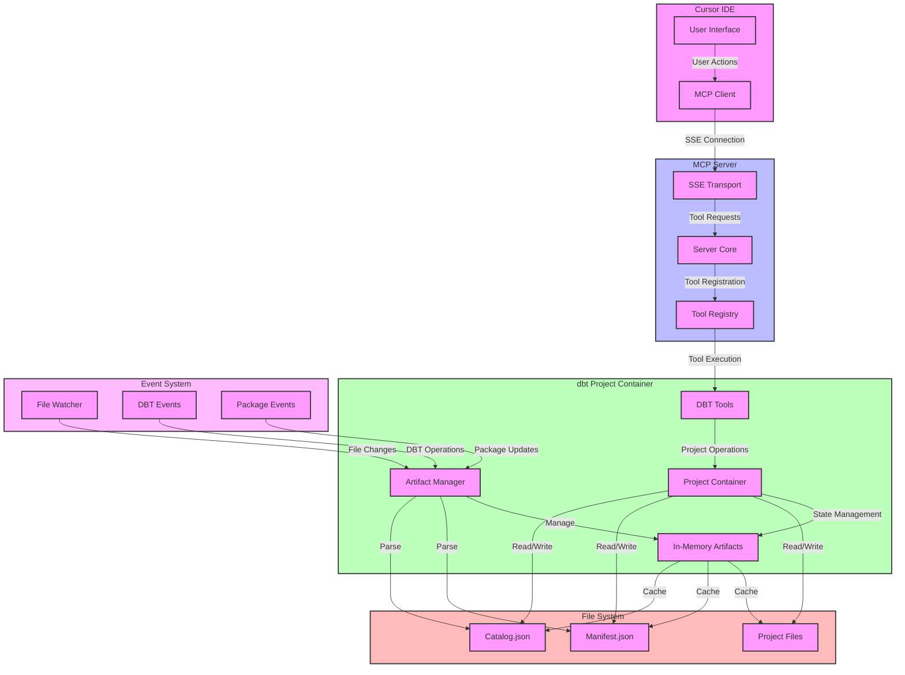

# Model Context Protocol (MCP) Server in dbt Power User

## Overview

The dbt Power User extension implements a Model Context Protocol (MCP) server that enables enhanced integration with the Cursor IDE. This server provides a robust interface for interacting with dbt projects, models, and their associated artifacts through a standardized protocol.

## Architecture

### Server Components

1. **MCP Server Core**

   - Built using the `@modelcontextprotocol/sdk`
   - Implements SSE (Server-Sent Events) transport for real-time communication
   - Runs on a dynamically allocated port (7800-7900 range)
   - Handles tool registration and execution

2. **Tool Registry**

   - Maintains a comprehensive set of dbt-specific tools
   - Each tool is defined with a clear schema and description
   - Tools are exposed through a standardized interface

3. **Project Management**
   - Integrates with the dbt project container
   - Maintains in-memory artifacts and project state
   - Handles project initialization and configuration

### Communication Flow

1. **Client-Server Interaction**

   ```
   Cursor IDE <-> SSE Transport <-> MCP Server <-> dbt Project Container
   ```

2. **In-Memory Artifacts**
   - The server maintains in-memory representations of:
     - Project configurations
     - Model definitions
     - Manifest data
     - Catalog information
   - These artifacts are updated dynamically as changes occur

### In-Memory Artifact Lifecycle

The in-memory artifacts are parsed dbt artifacts that provide fast access to project metadata and structure. Here's how they are managed:

1. **Initial Creation**

   - Created when a dbt project is first loaded
   - Parsed from manifest.json and catalog.json files
   - Stored in the dbt Project Container's memory
   - Includes:
     - Model definitions and relationships
     - Source definitions
     - Test definitions
     - Column metadata
     - Project configurations

2. **Update Triggers**

   - **Project Changes**:
     - When dbt models are modified
     - When new models are added
     - When project configuration changes
   - **dbt Operations**:
     - After `dbt compile`
     - After `dbt run`
     - After `dbt test`
     - After `dbt docs generate`
   - **Package Updates**:
     - When new packages are installed
     - When package dependencies change

3. **Update Process**

   - File system changes are detected
   - New manifest/catalog files are parsed
   - In-memory objects are updated atomically
   - All connected clients are notified of changes
   - Cache is invalidated and rebuilt

4. **Memory Management**
   - Artifacts are kept in memory for fast access
   - Memory is released when projects are closed
   - Periodic cleanup of unused artifacts
   - Memory usage is monitored and optimized

### Architecture Diagram



## Capabilities

### Project Management Tools

- `get_projects`: List available dbt project root paths
- `get_project_name`: Retrieve project name
- `get_selected_target`: Get current target configuration
- `get_target_names`: List available target names
- `get_target_path`: Get target path
- `get_package_install_path`: Get package installation path

### Model and Source Tools

- `get_columns_of_model`: Retrieve column definitions for models
- `get_columns_of_source`: Get column definitions for sources
- `get_column_values`: Get distinct values for specific columns
- `get_children_models`: List downstream dependencies
- `get_parent_models`: List upstream dependencies

### SQL and Compilation Tools

- `compile_model`: Convert dbt model Jinja to raw SQL
- `compile_query`: Compile arbitrary SQL with Jinja
- `execute_sql_with_limit`: Run SQL queries with row limits
- `run_model`: Execute dbt models
- `build_model`: Build dbt models
- `build_project`: Build entire dbt project

### Testing Tools

- `run_test`: Execute individual tests
- `run_model_test`: Run tests for specific models

### Package Management

- `install_dbt_packages`: Install specific dbt packages
- `install_deps`: Install project dependencies

## Benefits

1. **Enhanced IDE Integration**

   - Seamless integration with Cursor IDE
   - Real-time feedback and updates
   - Improved development workflow

2. **Standardized Interface**

   - Consistent API for dbt operations
   - Well-defined schemas for all operations
   - Type-safe tool execution

3. **Efficient Resource Management**

   - In-memory artifact caching
   - Optimized project state management
   - Reduced redundant operations

4. **Extensible Architecture**
   - Easy to add new tools
   - Modular design
   - Clear separation of concerns

## Usage

The MCP server is automatically initialized when:

1. The dbt Power User extension is loaded
2. A workspace is opened
3. The MCP server feature is enabled in settings

The server can be configured through VS Code settings:

- `dbt.enableMcpServer`: Enable/disable the MCP server
- `dbt.enableMcpDataSourceQueryTools`: Enable/disable data source query tools

## Technical Details

### Port Management

- Server dynamically finds available ports in range 7800-7900
- Port configuration is stored in `.cursor/mcp.json`
- Automatic port updates when configuration changes

### Error Handling

- Comprehensive error handling for all tool operations
- Detailed error messages and logging
- Graceful degradation on failures

### Security

- Local-only communication
- No external network dependencies
- Secure handling of project credentials

## Future Enhancements

1. **Performance Optimizations**

   - Enhanced caching mechanisms
   - Parallel tool execution
   - Optimized artifact management

2. **Additional Tools**

   - More sophisticated testing capabilities
   - Advanced lineage visualization
   - Enhanced debugging tools

3. **Integration Improvements**
   - Better IDE integration features
   - Enhanced error reporting
   - Improved user feedback
