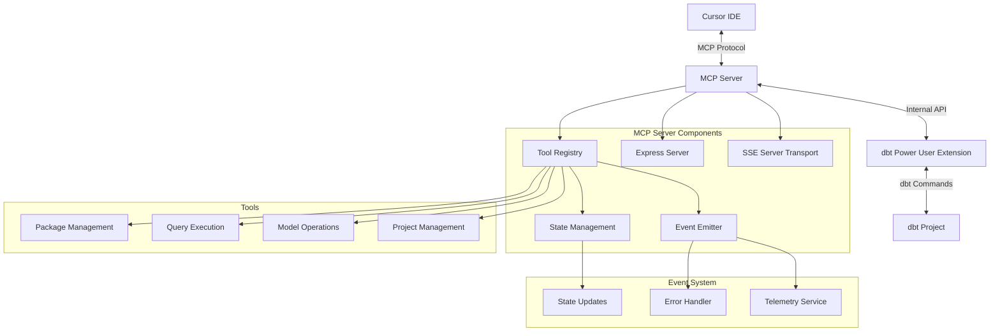

# MCP (Model Context Protocol) Server Integration

## Overview
The MCP (Model Context Protocol) server integration in the dbt Power User extension implements a standardized communication protocol between Cursor IDE and dbt functionality. This integration enables AI-powered features by exposing dbt operations through a well-defined API, allowing Cursor's AI capabilities to interact with dbt projects programmatically.

## Architecture



## Technical Implementation

### 1. MCP Server (DbtPowerUserMcpServer)
- **Core Implementation**:
  ```typescript
  @provideSingleton(DbtPowerUserMcpServer)
  export class DbtPowerUserMcpServer implements Disposable {
    private mcpServer: Server;
    private mcpTransport: SSEServerTransport;
    private port: number;

    constructor(
      private dbtPowerUserMcpServerTools: DbtPowerUserMcpServerTools,
      private dbtTerminal: DBTTerminal,
      private altimate: AltimateRequest,
      private emitterService: SharedStateService,
      private telemetry: TelemetryService,
      private dbtProjectContainer: DBTProjectContainer,
    ) {
      // Server initialization logic
    }
  }
  ```

- **Key Features**:
  - **Dynamic Port Allocation**: Uses port-finder utility to avoid conflicts
  - **Lifecycle Management**: Implements Disposable interface for cleanup
  - **Configuration Management**: Handles `.cursor/mcp.json` updates
  - **SSE Transport**: Implements Server-Sent Events for real-time communication

### 2. Tool Registry (DbtPowerUserMcpServerTools)
- **Implementation Details**:
  ```typescript
  @provideSingleton(DbtPowerUserMcpServerTools)
  export class DbtPowerUserMcpServerTools implements Disposable {
    private tools: Map<string, Tool>;
    
    constructor() {
      this.registerTools();
    }

    private registerTools() {
      // Tool registration logic
    }
  }
  ```

- **Available Tools**:
  1. **Project Management Tools**
     ```typescript
     {
       name: "get_projects",
       description: "Returns list of dbt project roots",
       inputSchema: zodToJsonSchema(BaseSchema)
     }
     ```
  2. **Model Operations**
     ```typescript
     {
       name: "compile_model",
       description: "Compiles specified dbt model",
       inputSchema: zodToJsonSchema(CompileModelSchema)
     }
     ```

### 3. Integration Components
- **McpPanel Implementation**:
  ```typescript
  @provideSingleton(McpPanel)
  export class McpPanel extends AltimateWebviewProvider {
    protected viewPath = "/mcp";
    protected panelDescription = "MCP view";
    
    async handleCommand(message: HandleCommandProps) {
      // Command handling logic
    }
  }
  ```

## Setup Process

1. **Initialization**
   ```typescript
   // Server initialization
   const port = await findAvailablePort();
   const app = express();
   app.listen(port, () => {
     this.port = port;
     this.updatePortInCursorMcpSettings(port);
   });
   ```

2. **Onboarding Flow**
   - **Step 1**: Server Configuration
     ```typescript
     async configureMcp() {
       const port = await this.mcpServer.start();
       await this.mcpServer.updatePortInCursorMcpSettings(port);
     }
     ```
   - **Step 2**: Cursor Settings Update
   - **Step 3**: Verification Process

3. **Configuration**
   - **File Structure**:
     ```json
     {
       "mcpServers": {
         "dbtPowerUser": {
           "url": "http://localhost:3000/sse",
           "capabilities": ["tools", "prompts", "resources"]
         }
       }
     }
     ```

## Communication Protocol

1. **Request Format**
   ```typescript
   interface ToolRequest {
     name: string;
     arguments: Record<string, unknown>;
     requestId: string;
   }
   ```

2. **Response Format**
   ```typescript
   interface ToolResponse {
     content: Array<{
       type: "text" | "error";
       text: string;
     }>;
     isError?: boolean;
     error?: Error;
   }
   ```

3. **Error Handling**
   ```typescript
   class MCPError extends Error {
     constructor(
       message: string,
       public code: string,
       public details?: unknown
     ) {
       super(message);
     }
   }
   ```

## Security Implementation

1. **Local Communication**
   ```typescript
   const isLocalRequest = (req: express.Request): boolean => {
     return req.hostname === 'localhost' || req.hostname === '127.0.0.1';
   };
   ```

2. **Request Validation**
   ```typescript
   const validateRequest = (req: ToolRequest): void => {
     if (!req.name || typeof req.name !== 'string') {
       throw new MCPError('Invalid tool name', 'INVALID_TOOL');
     }
     // Additional validation
   };
   ```

## Error Handling

1. **Error Types**
   ```typescript
   enum MCPErrorCode {
     SERVER_START_FAILED = 'SERVER_START_FAILED',
     TOOL_NOT_FOUND = 'TOOL_NOT_FOUND',
     INVALID_REQUEST = 'INVALID_REQUEST',
     EXECUTION_ERROR = 'EXECUTION_ERROR'
   }
   ```

2. **Telemetry Implementation**
   ```typescript
   private logError(error: MCPError): void {
     this.telemetry.sendTelemetryEvent(TelemetryEvents["MCP/Error"], {
       code: error.code,
       message: error.message,
       details: JSON.stringify(error.details)
     });
   }
   ```

## Tool Categories

### 1. Project Information
```typescript
interface ProjectInfo {
  name: string;
  root: string;
  target: string;
  profiles: string[];
}
```

### 2. Model Operations
```typescript
interface ModelOperation {
  modelName: string;
  operation: 'compile' | 'run' | 'test';
  options?: ModelOperationOptions;
}
```

### 3. Data Operations
```typescript
interface DataQuery {
  model: string;
  columns: string[];
  limit?: number;
  where?: string;
}
```

## Best Practices

1. **Server Management**
   ```typescript
   class ServerManager {
     private static instance: ServerManager;
     private status: ServerStatus;
     
     public async healthCheck(): Promise<boolean> {
       // Health check implementation
     }
   }
   ```

2. **Tool Implementation**
   ```typescript
   abstract class BaseTool implements Tool {
     abstract execute(params: unknown): Promise<ToolResponse>;
     
     protected validate(params: unknown): void {
       // Validation logic
     }
   }
   ```

## Performance Optimization

1. **Caching Implementation**
   ```typescript
   class ToolCache {
     private cache: Map<string, CacheEntry>;
     private readonly TTL: number = 5 * 60 * 1000; // 5 minutes
     
     public get(key: string): CacheEntry | undefined {
       // Cache retrieval logic
     }
   }
   ```

2. **Request Batching**
   ```typescript
   class RequestBatcher {
     private queue: ToolRequest[] = [];
     private batchSize: number = 10;
     
     public async processBatch(): Promise<void> {
       // Batch processing logic
     }
   }
   ```

## Testing Guidelines

1. **Unit Tests**
   ```typescript
   describe('MCPServer', () => {
     it('should start server on available port', async () => {
       // Test implementation
     });
   });
   ```

2. **Integration Tests**
   ```typescript
   describe('Tool Execution', () => {
     it('should execute dbt commands', async () => {
       // Test implementation
     });
   });
   ```

## API Documentation

### Tool Registry API
```typescript
interface ToolRegistry {
  registerTool(tool: Tool): void;
  getTool(name: string): Tool | undefined;
  listTools(): Tool[];
}
```

### Server API
```typescript
interface MCPServer {
  start(): Promise<number>;
  stop(): Promise<void>;
  handleRequest(req: ToolRequest): Promise<ToolResponse>;
}
```

### Event System
```typescript
interface EventSystem {
  emit(event: string, data: unknown): void;
  on(event: string, handler: (data: unknown) => void): void;
}
```

## Contributing

1. **Code Style**
   ```typescript
   // Example of expected code style
   class NewTool extends BaseTool {
     public readonly name = 'new_tool';
     
     public async execute(params: unknown): Promise<ToolResponse> {
       // Implementation
     }
   }
   ```

2. **Documentation Requirements**
   - API documentation using TypeDoc
   - Inline comments for complex logic
   - Update README.md with new features

3. **Testing Requirements**
   - Unit tests for new tools
   - Integration tests for new features
   - Performance benchmarks for optimizations 