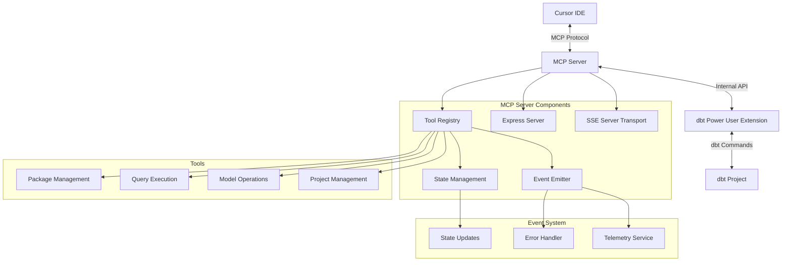

# MCP (Model Context Protocol) Server Integration

## Overview
The MCP (Model Context Protocol) server integration enables seamless communication between Cursor IDE's AI capabilities and dbt functionality. This integration allows AI-powered features to interact with dbt projects programmatically through a standardized protocol.

## System Architecture Overview

### High-Level Components
1. **Cursor IDE**: The client application that initiates requests through AI interactions
2. **MCP Server**: The bridge between Cursor IDE and dbt functionality
3. **dbt Power User Extension**: Provides dbt-specific functionality and tools
4. **dbt Project**: The underlying dbt project being managed

### Communication Flow
1. User interacts with Cursor IDE's AI features
2. AI generates tool requests through MCP protocol
3. MCP Server processes requests using registered tools
4. Tools interact with dbt project through dbt Power User Extension
5. Results are sent back to Cursor IDE through SSE transport

### Architecture Diagram


### Core Features
1. **Tool Registry**: Exposes dbt functionality through standardized tools
2. **Real-time Communication**: Uses SSE for live updates and responses
3. **State Management**: Maintains server and connection state
4. **Error Handling**: Comprehensive error management and telemetry
5. **Security**: Local-only communication with request validation

### Available Tool Categories
1. **Project Management**: Project discovery and configuration
2. **Model Operations**: Compilation, running, and testing models
3. **Query Execution**: SQL execution and data retrieval
4. **Package Management**: Managing dbt packages and dependencies

## Technical Implementation Details

### 1. MCP Server (DbtPowerUserMcpServer)
- **Core Implementation**:
  ```typescript
  @provideSingleton(DbtPowerUserMcpServer)
  export class DbtPowerUserMcpServer implements Disposable {
    private mcpServer: Server;
    private mcpTransport: SSEServerTransport;
    private port: number;

    constructor(
      private dbtPowerUserMcpServerTools: DbtPowerUserMcpServerTools,
      private dbtTerminal: DBTTerminal,
      private altimate: AltimateRequest,
      private emitterService: SharedStateService,
      private telemetry: TelemetryService,
      private dbtProjectContainer: DBTProjectContainer,
    ) {
      // Server initialization logic
    }
  }
  ```

- **Key Features**:
  - **Dynamic Port Allocation**: Uses port-finder utility to avoid conflicts
  - **Lifecycle Management**: Implements Disposable interface for cleanup
  - **Configuration Management**: Handles `.cursor/mcp.json` updates
  - **SSE Transport**: Implements Server-Sent Events for real-time communication

### 2. Tool Registry (DbtPowerUserMcpServerTools)
- **Implementation Details**:
  ```typescript
  @provideSingleton(DbtPowerUserMcpServerTools)
  export class DbtPowerUserMcpServerTools implements Disposable {
    private tools: Map<string, Tool>;
    
    constructor() {
      this.registerTools();
    }

    private registerTools() {
      // Tool registration logic
    }
  }
  ```

### 3. Communication Protocol

#### Request Format
```typescript
interface ToolRequest {
  name: string;
  arguments: Record<string, unknown>;
  requestId: string;
}
```

#### Response Format
```typescript
interface ToolResponse {
  content: Array<{
    type: "text" | "error";
    text: string;
  }>;
  isError?: boolean;
  error?: Error;
}
```

### 4. Tool Implementations

#### Project Information
```typescript
interface ProjectInfo {
  name: string;
  root: string;
  target: string;
  profiles: string[];
}
```

#### Model Operations
```typescript
interface ModelOperation {
  modelName: string;
  operation: 'compile' | 'run' | 'test';
  options?: ModelOperationOptions;
}
```

#### Data Operations
```typescript
interface DataQuery {
  model: string;
  columns: string[];
  limit?: number;
  where?: string;
}
```

## Setup and Configuration

### 1. Server Initialization
```typescript
// Server initialization
const port = await findAvailablePort();
const app = express();
app.listen(port, () => {
  this.port = port;
  this.updatePortInCursorMcpSettings(port);
});
```

### 2. Configuration File
```json
{
  "mcpServers": {
    "dbtPowerUser": {
      "url": "http://localhost:3000/sse",
      "capabilities": ["tools", "prompts", "resources"]
    }
  }
}
```

## Security and Error Handling

### 1. Security Implementation
```typescript
const isLocalRequest = (req: express.Request): boolean => {
  return req.hostname === 'localhost' || req.hostname === '127.0.0.1';
};

const validateRequest = (req: ToolRequest): void => {
  if (!req.name || typeof req.name !== 'string') {
    throw new MCPError('Invalid tool name', 'INVALID_TOOL');
  }
  // Additional validation
};
```

### 2. Error Management
```typescript
enum MCPErrorCode {
  SERVER_START_FAILED = 'SERVER_START_FAILED',
  TOOL_NOT_FOUND = 'TOOL_NOT_FOUND',
  INVALID_REQUEST = 'INVALID_REQUEST',
  EXECUTION_ERROR = 'EXECUTION_ERROR'
}

private logError(error: MCPError): void {
  this.telemetry.sendTelemetryEvent(TelemetryEvents["MCP/Error"], {
    code: error.code,
    message: error.message,
    details: JSON.stringify(error.details)
  });
}
```

## Performance and Best Practices

### 1. Caching Strategy
```typescript
class ToolCache {
  private cache: Map<string, CacheEntry>;
  private readonly TTL: number = 5 * 60 * 1000; // 5 minutes
  
  public get(key: string): CacheEntry | undefined {
    // Cache retrieval logic
  }
}
```

### 2. Request Batching
```typescript
class RequestBatcher {
  private queue: ToolRequest[] = [];
  private batchSize: number = 10;
  
  public async processBatch(): Promise<void> {
    // Batch processing logic
  }
}
```

## Testing and Quality Assurance

### 1. Unit Testing
```typescript
describe('MCPServer', () => {
  it('should start server on available port', async () => {
    // Test implementation
  });
});
```

### 2. Integration Testing
```typescript
describe('Tool Execution', () => {
  it('should execute dbt commands', async () => {
    // Test implementation
  });
});
```

## API Reference

### Tool Registry API
```typescript
interface ToolRegistry {
  registerTool(tool: Tool): void;
  getTool(name: string): Tool | undefined;
  listTools(): Tool[];
}
```

### Server API
```typescript
interface MCPServer {
  start(): Promise<number>;
  stop(): Promise<void>;
  handleRequest(req: ToolRequest): Promise<ToolResponse>;
}
```

### Event System
```typescript
interface EventSystem {
  emit(event: string, data: unknown): void;
  on(event: string, handler: (data: unknown) => void): void;
}
```

## Contributing Guidelines

### 1. Code Style
```typescript
class NewTool extends BaseTool {
  public readonly name = 'new_tool';
  
  public async execute(params: unknown): Promise<ToolResponse> {
    // Implementation
  }
}
```

### 2. Documentation Requirements
- API documentation using TypeDoc
- Inline comments for complex logic
- Update README.md with new features

### 3. Testing Requirements
- Unit tests for new tools
- Integration tests for new features
- Performance benchmarks for optimizations 