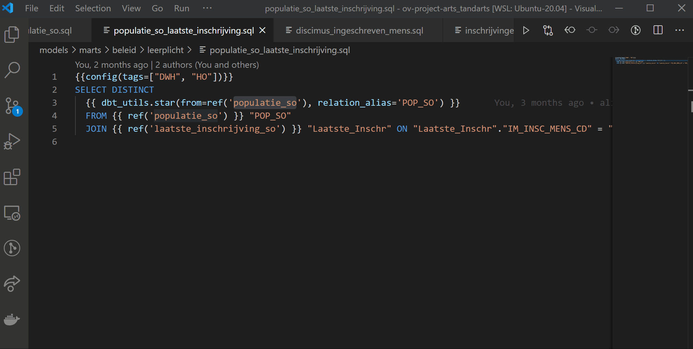
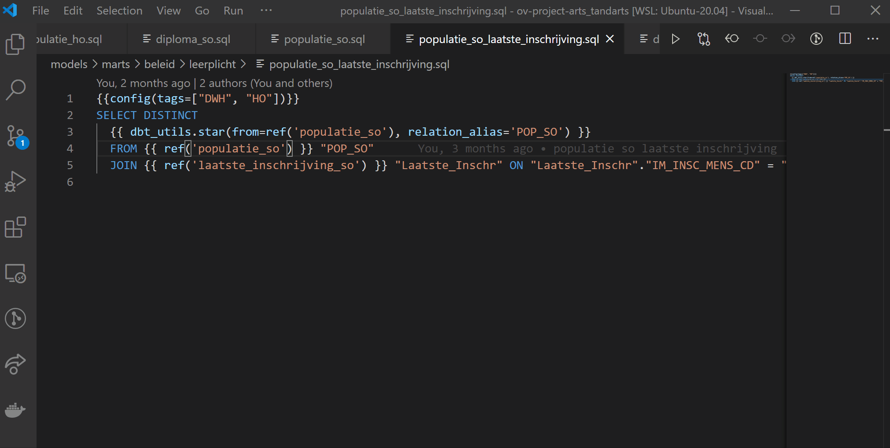
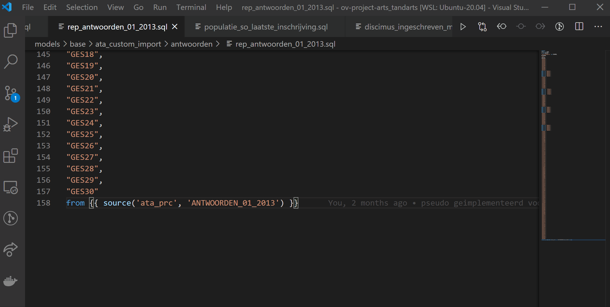
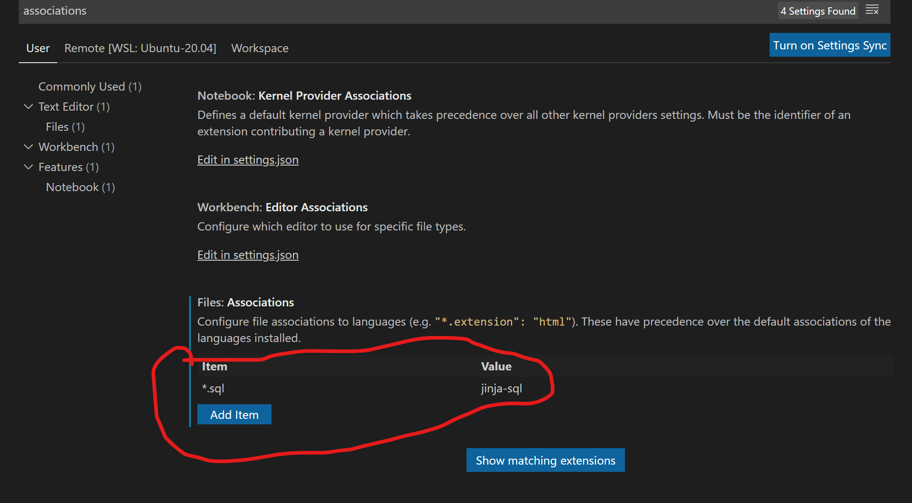

# vscode-dbt-power-user

    

This extension makes vscode seamlessly work with [dbt](https://www.getdbt.com/).

Main features:
- Go to the definition of any models, macro's and sources.
- Autocompletion of models, macros and sources
- Ability to run a model through the play button of the document

Please let us know about any bugs or feature requests through the github issues.

## Features at work

### Go to definition






### Autocompletion




## How to use the extension

You should associate your .sql files with the jinja-sql language by configuring in Preferences > Settings



or add the following in settings.json:

```
    "files.associations": {
        "*.sql": "jinja-sql"
    },
```
