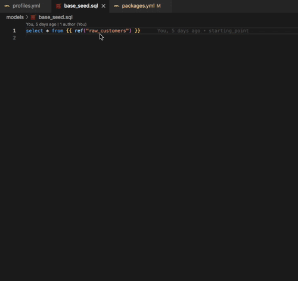
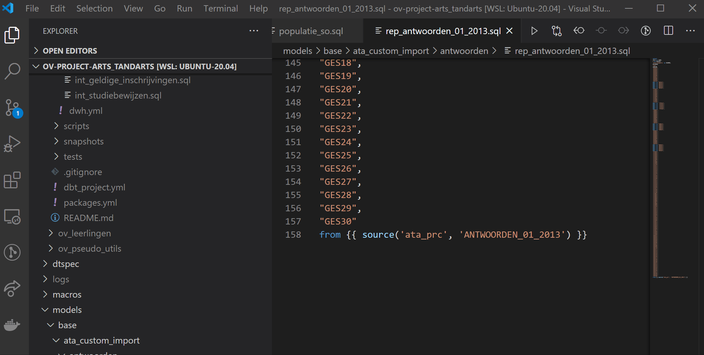

# vscode-dbt-power-user

   

This extension makes vscode seamlessly work with [dbt](https://www.getdbt.com/).

Main features:

- Generate models from your source definitions
- Query result set visualization
- Lineage of current model
- Execute all or individual model tests
- Go to the definition of any models, macros, sources and docs.
- Autocompletion of models, macros, sources and docs
- Ability to run a model through the play button of the document
- Ability to build a model through the paper plane button (next to the play button)
- dbt update notifications
- dbt logs viewer (force tailing)

This extension is using the Python extension to detect Python interpreters that are installed in standard locations. See [Python Environments](https://code.visualstudio.com/docs/languages/python#_environments).

This extension is fully compatible with the remote extension. See [Visual Studio Code Remote - Containers](https://code.visualstudio.com/docs/remote/containers) and [Visual Studio Code Remote - WSL](https://code.visualstudio.com/docs/remote/wsl).

Please let us know about any bugs or feature requests through the github issues.

This extension is sponsored by [innover.io](https://innover.io/).

If you want to contribute to the extension, let us know and we will help set you up.

## How to setup the extension

### Associate your .sql files the jinja-sql language

You should associate your .sql files with the jinja-sql language by configuring in Preferences > Settings


or add the following in settings.json:

```
    "files.associations": {
        "*.sql": "jinja-sql"
    },
```

### Select the Python interpreter that has dbt installed

Ensure that the Python interpreter selection is always visible for ease of use:


Make sure that you select the interpreter that has dbt installed. In my case it is virtual environment in the project itself.


Avoid using the setting `dbt.dbtPythonPathOverride` unless using Meltano, the extension depends on the Python interpreter for visual code compatible environment variable parsing.

When you set the Python interpreter, the extension will try to detect dbt and you should be able to make use of the features listed below.

### Environment variables

This extension supports environment variables in various ways;

#### Environment variables setup outside of Visual Code (.zshrc, .bashrc, ...)

These environment variables will be passed to all operations of the extension. Note that the environment variable should be valid for all your dbt projects. For example `DBT_PROFILES_DIR` can be set to `.`, that way dbt will lookup the profiles.yaml file inside the root of the dbt project.

#### Environment variables through `python.envFile`

The extension also loads an environment variable definitions file identified by the python.envFile setting. The default value of this setting is `${workspaceFolder}/.env`.

This way supports all Visual Code variable substitution patterns and is best practise. Read all about [environment variables](https://code.visualstudio.com/docs/python/environments#_environment-variables) supported by the Visual Code Python extension

#### Environment variables setup for the terminal

The extension will read any vscode configurations in `.vscode/settings.json` and pass them to all operations of the extension:

```
"terminal.integrated.env.[osx|windows|linux]": {
    "DBT_PROFILES_DIR": "."
}
```

Note that Visual Code variable substitution is not supported except the environment variable pattern `${env:*}` and `${workspaceFolder}`.

### Query results visualization

Your database may not support standard SQL LIMIT statements like `SELECT * from table LIMIT 10`.

You can override this default behaviour through `dbt.queryTemplate`.

Please make a PR if you find that you need to change `dbt.queryTemplate` for your favourite adapter and help the community.

#### `dbt.queryTemplate` for Oracle

Change to `select * from ({query})\n where ROWNUM <= {limit}`

#### `dbt.queryTemplate` for MS SQL

Change to `{query}\n order by 1 OFFSET 0 ROWS FETCH FIRST {limit} ROWS ONLY`

Note that your query can't have an order by clause.

### Format your dbt SQL with `sqlfmt`

#### Install `sqlfmt`

Install sqlfmt through running `pip install 'shandy-sqlfmt[jinjafmt]'`. Find more about sqlfmt in their [docs](https://sqlfmt.com/).

#### Usage

Please select "dbt Power User" (extension id:`innoverio.vscode-dbt-power-user`) as the default formatter. You can do this either by using the context menu (right click on a open dbt model in the editor) and select "Format Document With...", or you can add the following to your settings:

```json
  "[jinja-sql]": {
    "editor.defaultFormatter": "innoverio.vscode-dbt-power-user"
  }
```

#### Format on save

You can enable format on save for python by having the following values in your settings:

```json
  "[jinja-sql]": {
    "editor.defaultFormatter": "innoverio.vscode-dbt-power-user",
    "editor.formatOnSave": true
  }
```

## Features at work

### Lineage of current model


### Generate a model from your source definition


You can select a file name template and prefix in the settings.

### Generate a schema yml file from your model file


### Visualize the result set of your model (Use CMD+ENTER (mac) or CTRL+ENTER (win))


### See the compiled query of your model (Use CMD+' (mac) or CTRL+' (win))


### Execute model tests


### See the model graph


### Go to definition





### Autocompletion


### dbt logs force tailing


