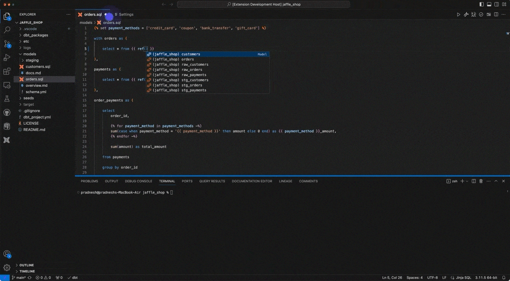
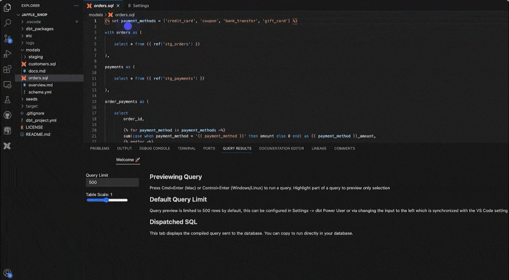
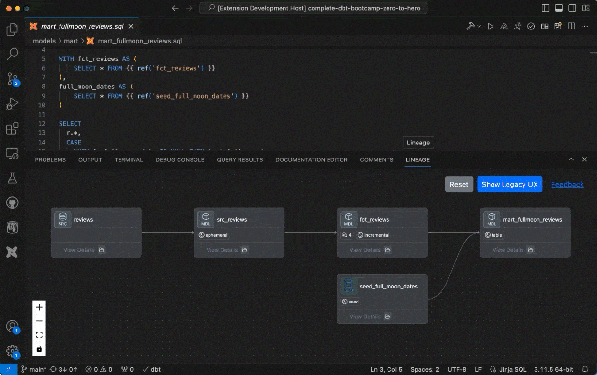
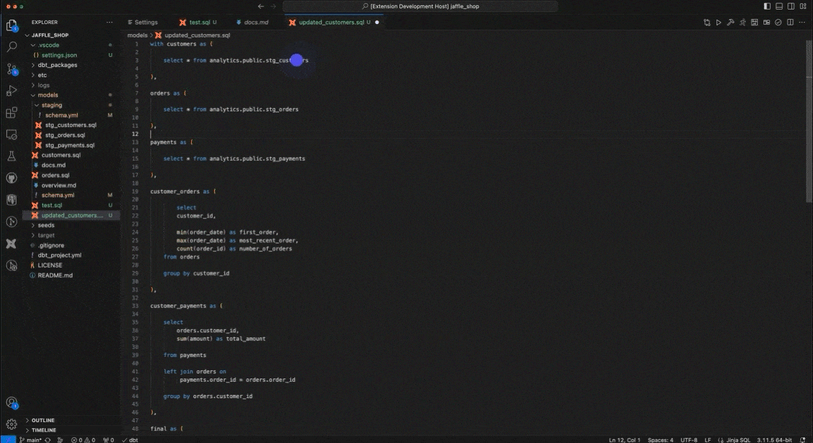
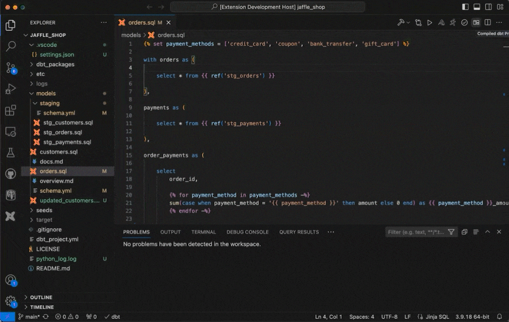
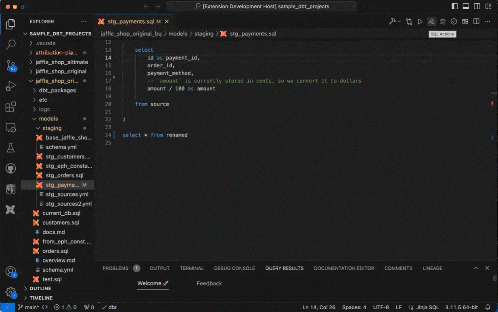

# vscode-dbt-power-user

   

This [open source](https://github.com/AltimateAI/vscode-dbt-power-user) extension makes VSCode seamlessly work with [dbt™](https://www.getdbt.com/).

If you need help with setting up the extension, please check the [documentation](https://docs.myaltimate.com/setup/installation/).
For any issues or bugs, please [contact us](https://www.altimate.ai/support) via chat or Slack.

**Features:**

| Feature                                                     | Details                                                                                                                                 |
| ----------------------------------------------------------- | --------------------------------------------------------------------------------------------------------------------------------------- |
| [Auto-complete dbt™ code](#autocomplete)                   | Auto-fill model names, macros, sources and docs. Click on model names, macros, sources to go to definitions.                            |
| [Preview Query results and Analyze](#querypreview)          | Generate dbt™ model / query results. Export as CSV or analyze results by creating graphs, filters, groups                              |
| [Column lineage](#lineage)                                  | Model lineage as well as column lineage                                                                                                 |
| [Generate dbt™ Models](#genmodel)                          | from source files or convert SQL to dbt™ Model (docs)                                                                                  |
| [Generate documentation](#gendoc)                           | Generate model and column descriptions or write in the UI editor. Save formatted text in YAML files.                                    |
| [Defer to prod](#defertoprod)                               | Build your model in development without building (by defering) your upstream models                                                     |
| [Click to run parent / child models and tests](#clicktorun) | Just click to do common dbt™ operations like running tests, parent / child models or previewing data.                                  |
| [Compiled query preview and explanation](#queryexplanation) | Get live preview of compiled query as your write code. Also, generate explanations for dbt™ code written previously (by somebody else) |
| [Project health check](#healthcheck)                        | Identify issues in your dbt™ project like columns not present, models not materialized                                                 |
| [SQL validator](#validateSQL)                               | Identify issues in SQL like typos in keywords, missing or extra parentheses, non-existent columns                                       |
| [Big Query cost estimator](#bqcost)                         | Estimate data that will be processed by dbt™ model in BigQuery                                                                         |
| [Other features](#otherfeatures)                            | dbt™ logs viewer (force tailing)                                                                                                       |

Note: This extension is fully compatible with dev containers, code spaces and remote extension. See [Visual Studio Code Remote - Containers](https://code.visualstudio.com/docs/remote/containers) and [Visual Studio Code Remote - WSL](https://code.visualstudio.com/docs/remote/wsl).
The extension is supported for dbt™ versions above 1.0.

## Features

### <a id="autocomplete">Autocomplete model, macro, source names and click to go to definition</a>

Auto-fill model names, macros, sources and docs. Click on model names, macros, sources to go to definitions. [(docs)](https://docs.myaltimate.com/develop/autocomplete/)



### <a id="querypreview">Preview query results and analyze</a>

Generate dbt™ model / query results. Export as CSV or analyze results by creating graphs, filters, groups. [(docs)](https://docs.myaltimate.com/test/queryResults/)



### <a id="lineage">Column lineage</a>

View model lineage as well as column lineage with components like models, seeds, sources, exposures and info like model types, tests, documentation, linkage types. [(docs)](https://docs.myaltimate.com/test/lineage/)



### <a id="genmodel"> Generate dbt™ Models from source or SQL</a>

Generate dbt™ models from sources defined in YAML. You can also convert existing SQL to a dbt™ model where references get populated automatically. [(docs)](https://docs.myaltimate.com/develop/clicktorun/)



### <a id="gendoc"> Generate documentation</a>

Generate model and column descriptions automatically or write descriptions manually in the UI editor. Your descriptions are automatically formatted and saved in YAML files. [(docs)](https://docs.myaltimate.com/document/generatedoc/)


### <a id="defertoprod">Defer to prod</a>

Defer building your upstream models when you make changes in development by referencing production models. Here's [(more info)](https://docs.getdbt.com/blog/defer-to-prod) about the concept. This functionality can be used in dbt™ core with the extension. [(docs)](https://docs.myaltimate.com/test/defertoprod/)

### <a id="clicktorun"> Click to run parent/child models and tests</a>

Just click to do common button operations like executing tests, building or running parent / child models. [(docs)](https://docs.myaltimate.com/develop/clicktorun/)


### <a id="queryexplanation"> Compiled query preview and explanation</a>

Get live preview of compiled query as your write code. Also, generate explanations for dbt™ code written previously (by somebody else). [(docs)](https://docs.myaltimate.com/develop/explanation/)



### <a id="healthcheck"> Project health check</a>

Identify issues in your dbt™ project like columns not present, models not materialized. [(docs)](https://docs.myaltimate.com/test/healthcheck/)


### <a id="validateSQL"> SQL validator</a>

Validate SQL to identify issues like mistyped keywords, extra parentheses, columns no present in database [(docs)](https://docs.myaltimate.com/test/sqlvalidation/)


### <a id="bqcost"> Big Query cost estimator</a>

Estimate data that will be processed by dbt™ model in BigQuery [(docs)](https://docs.myaltimate.com/test/bigquerycost/)



### <a id="otherfeatures"> Other features</a>

**dbt™ logs view (force tailing)**


Please check [documentation](https://docs.myaltimate.com/arch/faq/) for additional info.
For any issues or bugs, please [contact us](https://www.altimate.ai/support) via chat or Slack.

## Model Context Protocol (MCP) Integration

The dbt Power User extension now supports the [Model Context Protocol (MCP)](https://www.anthropic.com/news/model-context-protocol), allowing you to use the extension's functionality with AI-enabled IDEs like Cursor.

### What is MCP?

MCP is an open standard that defines how external tools and data sources can be connected to AI models in a unified way. It allows AI assistants to discover and use tools from your development environment.

### Using dbt Power User with Cursor

To use dbt Power User with Cursor:

1. Install the extension as usual
2. Run the MCP server:

```bash
# Set required environment variables
export DBT_PROJECT_PATH=/path/to/your/dbt/project
export DBT_PROFILES_PATH=/path/to/your/profiles.yml  # Optional
export ALTIMATE_API_KEY=your_api_key  # Optional, for AI features
export ALTIMATE_INSTANCE=your_instance  # Optional

# Run the MCP server
npm run mcp-server
```

3. In Cursor, add the MCP server in Settings > MCP > Add MCP Server
4. Choose "stdio" as the transport and enter the command to run the server
5. Now Cursor's AI assistant can use dbt Power User's tools to help with your dbt development

### Available MCP Tools

The following tools are available via MCP:

- `list_models` - Lists all models in the dbt project
- `compile_model` - Compiles a dbt model and returns the generated SQL
- `run_query` - Executes a SQL query against the data warehouse
- `get_lineage` - Returns lineage information for a given model
- `run_tests` - Runs dbt tests on a specific model or the entire project
- `explain_query` - Provides an AI-generated explanation of a SQL query
- `generate_model_from_sql` - Uses AI to generate a dbt model from raw SQL
- `generate_docs` - Uses AI to generate documentation for a model

For more details, see the [MCP documentation](https://docs.myaltimate.com/mcp/).
