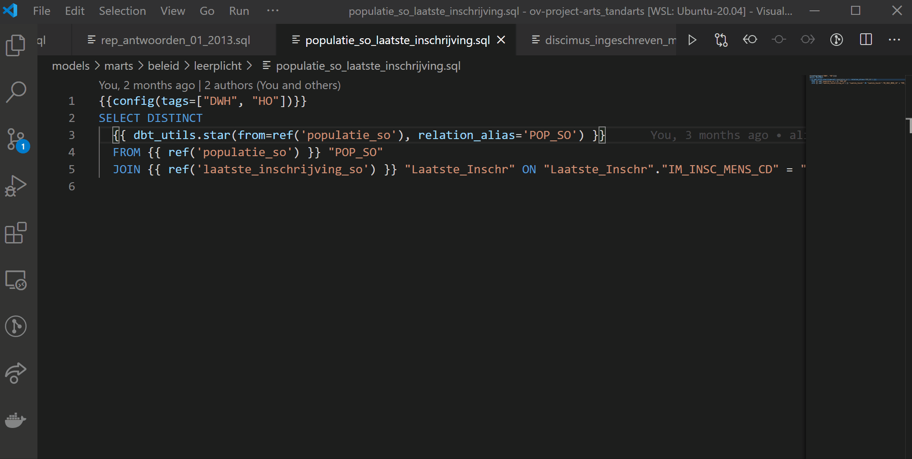
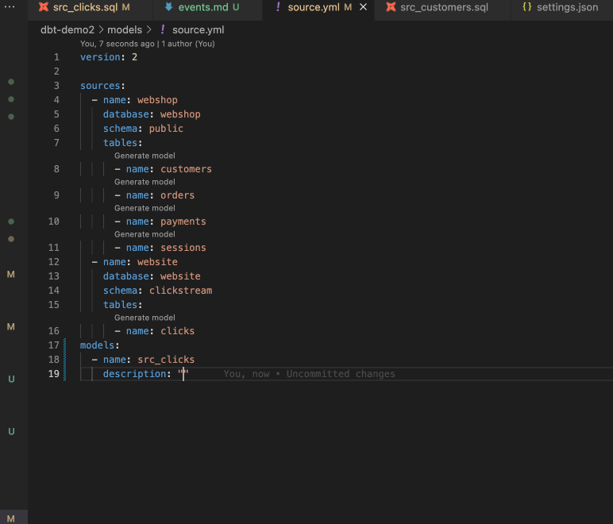
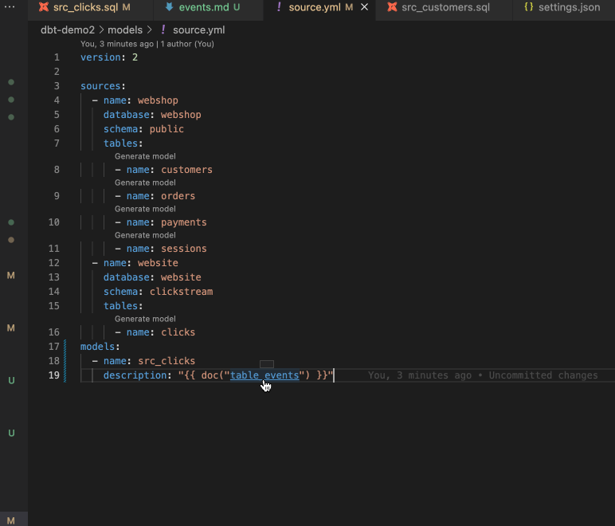

dbt-power user extension auto-completes model, macro, column names in the VSCode

## Models

a) Autocomplete model

b) Go to model definition

## Macros

a) Autocomplete macro

b) Go to macro definition

## Sources

a) Autocomplete source

b) Go to source definition

## Doc blocks

a) Autocomplete source

b) Go to doc block definition

