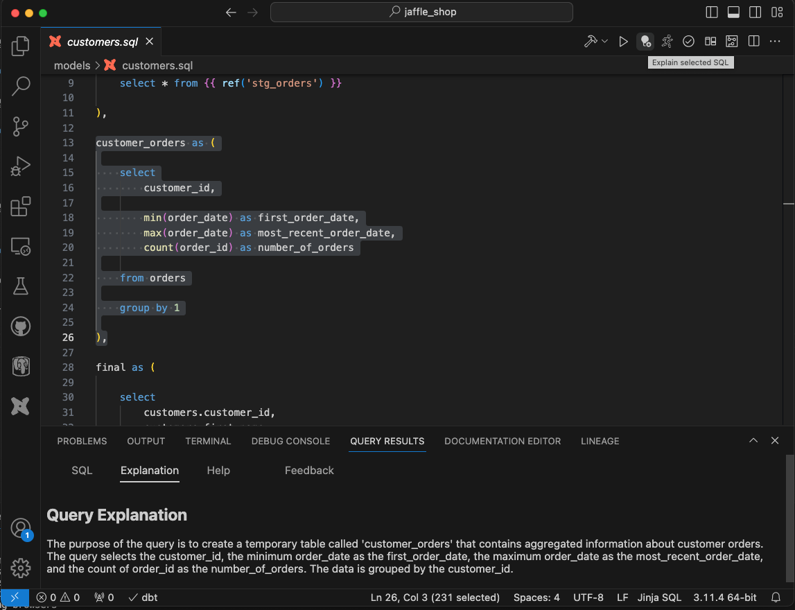

You can get explanation for code in the entire file or selected parts. If you need explanation for only some part of the code, select that code and press toolbar action button to get code explanation.

The toolbar action get code explanation is present on the top right corner of the VSCode as shown in the image below:

