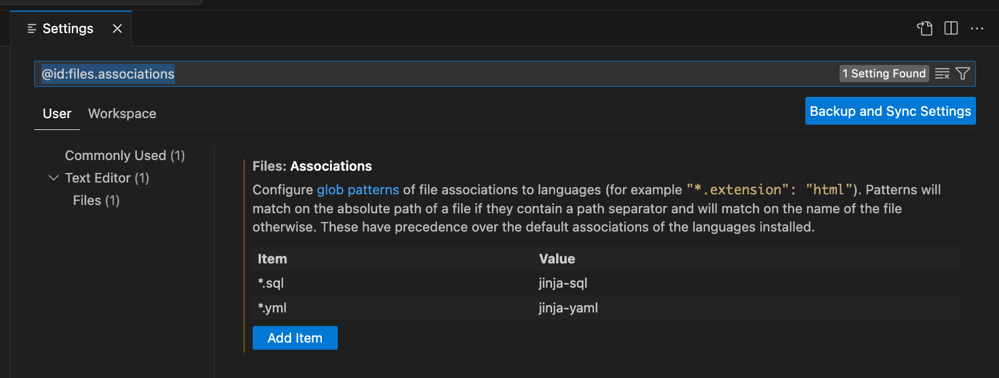
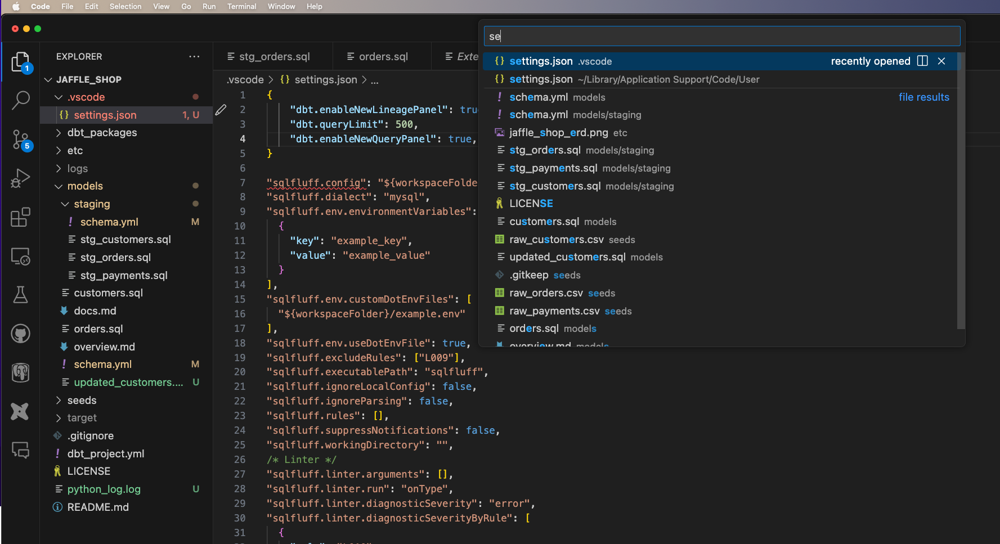
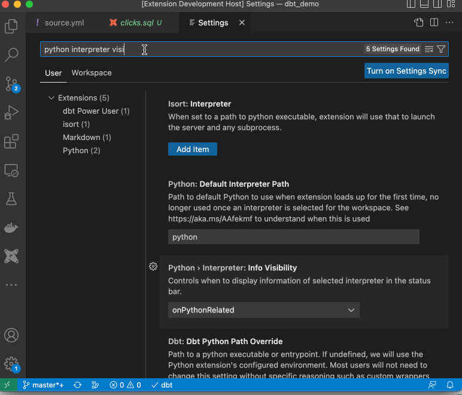
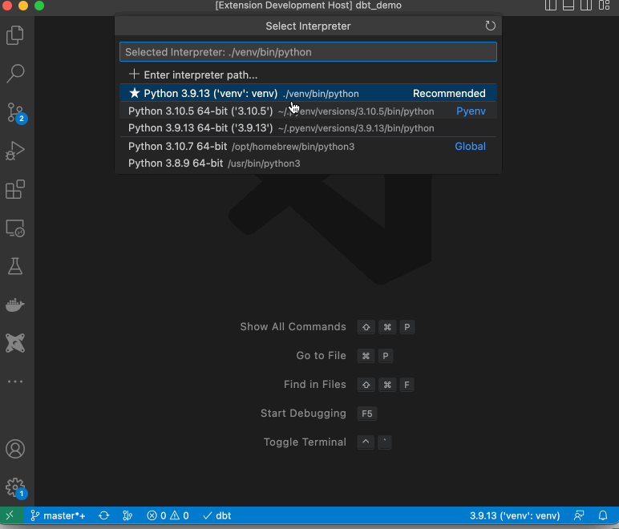

## Install the extension in VSCode

<interactive demo for installing the extension>

<div style="position: relative; padding-bottom: calc(57.25% + 44px); height: 0;"><iframe src=https://app.supademo.com/embed/clpbwiqry0jb7penezw0wwz31 frameborder="0" webkitallowfullscreen="true" mozallowfullscreen="true" allowfullscreen style="position: absolute; top: 0; left: 0; width: 100%; height: 100%;"></iframe></div>

Note: If you are seeing the message "Reload required", please reload the VSCode or restart the VSCode.

## Use the setup wizard for configuration (recommended)

This method will save a bunch of time for you, and you can also validate your configuration. This is how you start the setup wizard in the VSCode extension

<interactive demo for setup wizard>

<div style="position: relative; padding-bottom: calc(57.25% + 44px); height: 0;"><iframe src=https://app.supademo.com/embed/clph7wqbu4xjbpe69qnl0m9pf frameborder="0" webkitallowfullscreen="true" mozallowfullscreen="true" allowfullscreen style="position: absolute; top: 0; left: 0; width: 100%; height: 100%;"></iframe></div>

## Manual method of configuration (optional)

### Associate \*.sql files with jinja-sql

There are two different methods to do this. Please follow only one method:

1. Method1: Configure in Preferences > Settings in the extension



2. Method2: Update the settings.json file directly

Type ‘settings.json’ in the VS Code command pallet to open it


and add following lines at the end of settings.json

```
    "files.associations": {
        "*.sql": "jinja-sql",
        "*.yml": "jinja-yaml"
    },
```

### Select the Python interpreter where dbt is installed

Ensure that the Python interpreter selection is always visible on the bottom strip of the VS Code for ease of use:



Select the Python interpreter that has dbt installed. If you select a python environment with dbt already installed, the dbt label on the bottom strip of the VS Code will show a checkmark.



If a Python environment selected that has no dbt installed, the extension will give you an option to install dbt for you automatically:

<interactive demo to install dbt in Python environment>

<div style="position: relative; padding-bottom: calc(57.25% + 44px); height: 0;"><iframe src=https://app.supademo.com/embed/clphpdd9d0fkapet0d9v8goup frameborder="0" webkitallowfullscreen="true" mozallowfullscreen="true" allowfullscreen style="position: absolute; top: 0; left: 0; width: 100%; height: 100%;"></iframe></div>

Note - Avoid using the setting dbt.dbtPythonPathOverride unless using Meltano, the extension depends on the Python interpreter for visual code compatible environment variable parsing.

## Enable preview features by adding API key

There are multiple preview features in the extension including generate dbt documentation, column lineage, query explanation, generate dbt model from SQL that require an API key.

You can get an API key for free by signing up at [www.altimate.ai](https://www.altimate.ai)

<interactive demo to get an API key>

<div style="position: relative; padding-bottom: calc(51.70312500000001% + 44px); height: 0;"><iframe src=https://app.supademo.com/embed/yanO4l-w5hH0xzXf93w-d frameborder="0" webkitallowfullscreen="true" mozallowfullscreen="true" allowfullscreen style="position: absolute; top: 0; left: 0; width: 100%; height: 100%;"></iframe></div>

Here's how you add the API key in the VSCode extension:

(First few steps are on how to install the extension)

<Interactive demo to add API key in the extension>

<div style="position: relative; padding-bottom: calc(57.25% + 44px); height: 0;"><iframe src=https://app.supademo.com/embed/clnjpwl3u07x4pedv9ifjfuf9 frameborder="0" webkitallowfullscreen="true" mozallowfullscreen="true" allowfullscreen style="position: absolute; top: 0; left: 0; width: 100%; height: 100%;"></iframe></div>
