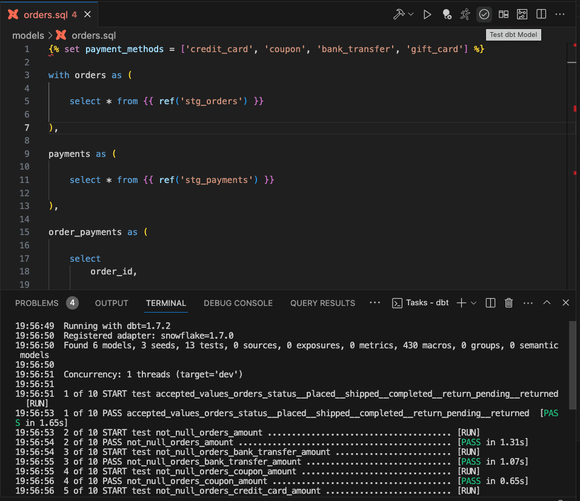
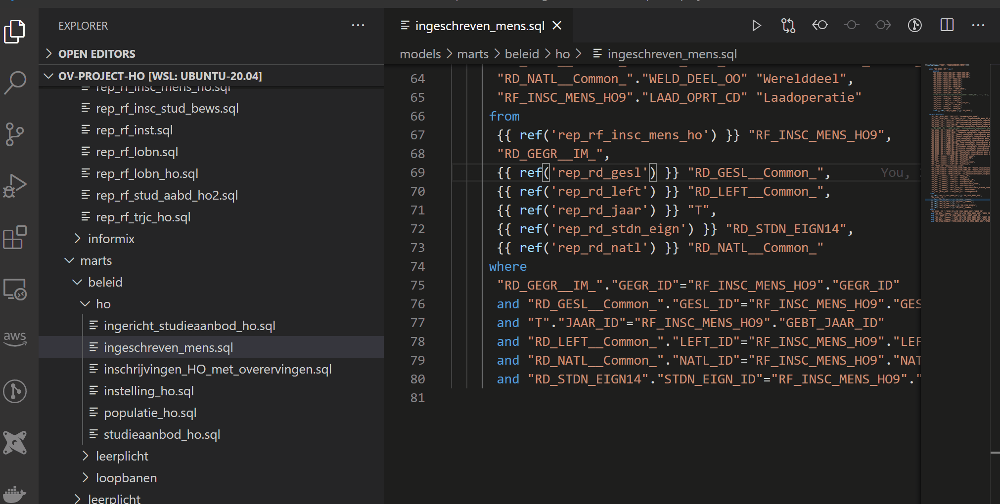

There are two methods to do it. You can either do it from the top right corner toolbar or from the extension side pane

### Method 1: Test models from the toolbar

The toolbar action to test models is present on the top right corner of the VSCode as shown in the image below:

### Method 2: Run tests from the side panel

