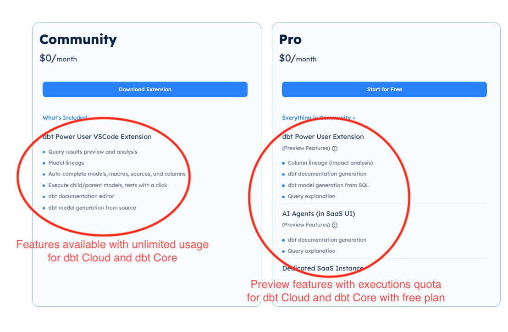

/// admonition | Only use the following steps for "dbt Cloud" environments. If you have a dbt Core environment, use the [required config instructions for "dbt Core" environments](../setup/reqdConfig.md). If you have a dbt Fusion environment, use the [required config instructions for "dbt Fusion" environments](../setup/reqdConfigFusion.md).
    type: warning
///

/// admonition | dbt Cloud integration is available as beta functionality
    type: tip
///

## Enable dbt Cloud Integration by adding an API key

dbt Cloud integration in Power User VSCode extension requires an API key. There are also multiple preview features in the extension including [generate dbt documentation](../document/generatedoc.md), [column lineage](../test/lineage.md), [query explanation](../develop/explanation.md), [generate dbt model from SQL](../develop/genmodelSQL.md) that are also enabled with an API key.

/// details | You can get an API key for free by signing up at [www.altimate.ai](https://www.altimate.ai)

<interactive demo to get an API key>

<div style="position: relative; padding-bottom: calc(51.70312500000001% + 44px); height: 0;"><iframe src=https://app.supademo.com/embed/yanO4l-w5hH0xzXf93w-d frameborder="0" webkitallowfullscreen="true" mozallowfullscreen="true" allowfullscreen style="position: absolute; top: 0; left: 0; width: 100%; height: 100%;"></iframe></div>

///

You need to add the API key from "Settings->API key" in your Altimate instance to the VSCode extension settings. You also need to add "Instance name" in the extension settings. Please get your instance name from your Altimate AI URL. If your URL for Altimate instance is - "companyx.app.myaltimate.com", then instance name is "companyx".

Go to the VSCode extension settings, and then add an API key and instance name.

/// details | Here's a demo of how to add an instance name and an API Key to the extension settings

<Interactive demo to add API key in the extension>

<div style="position: relative; padding-bottom: calc(57.25% + 44px); height: 0;"><iframe src=https://app.supademo.com/embed/clnjpwl3u07x4pedv9ifjfuf9 frameborder="0" webkitallowfullscreen="true" mozallowfullscreen="true" allowfullscreen style="position: absolute; top: 0; left: 0; width: 100%; height: 100%;"></iframe></div>
///

## Use the setup wizard for configuration (recommended)

/// admonition | Need to setup environment variables? Refer to this [section](https://docs.myaltimate.com/setup/optConfig/#environment-variables-setup)
    type: warning
///

This method will save a bunch of time for you, and you can also validate your configuration. Setup wizard will help you in associating sql files with jinja-sql, selecting the right Python interpreter, make sure dbt dependencies are correctly installed etc. In the end, it will also validate your configuration.

You can start the setup wizard by clicking on dbt status icon in the bottom status bar, and performing the following necessary steps as shown in the recorded demo below:

<div style="position: relative; padding-bottom: 56.25%; height: 0;"><iframe src="https://www.loom.com/embed/9e77435a96374622934daf5ff4e741e0?sid=1d407b78-eecc-436c-a49d-d9ffe858ba5d" frameborder="0" webkitallowfullscreen mozallowfullscreen allowfullscreen style="position: absolute; top: 0; left: 0; width: 100%; height: 100%;"></iframe></div>

**Here are the steps covered in the setup wizard**

**Select Python Interpreter**

Click on the action button - "Select Python Interpreter" and choose your preferred python interpreter. Usually, choosing an interpreter that's recommended or mapped to your virtual environment software (e.g. venv) as per the list is a good idea. If you know the path of your Python environment, you can choose it from the list, or if the path is not present, you can enter it manually.

/// admonition | If needed, please run 'where python' command on terminal to see if it shows path to Python interpreter that you are using.
    type: tip
///

**Install dbt**

If dbt is not installed in your environment (dbt status icon on bottom status bar will show it), Click on "Install dbt Cloud" button in the next step. This will install latest version of dbt Cloud CLI in your environment.

**Validate Project**

Last step is clicking on button - "Validate Project" It will run a bunch of checks to make sure your dbt environment and project are setup correctly.
If there are some issues, it will tell you exactly what's wrong as well.

/// admonition | If you still can't get the extension setup correctly, please check the [troubleshooting page](../troubleshooting.md)
    type: tip
///

## Recorded Demo

<div style="position: relative; padding-bottom: 56.25%; height: 0;"><iframe src="https://www.loom.com/embed/9e77435a96374622934daf5ff4e741e0?sid=a36e1758-8dc0-46b5-affe-0d14957120de" frameborder="0" webkitallowfullscreen mozallowfullscreen allowfullscreen style="position: absolute; top: 0; left: 0; width: 100%; height: 100%;"></iframe></div>

## Questions and Answers

#### Is dbt Cloud or dbt Fusion integration free?

Answer: Yes, integration with dbt Cloud or dbt Fusion is free and treated the same as integration with dbt Core. It will not count towards the usage quota.



#### Why do I need to add the Altimate API key?

The API key is necessary for authentication with our backend. VSCode supports login-based authentication, but it often logs out between sessions, which can disrupt the workflow. The API key provides a more stable and streamlined experience. This is particularly beneficial for large teams, allowing them to integrate the key into their deployment secrets when setting up VSCode as a remote environment. In the future, integration with [Cloud Service token](https://docs.getdbt.com/docs/dbt-cloud-apis/authentication)s might be necessary for deeper cloud interactions, thus having the Altimate integration in place from the start makes sense.

#### What benefits does registering an API key provide?

A direct line of communication with our users is established with the authentication in place. This is essential for efficiently communicating hotfixes, new releases, and deprecation warnings. It helps to minimize operational challenges and ensures that users are not left with outdated versions or unaware of updates due to the limitations of VSCode or lack of IDE restarts. Our main goal is to prevent any disruption in your development environment and to support our users proactively.

#### What if I don't want to use preview features or accidentally send data to Altimate?

We understand the concern about using preview features and the risk of accidental data transmission. To address this, we have implemented stringent data security practices, which you can review in our [security FAQ](https://docs.myaltimate.com/arch/faq/). Our solutions have passed security reviews by several large organizations in the US, and we are open to undergoing similar reviews for your organization. Additionally, we are working on making some preview features available offline through our [open-source Python CLI package](https://github.com/AltimateAI/datapilot-cli).

#### How are you addressing concerns about data transmission in preview features?

To directly address concerns about data transmission, we have added a "local-mode-only" setting in VSCode. If enabled, this setting prevents backend calls for any feature except authentication. This setting can be reviewed by your security team since our [client code](https://github.com/AltimateAI/vscode-dbt-power-user/blob/master/src/altimate.ts) is open-source.

Add the following setting in vscode settings.json

```json
{
   dbt.isLocalMode: True
}
```
