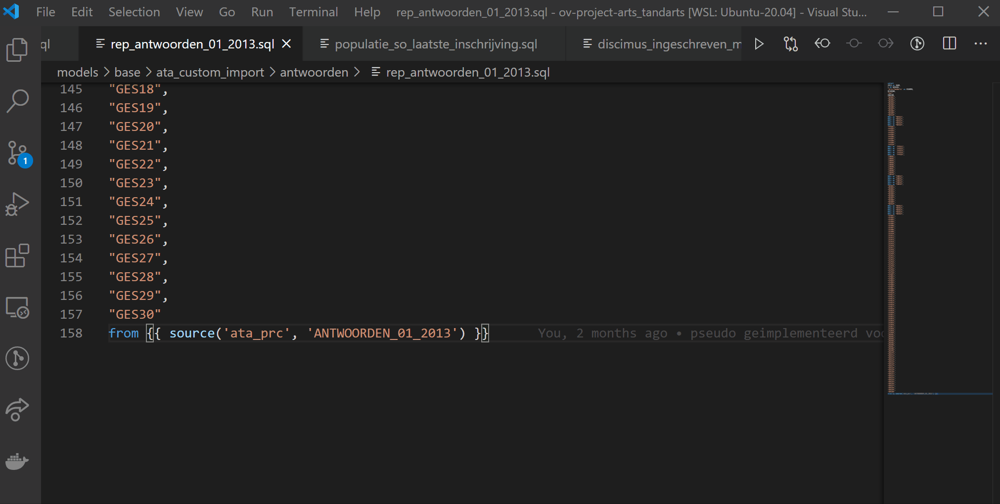
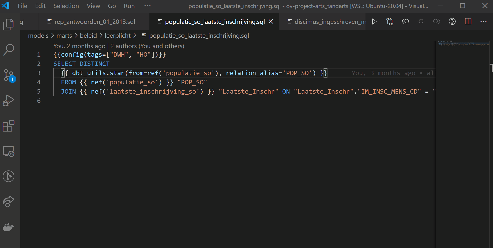
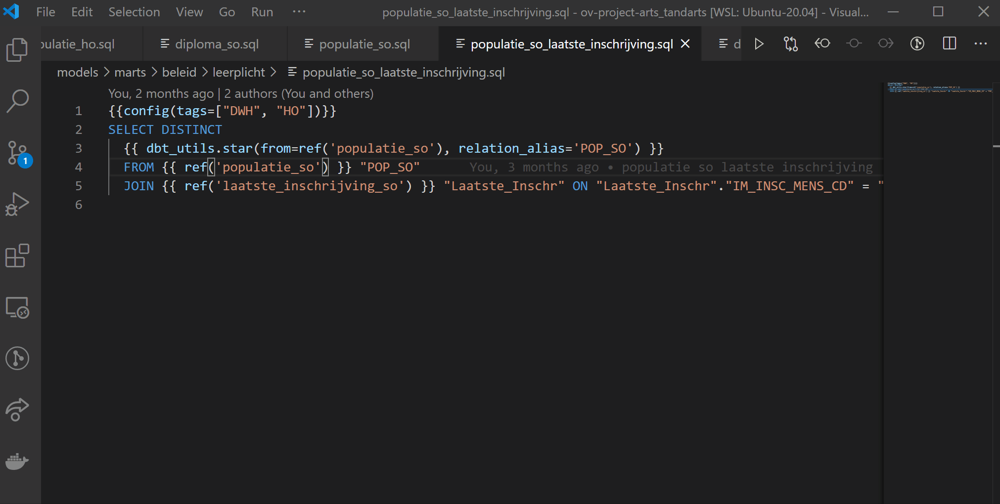
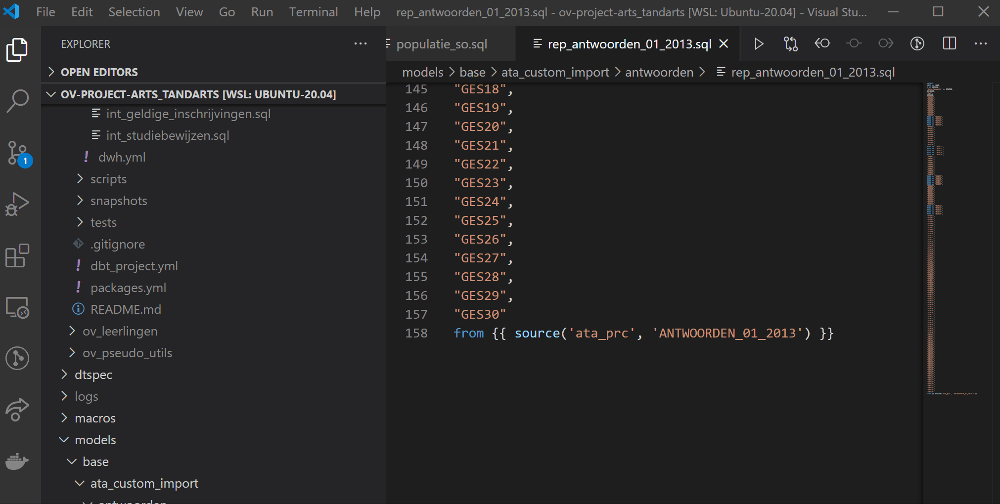
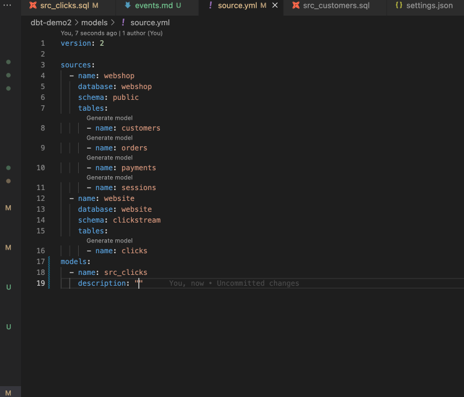
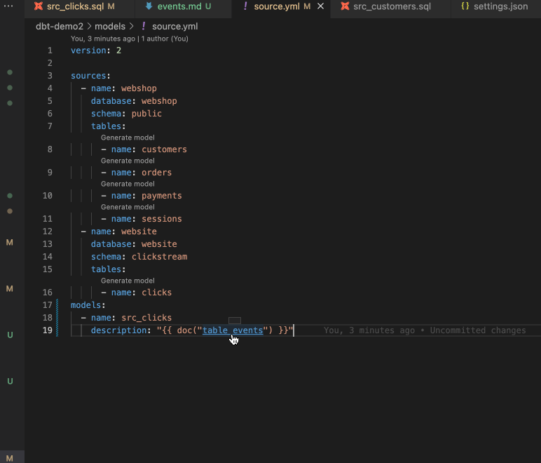

dbt-power user extension auto-completes model, macro, column names in the VSCode

## Models

a) Autocomplete model

b) Go to model definition

## Macros

/// details | a) Autocomplete macro

///

/// details | b) Go to macro definition

///

## Sources

/// details | a) Autocomplete source

///

/// details | b) Go to source definition

///

## Doc blocks

/// details | a) Autocomplete doc block

///

/// details | b) Go to doc block definition

///
