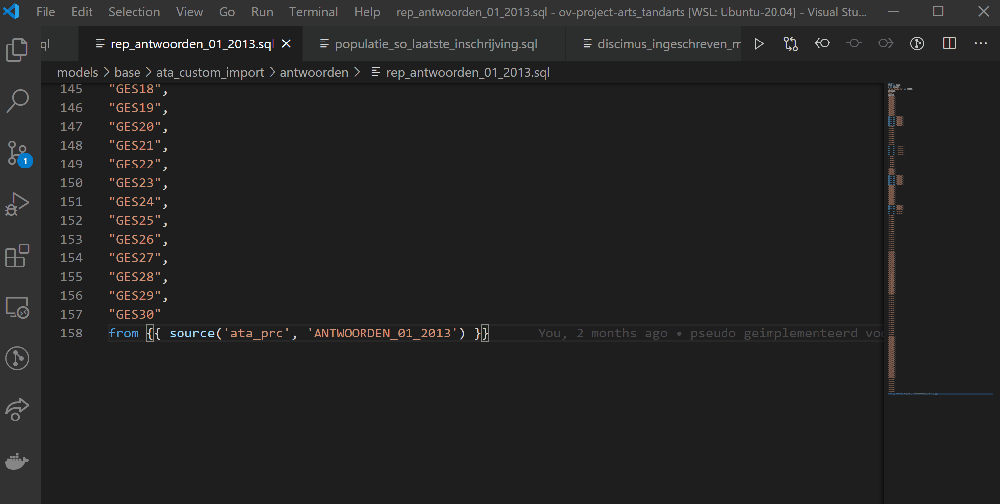
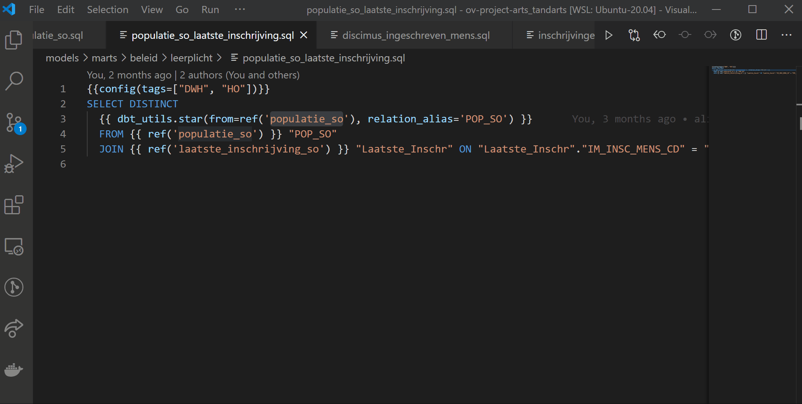
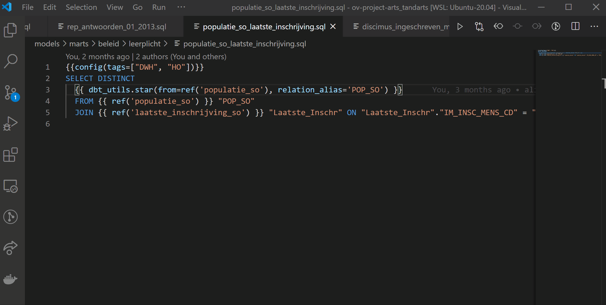
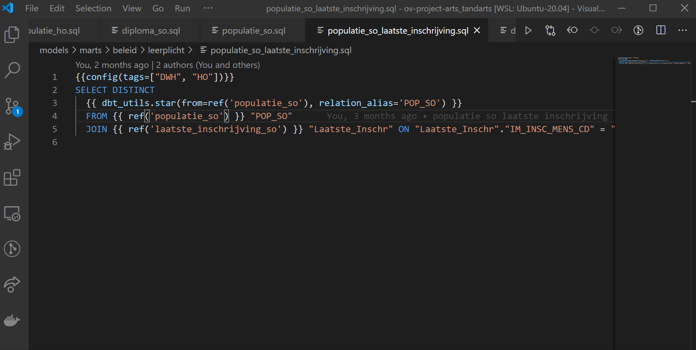
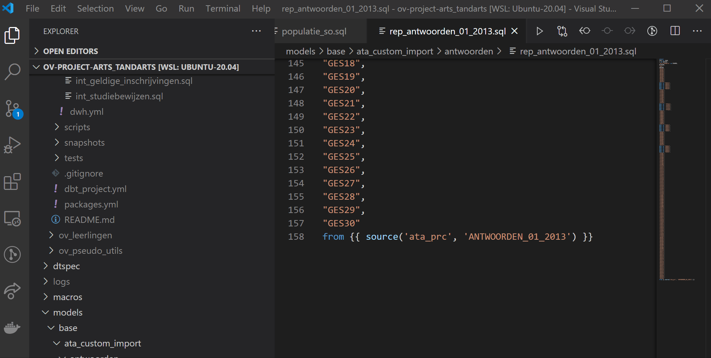
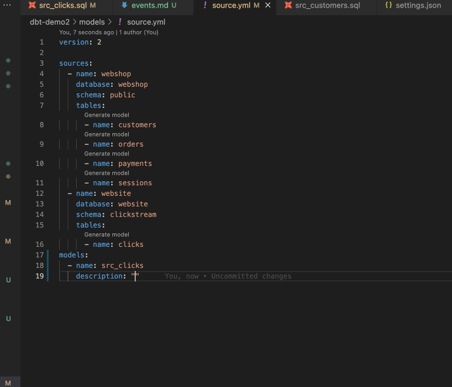
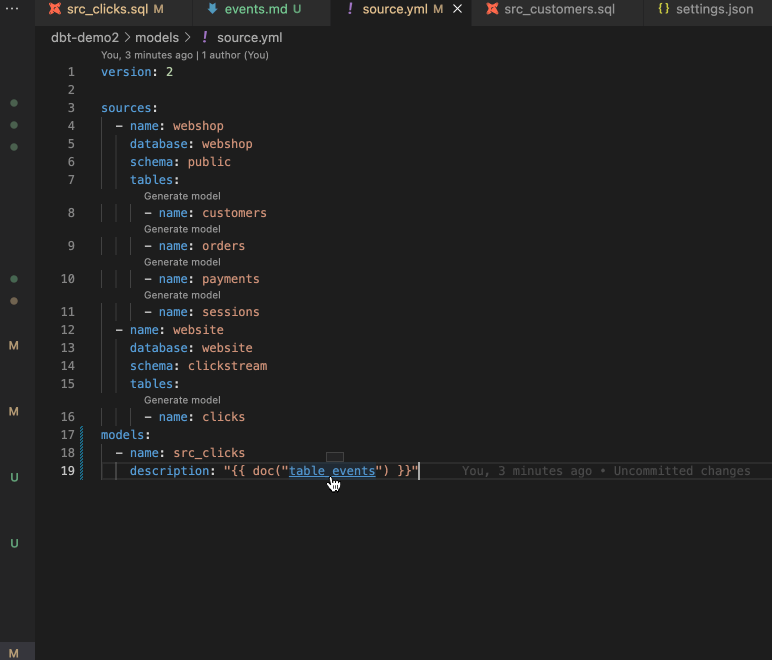
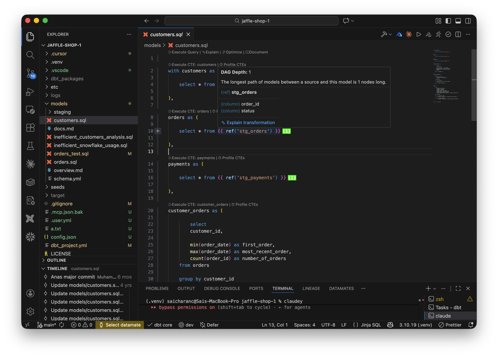
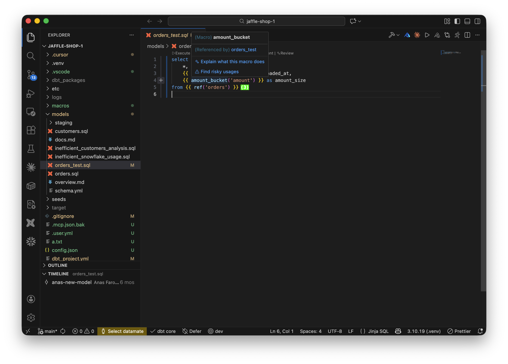

dbt-power user extension auto-completes model, macro, column names in the VSCode

## Models

a) Autocomplete model

b) Go to model definition

## Macros

/// details | a) Autocomplete macro

///

/// details | b) Go to macro definition

///

## Sources

/// details | a) Autocomplete source

///

/// details | b) Go to source definition

///

## Doc blocks

/// details | a) Autocomplete doc block

///

/// details | b) Go to doc block definition

///

## Hover actions

Hover tooltips expose **Altimate Code** action links so you can ask AI questions about whatever symbol you're inspecting without leaving the file. Clicking an action opens the Altimate Code chat beside the editor with a pre-filled prompt.

### Model hover — `ref('model_name')`

- ✨ **Explain transformation** — walks through selects, filters, joins, and aggregations step by step.

### Macro hover — `{{ macro_name(...) }}`

- ✨ **Explain what this macro does** — explains purpose, parameters, and usage.
- ⚠️ **Find risky usages** — analyzes missing args, wrong types, edge cases, and anti-patterns.

/// admonition | Looking for column-level hover actions?
    type: tip

When you hover a column's `name:` value in `schema.yml`, two more Altimate Code actions appear — ✏️ **Suggest description** and 🧪 **Suggest tests**. Those live with the doc-generation flow on the [Generate documentation](../document/generatedoc.md#single-column-hover-shortcut) page.
///

/// admonition | Hover actions delegate to the Datamates extension
    type: info

Like all Altimate Code surfaces, hover actions open the chat panel provided by the **Datamates** extension (`altimateai.vscode-altimate-mcp-server`), which is installed as a dependency of dbt Power User. The bundled chat handles BYOK or [Altimate LLM Gateway](../arch/llm-gateway.md) routing.
///
