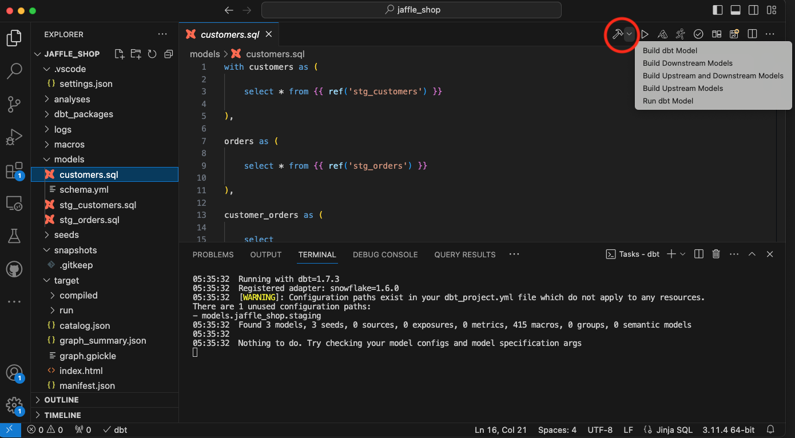
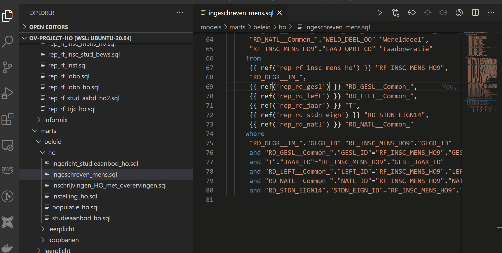
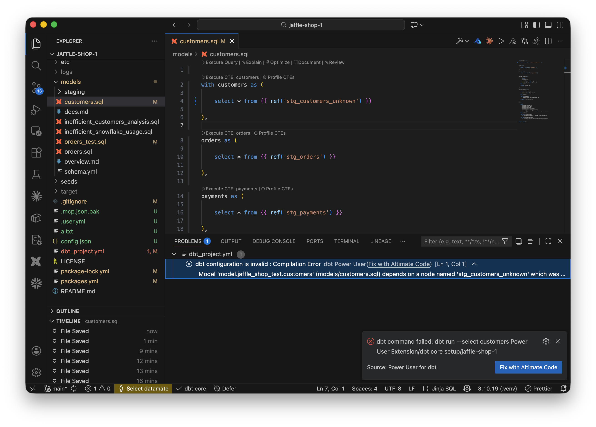
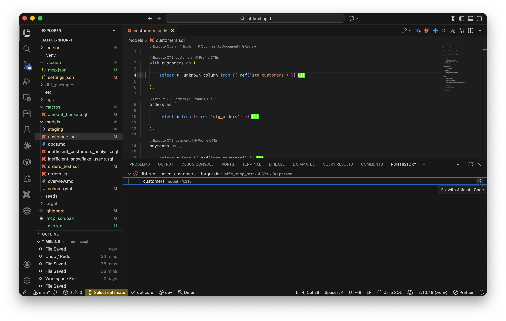
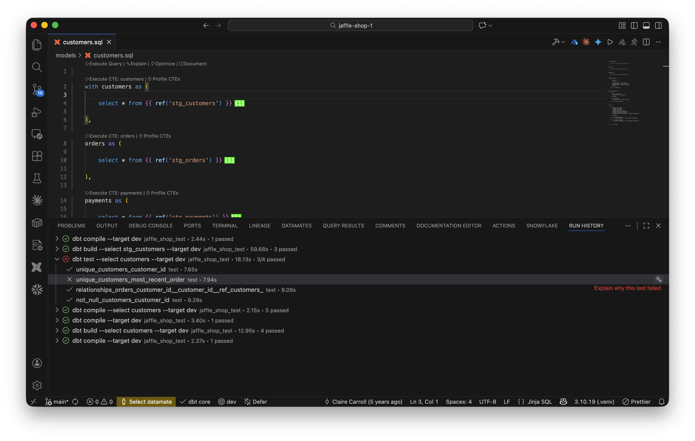

There are two methods to do it. You can either do it from the top right corner toolbar or from the extension side pane

### Method 1: Build and run models from the toolbar

The toolbar action to build models is present on the top right corner of the VSCode as shown in the image below:

### Method 2: Run models from the side panel

/// admonition | You cannot build models from the side panel
    type: info

///

## When a build fails

When `dbt build`, `dbt run`, or `dbt test` fails, the extension surfaces a **Fix with Altimate Code** button so you can jump straight into AI-assisted debugging without copying error text by hand.

There are three places the button appears:

| Failure point | Where you see it | Prompt sent to Altimate Code |
|---|---|---|
| Model fails at runtime (`run_results.json` contains an error) | Notification: *dbt: `my_model` failed* | Run command + failed resource names/types + error messages |
| dbt exits **before** generating `run_results.json` (broken `ref()`, missing node, config error) | Notification: *dbt command failed: `dbt run --select my_model`* | Exact dbt CLI command (machine paths stripped) + full stderr |
| Failed model / seed / snapshot in the **Run History** panel | Inline 💡 **Fix with Altimate Code** action on the failed row | Run command first, error in a fenced code block |

