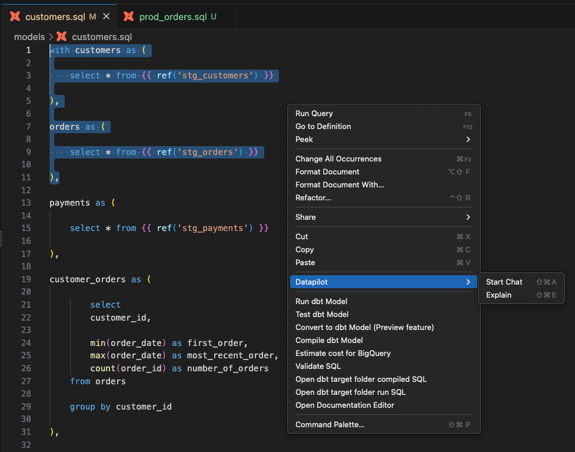
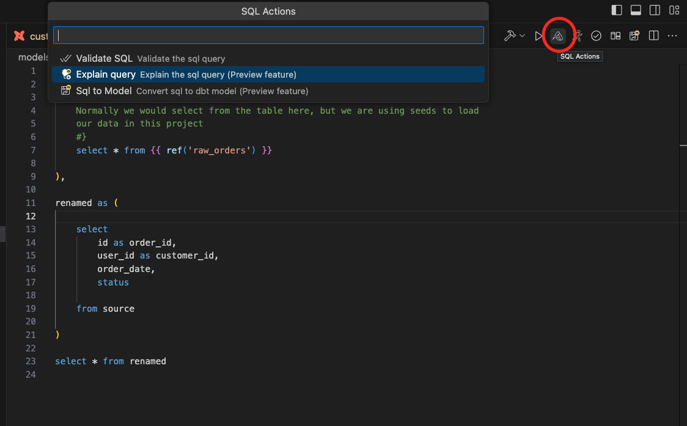
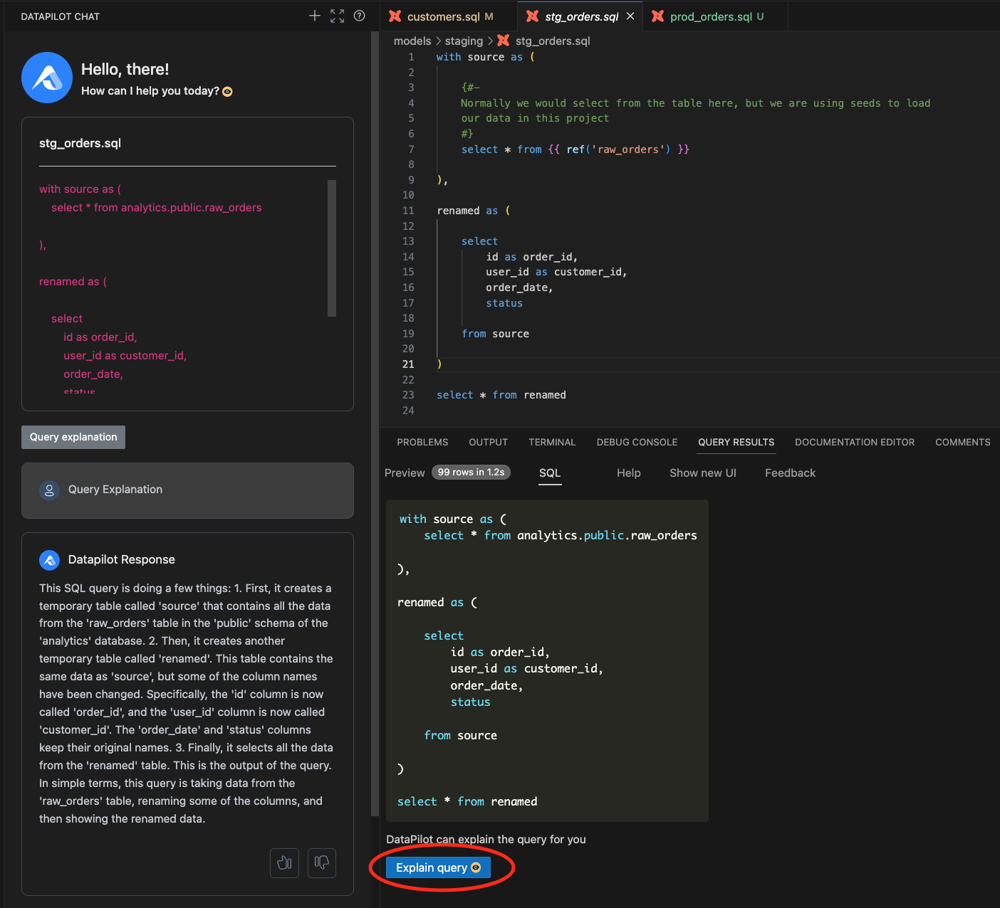
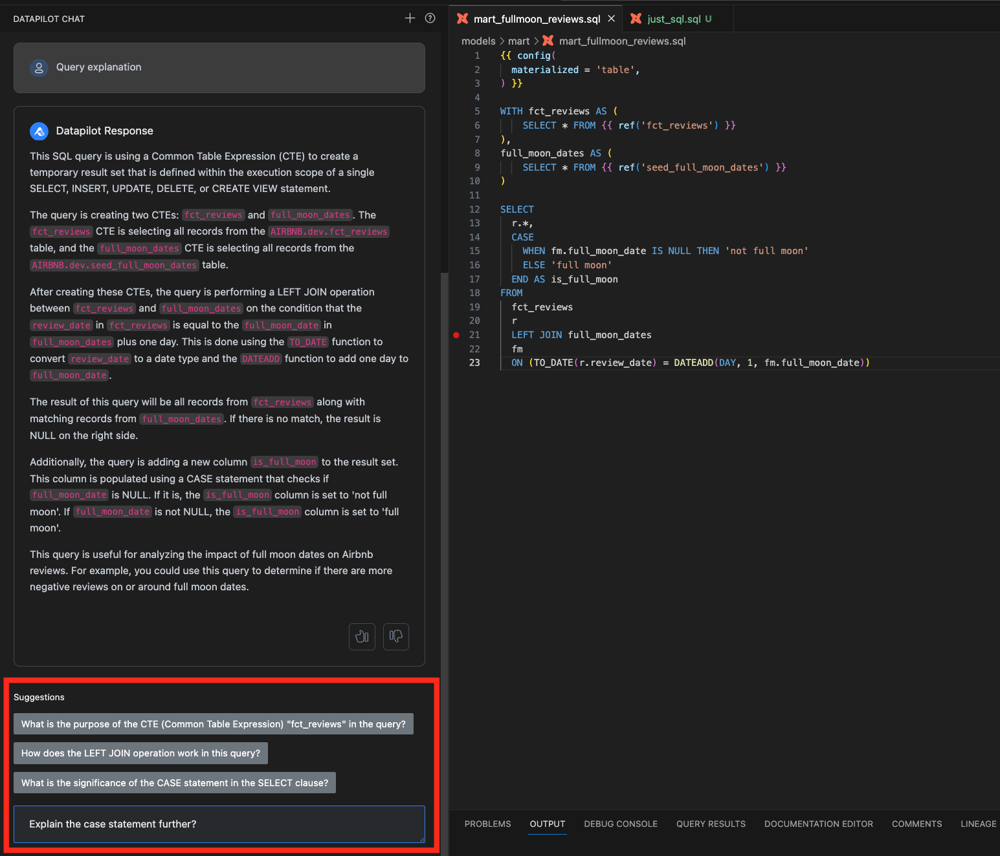

Query explanation is invaluable to understanding a complex piece of dbt or SQL code (especially written by others!).

## Start Query Explanation

You can get an explanation for the entire query code in the file or selected parts. If you need an explanation for only some part of the code, select that code first. You can trigger the query explanation functionality in three different ways.

### Right Click Menu #Right-click, select "DataPilot" menu, and choose an action to "explain" the query. 

 

### Utilize SQL actions menu

Press "SQL actions" button from the toolbar. It will open the "SQL actions" menu drawer, as shown below. Please select the "Explain query" action. 

  

### Explain query button from the query results panel

There is an explain query button in the query results panel where you can see compiled SQL. Pressing that button will start query explanation workflow. 

 

## Get more details in the DataPilot chat

Once you start the query explanation workflow in the DataPilot chat panel on the left-hand side, DataPilot will show more specific suggestions to get detailed explanations on specific areas. You can choose one of those suggestions or ask more questions in the input box below the suggestions, as shown in the image below.

 

## Recorded demo video

<iframe width="800" height="600" src="https://www.youtube.com/embed/OfAmF9cJHEw?si=ueaufGL_MObAJpbf" title="YouTube video player" frameborder="0" allow="accelerometer; autoplay; clipboard-write; encrypted-media; gyroscope; picture-in-picture; web-share" referrerpolicy="strict-origin-when-cross-origin" allowfullscreen></iframe>

/// admonition | Please provide feedback on the generated explanations using thumbs up / down buttons. Your feedback will help us tremendously to improve this functionality.
    type: tip
///

/// admonition | This feature requires an API key. You can get it by signing up for free at [www.altimate.ai](https://www.altimate.ai)
    type: info
///
