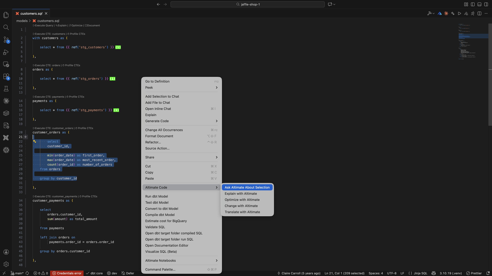
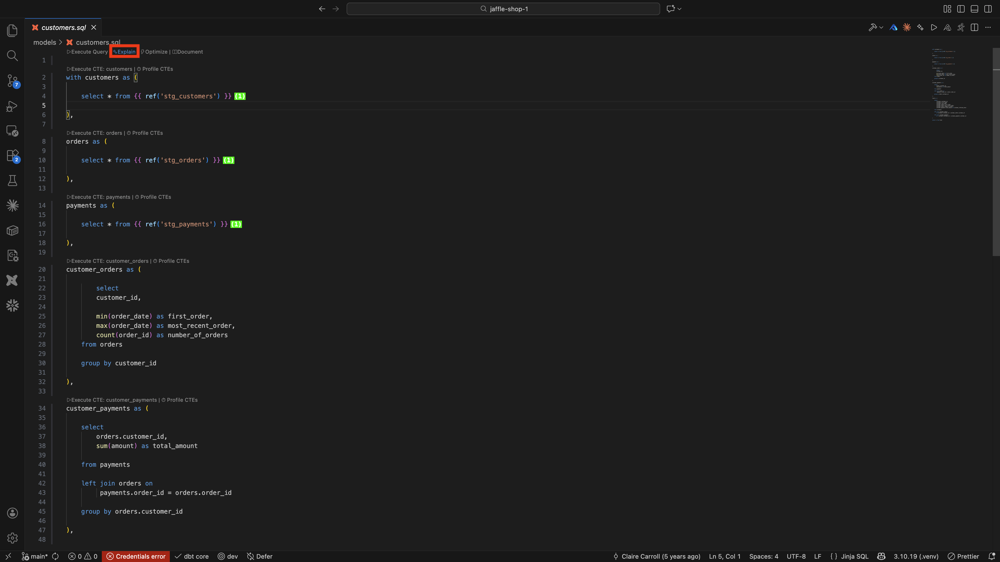
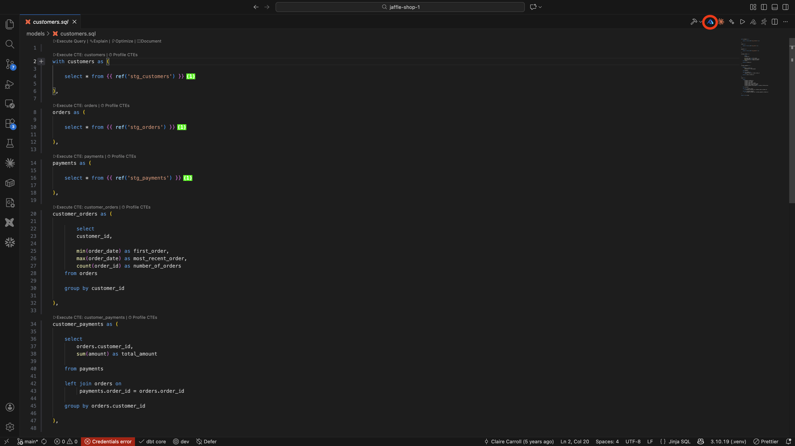
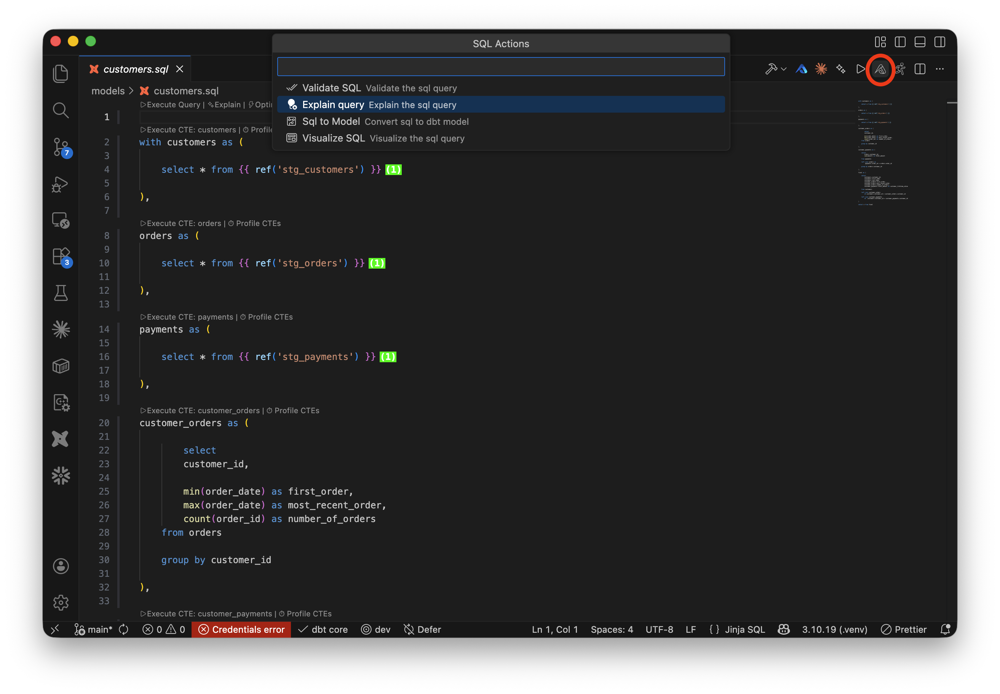
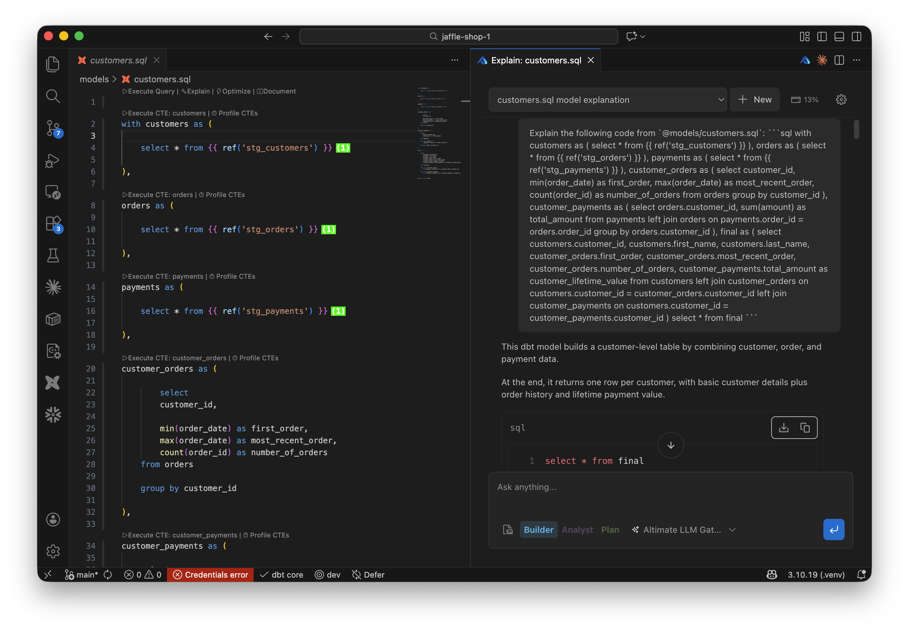

Query explanation is invaluable to understanding a complex piece of dbt or SQL code (especially written by others!).

/// admonition | Requires the Datamates extension
    type: info

Altimate Code features (Explain, Optimize, Change, Translate, Review) open a chat session through the **[Datamates](https://marketplace.visualstudio.com/items?itemName=altimateai.vscode-altimate-mcp-server)** extension. Make sure Datamates is installed and active before invoking these actions.
///

## Start Query Explanation

You can get an explanation for the entire query or a selected portion. Select the code you want explained first (or leave nothing selected to explain the whole file), then trigger the action one of four ways.

### 1. Right-click → Altimate Code → Explain with Altimate

Open the right-click context menu on a `.sql` (or `.jinja-sql`) file, expand the **Altimate Code** submenu, and choose **Explain with Altimate**.

The default Altimate Code submenu shows four actions: **Explain**, **Optimize**, **Change**, and **Translate**. Two more appear conditionally:

- **Ask Altimate About Selection** — visible only when text is selected.
- **Review with Altimate** — visible only when the file has uncommitted git changes.

### 2. Code lens at the top of the file

A code-lens row appears above every SQL file. Click **✦ Explain** to start the same flow.

### 3. Editor title bar → Open Altimate Code Chat

The sparkle icon in the editor title bar opens an Altimate Code chat directly. From there you can paste, ask, or use the file as context.

### 4. Utilize SQL actions menu

Press "SQL actions" button from the toolbar. It will open the "SQL actions" menu drawer, as shown below. Please select the "Explain query" action. 

  

## Read the explanation in the Altimate Code chat panel

Altimate Code opens in a side-panel chat (powered by the Datamates extension). It streams an explanation of the selected code and you can ask follow-up questions in the input box at the bottom.

## Recorded demo

  <iframe src="https://app.supademo.com/embed/cmp3zl9jc0ma95lqmi9teklrn?embed_v=2&utm_source=embed" loading="lazy" title="Power User Explain Query" allow="clipboard-write" frameborder="0" webkitallowfullscreen="true" mozallowfullscreen="true" allowfullscreen style="position: absolute; top: 0; left: 0; width: 100%; height: 100%;"></iframe>

/// admonition | Please provide feedback on the generated explanations using thumbs up / down buttons. Your feedback will help us tremendously to improve this functionality.
    type: tip
///

/// admonition | This feature requires an API key. You can get it by signing up for free at [www.altimate.ai](https://www.altimate.ai)
    type: info
///
