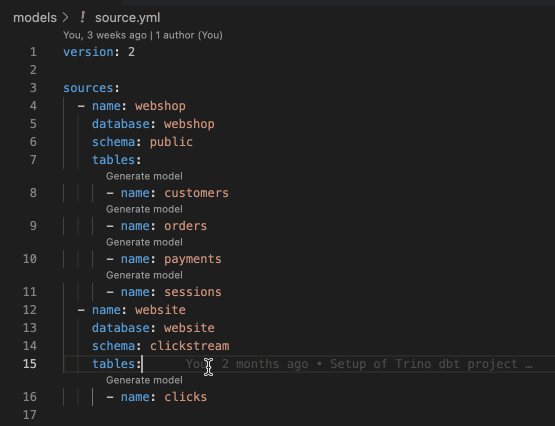
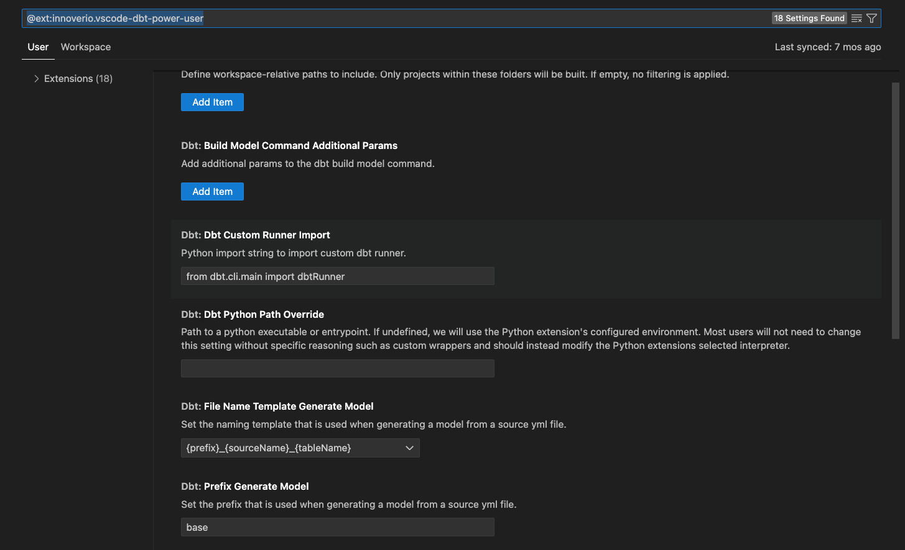

Generating model from sources defined in yaml file is very easy as below:

/// details | You can configure a file name template and prefix in the extension settings

///

/// admonition | Why does the generated model appear with the syntax {{ adapter.quote(column_name)}}?
    type: info

This syntax provides a safe way for the adapter to quote the columns.
Since the extension supports different adapters, this is the easiest way to ensure that it works for all of them.
///
