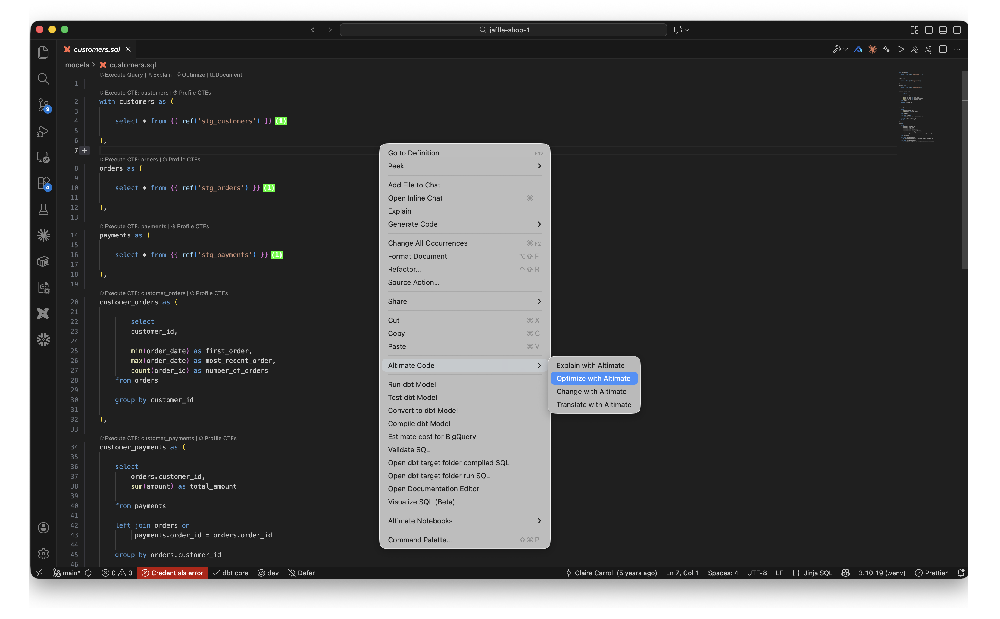
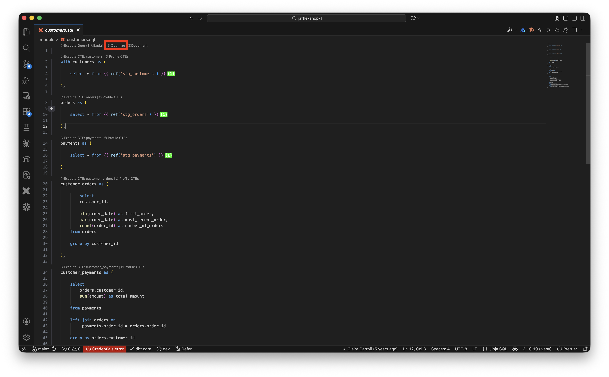
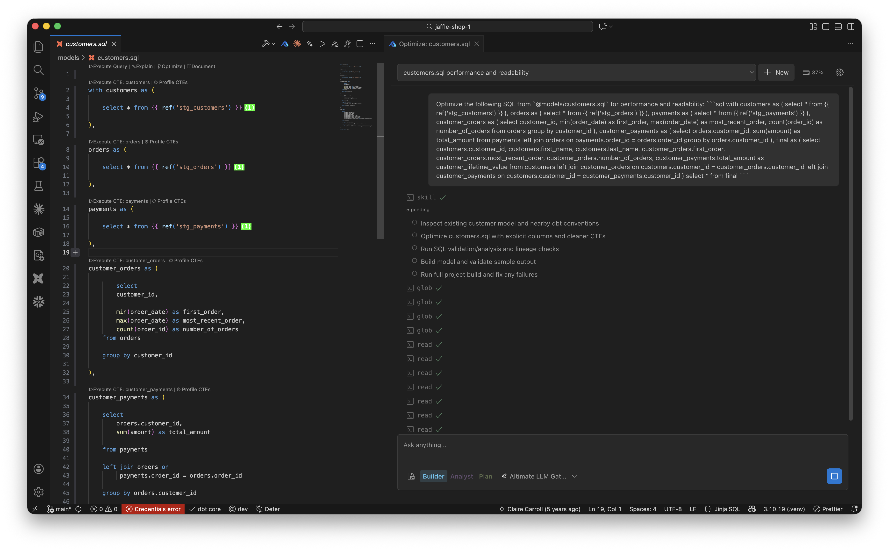

# Optimize SQL with Altimate Code

Optimize with Altimate analyzes a SQL query (or selected snippet) and suggests rewrites for performance — join order, predicate pushdown, redundant scans, unnecessary `DISTINCT` / `ORDER BY`, and dialect-specific anti-patterns.

/// admonition | Requires the Datamates extension
    type: info

Altimate Code features (Explain, Optimize, Change, Translate, Review) open a chat session through the **[Datamates](https://marketplace.visualstudio.com/items?itemName=altimateai.vscode-altimate-mcp-server)** extension. Make sure Datamates is installed and active before invoking these actions.
///

## Start an optimization

Open a `.sql` (or `.jinja-sql`) file. Optionally select the part you want to optimize — otherwise the whole file is used. You can trigger Optimize from two places.

### 1. Right-click → Altimate Code → Optimize with Altimate

Open the right-click context menu on the file, expand the **Altimate Code** submenu, and choose **Optimize with Altimate**.

/// admonition | Where to find it
    type: tip

**Optimize with Altimate** is the second entry in the Altimate Code submenu (after Explain) and only appears on `.sql` / `.jinja-sql` files.
///

### 2. Code lens at the top of the file

A code-lens row appears above every SQL file. Click **⚡ Optimize** to run the same flow.

## Review the suggestions in the Altimate Code chat panel

Altimate Code opens in a side panel and returns a rewritten query alongside an explanation of why each change should help. You can ask follow-up questions (e.g. "show me the EXPLAIN plan for the rewrite", or "keep the CTE structure but only fix the join order") in the input box at the bottom.

/// admonition | Please provide feedback on the suggestions using thumbs up / down buttons. Your feedback helps us improve this functionality.
    type: tip
///

/// admonition | This feature requires an API key. You can get it by signing up for free at [www.altimate.ai](https://www.altimate.ai)
    type: info
///
