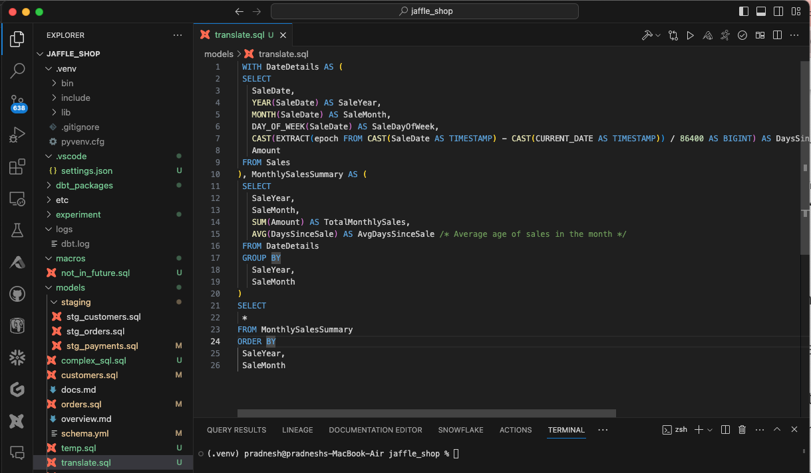
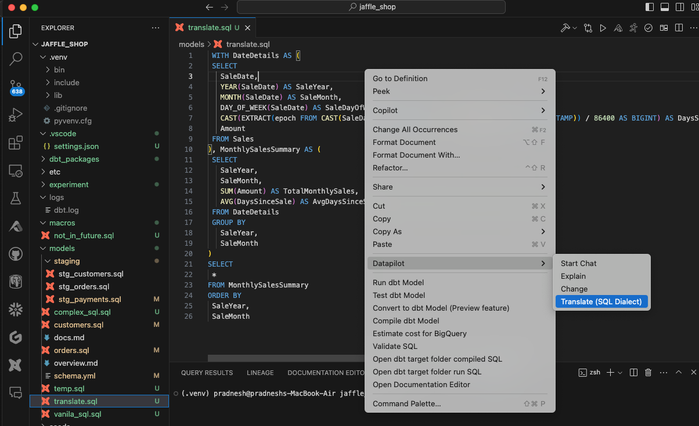
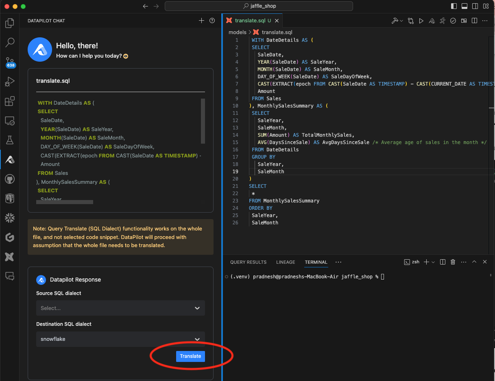
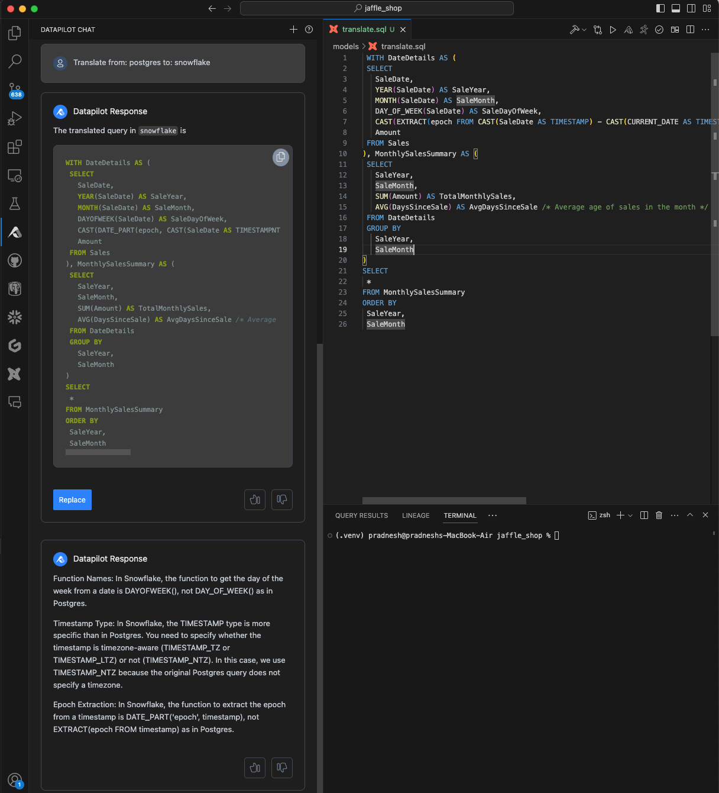

You can translate SQL queries from one dialect to another using this functionality. For example, translate query in Postgres SQL dialect to Snowflake SQL dialect

### Supported SQL dialects

athena, bigquery, clickhouse, databricks, doris, drill, duckdb, hive, mysql, oracle, postgres, presto, prql, redshift, snowflake, spark, sqlite, starrocks, tableau, teradata, trino, tsql

### Step 1: Create a new file and add SQL query

### Step 2: Right click, and choose DataPilot -> Translate (SQL Dialect)

### Step 3: Provide source and destination dialect

DataPilot chat interface will open on the left hand side, where you should provide source and destination dialects.

Source dialect: Current dialect of the SQL present in the file
Destination dialect: The SQL dialect in which you want to translate the query

/// admonition | Destination dialect value is auto-populated in the drop-down based on the data backend for current dbt Project. It can be changed by clicking on it.
type: tip
///

Hit the "Translate" button after source and destination dialects are provided.

/// admonition | Query Translate (SQL Dialect) functionality works on the whole file, and not selected code snippet. DataPilot will proceed with assumption that the whole file needs to be translated.
type: info
///

### Step 4: Review Translated SQL and Explanation

In this step, DataPilot will give you translated SQL along with explanation of what has been changed in translation.

Different databases use different functions for common operations or sometimes syntax is different. DataPilot translation takes care of these differences and it also provides explanation of those differences.

/// admonition | You can click on "Replace" button below translated query, and translate query will replace the original query in the file.
type: tip
///

### Step 5: Convert SQL to dbt Model (optional)

If needed, you can covert SQL from a file to a dbl model
with the SQL to dbt Model functionality [(details)](genmodelSQL.md)

### Limitations

/// details | Following are a few limitations

- If there are functions we can't identify, then we will not be able to convert it. In those scenario, it will be kept as is.
- We do not look at data types. If there are some data types which are not supported in the target database, we may not be able translate those
  ///

### Recorded Demo

<iframe width="800" height="600" src="https://www.youtube.com/embed/ssLpEFVNE3c?si=aT8JgDlq2BKMHzN5" title="YouTube video player" frameborder="0" allow="accelerometer; autoplay; clipboard-write; encrypted-media; gyroscope; picture-in-picture; web-share" referrerpolicy="strict-origin-when-cross-origin" allowfullscreen></iframe>
