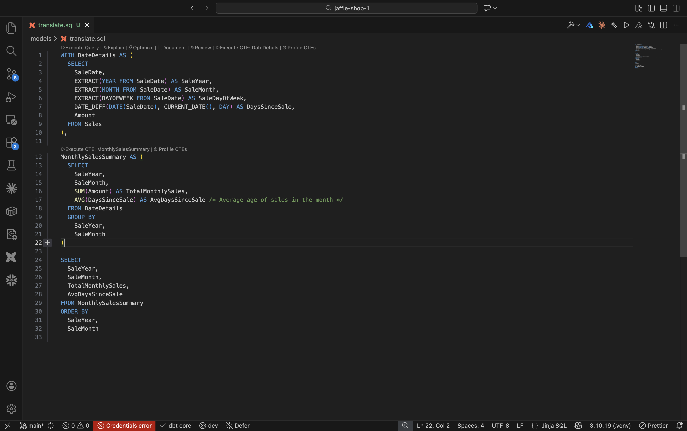
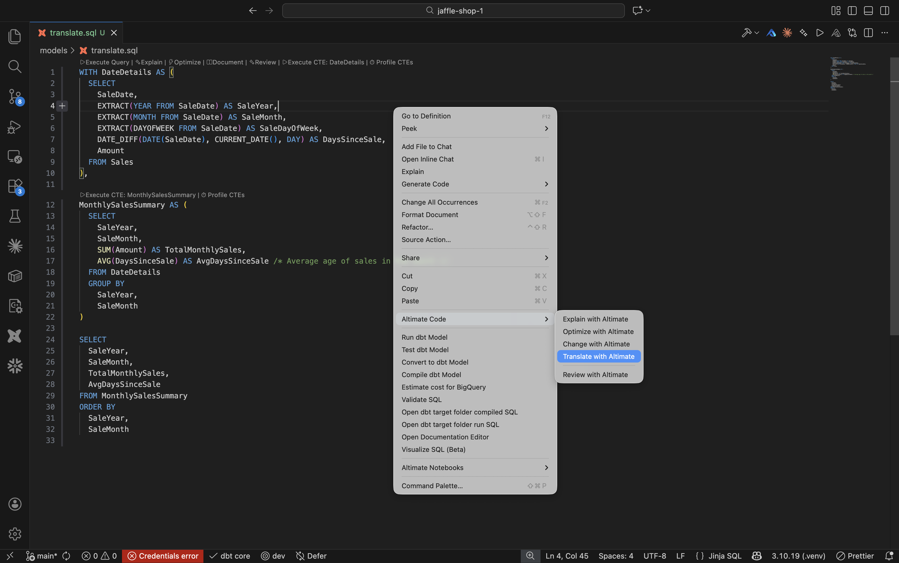
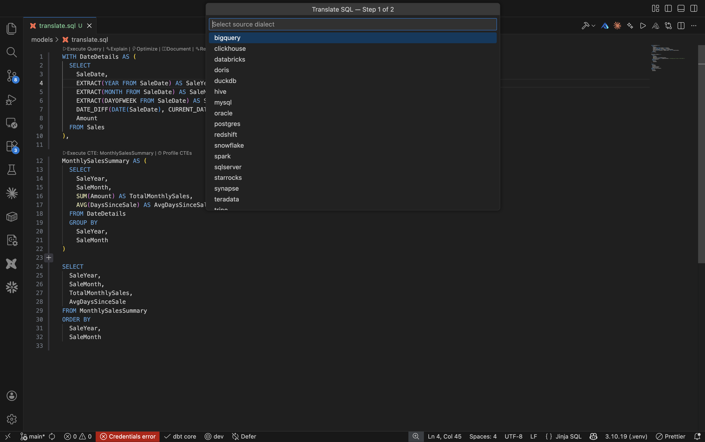
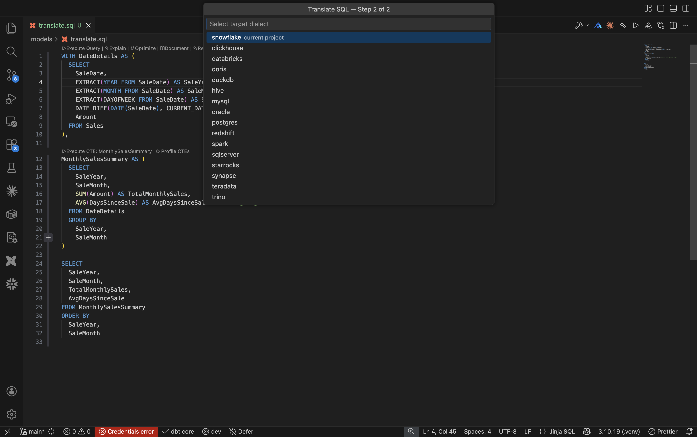
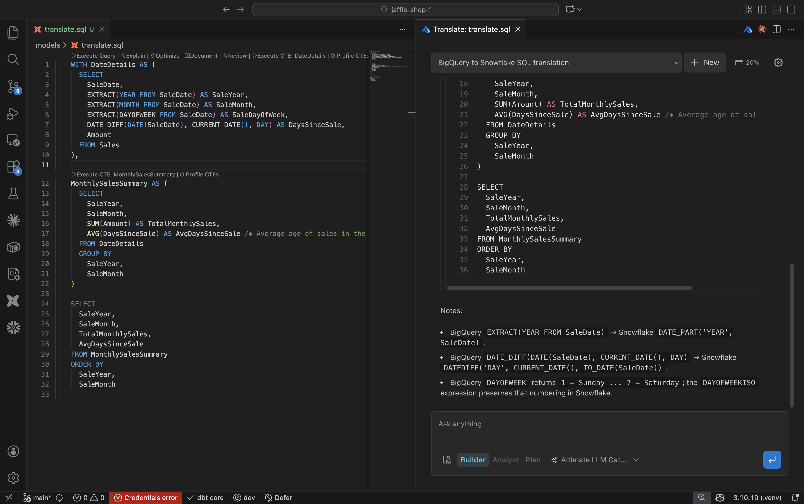

You can translate SQL queries from one dialect to another using Altimate Code. For example, translate a query in Postgres SQL dialect to Snowflake SQL dialect.

/// admonition | Requires the Datamates extension
    type: info

The **Translate with Altimate** action opens a chat session through the **[Datamates](https://marketplace.visualstudio.com/items?itemName=altimateai.vscode-altimate-mcp-server)** extension. Make sure Datamates is installed and active before invoking it.
///

### Supported SQL dialects

bigquery, clickhouse, databricks, doris, duckdb, hive, mysql, oracle, postgres, redshift, snowflake, spark, sqlserver, starrocks, synapse, teradata, trino

### Step 1: Create a new file and add the SQL query

### Step 2: Right-click → Altimate Code → Translate with Altimate

Open the right-click context menu on the `.sql` file, expand the **Altimate Code** submenu, and select **Translate with Altimate**.

/// admonition | Where to find it
    type: tip

The Altimate Code submenu shows four default actions: **Explain**, **Optimize**, **Change**, and **Translate**. **Translate with Altimate** is the fourth entry and only appears on `.sql` / `.jinja-sql` files.
///

### Step 3: Pick source and destination dialects

A two-step quick pick appears in VS Code:

1. **Translate SQL — Step 1 of 2** — pick the **source dialect** (the current dialect of the SQL in the file).

    

2. **Translate SQL — Step 2 of 2** — pick the **target dialect** (the dialect you want to translate to). The adapter type of your current dbt project is bubbled to the top of the list and marked "current project" — you can pick it or choose any other dialect.

    

/// admonition | Translation works on the whole file. Altimate Code will treat the entire file as the source query.
    type: info
///

### Step 4: Review the translated SQL and explanation

Once both dialects are selected, Altimate Code opens beside the editor and returns the translated SQL alongside an explanation of what changed. Different databases use different functions and syntax for the same operation — Altimate Code translates the differences and explains them.

### Step 5: Convert SQL to dbt Model (optional)

If needed, you can convert the translated SQL into a dbt model with the [SQL → dbt Model](genmodelSQL.md) functionality.

### Limitations

/// details | Following are a few limitations

- If there are functions we can't identify, we will not be able to convert them — they are kept as-is.
- We do not look at data types. If the target database does not support some data types, those may not be translated.
  ///

### Recorded demo

  <iframe src="https://app.supademo.com/embed/cmp40t9to0oc95lqmz096tmvc?embed_v=2&utm_source=embed" loading="lazy" title="Power User SQL Query translate" allow="clipboard-write" frameborder="0" webkitallowfullscreen="true" mozallowfullscreen="true" allowfullscreen style="position: absolute; top: 0; left: 0; width: 100%; height: 100%;"></iframe>

