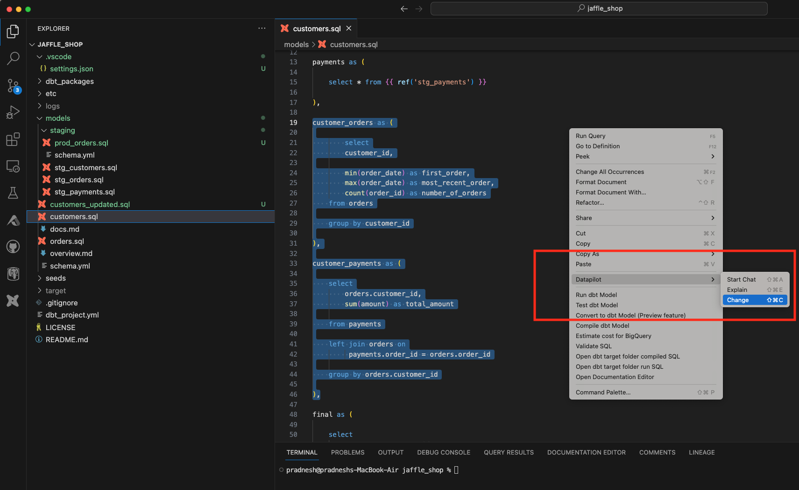
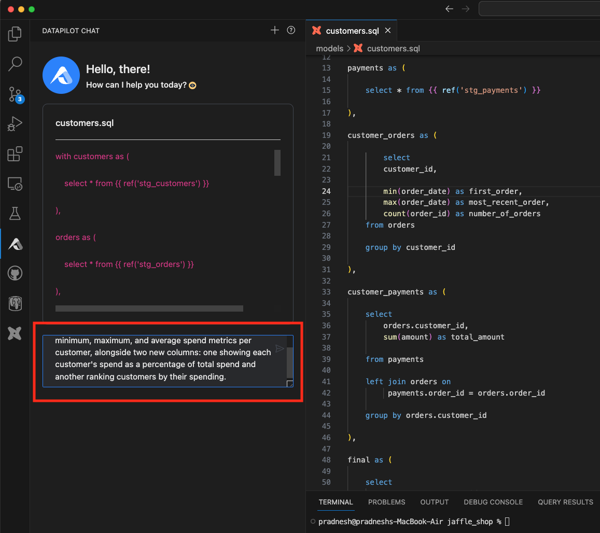
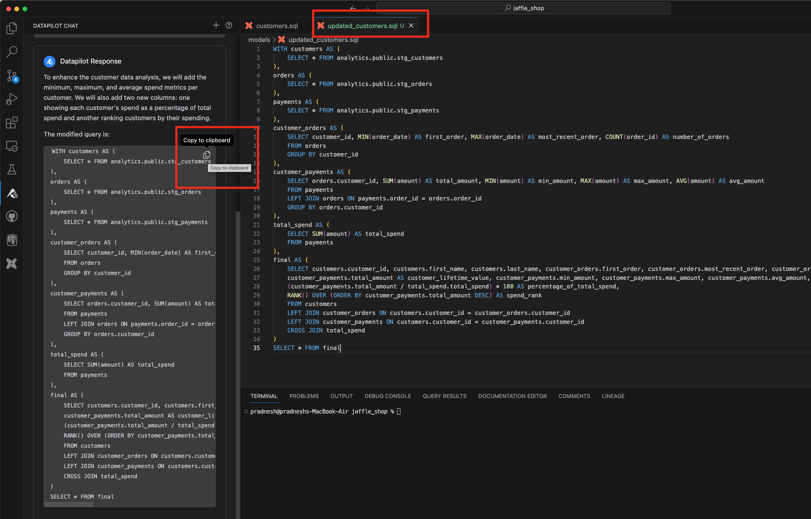

Updating or changing an existing dbt (or SQL) model using natural language is quite straightforward with this functionality.

### Step 1: Trigger the Operation

Select a piece of code, or if you want to use a whole file, right-click and choose the DataPilot menu and choose the "change" submenu

### Step 2: Instructions for Changes

Give instructions for changes in the input text box

### Step 3: Copy the Code #Copy the changed code and put it in a file

### Recorded demo video

<iframe width="800" height="600" src="https://www.youtube.com/embed/TqyNhLTRD0M?si=TJXknBYz1fVpMFAi" title="YouTube video player" frameborder="0" allow="accelerometer; autoplay; clipboard-write; encrypted-media; gyroscope; picture-in-picture; web-share" referrerpolicy="strict-origin-when-cross-origin" allowfullscreen></iframe>

/// admonition | Please provide feedback on the generated explanations using thumbs up / down buttons. Your feedback will help us tremendously to improve this functionality.
type: tip
///

/// admonition | This feature requires an API key. You can get it by signing up for free at [www.altimate.ai](https://www.altimate.ai)
type: info
///
