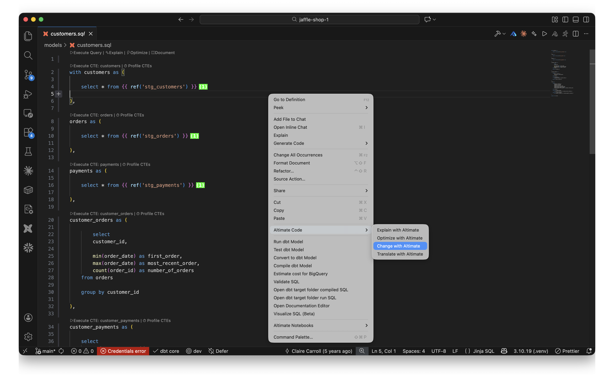
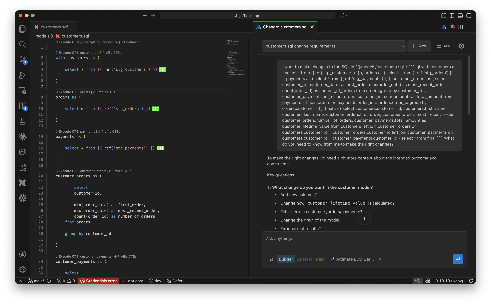
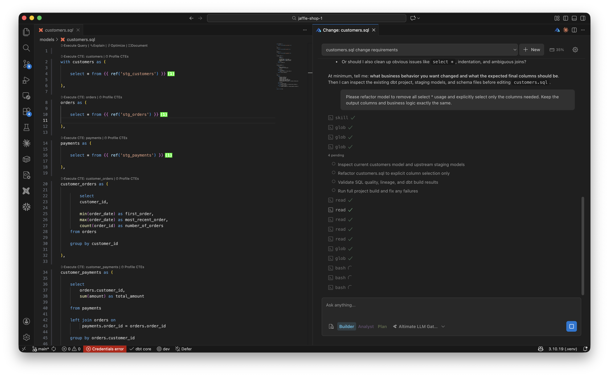
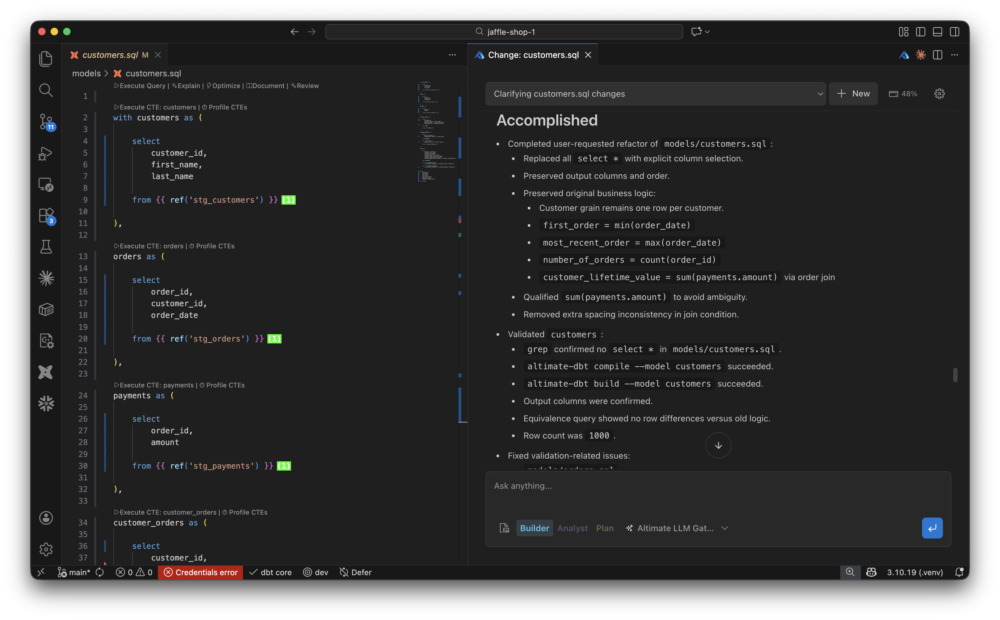

Updating or changing an existing dbt (or SQL) model using natural language is straightforward through Altimate Code.

/// admonition | Requires the Datamates extension
    type: info

The **Change with Altimate** action opens a chat session through the **[Datamates](https://marketplace.visualstudio.com/items?itemName=altimateai.vscode-altimate-mcp-server)** extension. Make sure Datamates is installed and active before invoking it.
///

### Step 1: Trigger the operation

Open a `.sql` (or `.jinja-sql`) file. Optionally select the portion you want to change. Right-click and choose **Altimate Code → Change with Altimate**.

/// admonition | Where to find it
    type: tip

The Altimate Code submenu shows four actions by default: **Explain**, **Optimize**, **Change**, and **Translate**. **Change with Altimate** is the third entry and only appears on `.sql` / `.jinja-sql` files.
///

### Step 2: Describe the change

Altimate Code opens in a side panel and asks for context about the change you want. Type the instruction (e.g. "add a column for monthly revenue, joined from `orders`"). It may ask clarifying questions before producing a diff — answer them inline.

### Step 3: Review the accomplished changes

Altimate Code shows an Accomplished summary listing every change it made (replaced columns, preserved business logic, validated builds, etc.). Review the summary then continue iterating with follow-up questions if needed.

/// admonition | Please provide feedback on the result using thumbs up / down buttons. Your feedback will help us tremendously to improve this functionality.
    type: tip
///

/// admonition | This feature requires an API key. You can get it by signing up for free at [www.altimate.ai](https://www.altimate.ai)
    type: info
///
