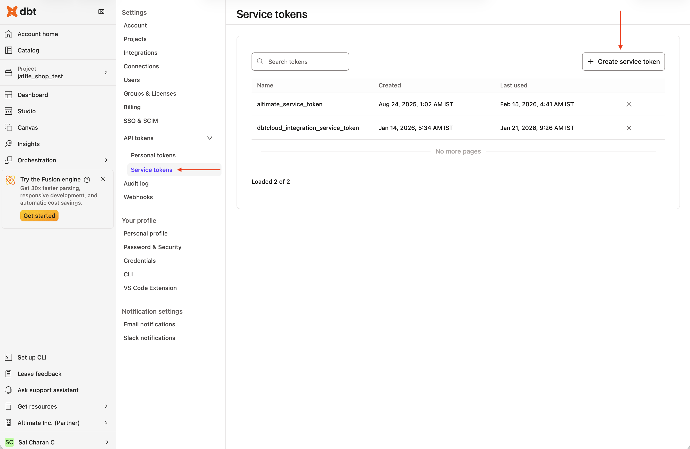
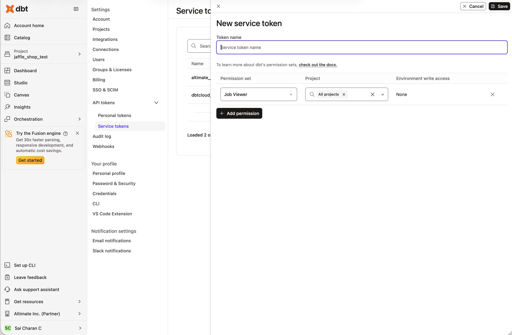
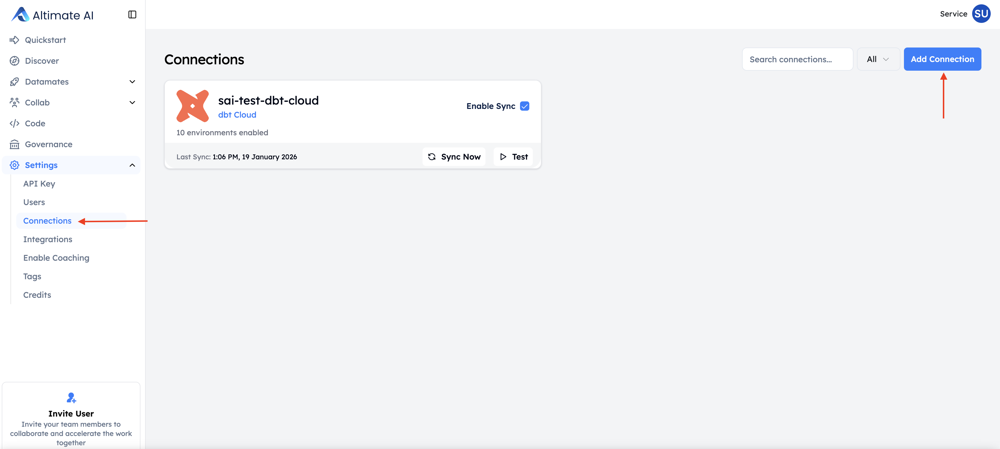

For **dbt Cloud** users, Altimate can automatically sync artifacts (`manifest.json`, `catalog.json`) from your dbt Cloud runs using the dbt Cloud API. This eliminates the need for manual file uploads or CLI commands.

/// admonition | Please note that this lineage and documentation in UI functionality is not yet supported with dbt 1.8
    type: info
///

## Prerequisites: Create a dbt Cloud Service Token

Before setting up the connection, create a service token in dbt Cloud with **Job Viewer** permission. This grants read-only access to the Jobs API for fetching artifacts (`manifest.json`, `catalog.json`) from your dbt Cloud runs.

1. Click your account name in the left menu and select **Account settings**
2. Select **Service Tokens** from the left sidebar
3. Click **+ New Token**
4. Enter a descriptive name (e.g., "Altimate Integration")
5. Assign the **Job Viewer** permission and select the projects you want to sync
6. Click **Save**
7. **Important**: Copy and save the token immediately — you won't be able to view it again

/// admonition | Permission availability may vary by dbt Cloud plan. Refer to the [dbt Cloud Service Tokens documentation](https://docs.getdbt.com/docs/dbt-cloud-apis/service-tokens) for details.
    type: info
///

## Create a dbt Cloud Connection

1. Navigate to **Settings -> Connections** and click **Create new connection**
2. Select **dbt Cloud** as the connection type
3. Provide the required connection details:
    - **Service Account Token**: Paste the token you created in the prerequisites step above
    - **Account ID**: Available at `https://cloud.getdbt.com/next/settings/accounts/{{account_id}}`
    - **Custom URL** (optional): For custom dbt Cloud instances (defaults to `https://cloud.getdbt.com/api/v2/`)
4. Click **Test Connection** to verify your setup
5. Configure the sync schedule:
    - **Scheduled**: Sync artifacts on a regular schedule. Select from Daily, Weekly, or Monthly frequency options and choose the time (UTC) when sync should occur (e.g., Daily at 12:00 AM UTC)
    - **Real-time**: (Coming soon) Immediate sync when dbt Cloud runs complete
6. Click **Create Connection**

After creation, your dbt Cloud projects and environments will be automatically discovered.

  <iframe src="https://app.supademo.com/embed/cml93jv5t01in180iqac81nl2?embed_v=2&utm_source=embed" loading="lazy" title="dbt Cloud Integration" allow="clipboard-write" frameborder="0" webkitallowfullscreen="true" mozallowfullscreen="true" allowfullscreen style="position: absolute; top: 0; left: 0; width: 100%; height: 100%;"></iframe>

/// admonition | Automatic syncing keeps your documentation and lineage always up-to-date without manual intervention.
    type: tip
///

/// admonition | The dbt Cloud connection deletion has a processing delay of a few hours. If you need to recreate the same connection immediately, contact us.
    type: warning
///
