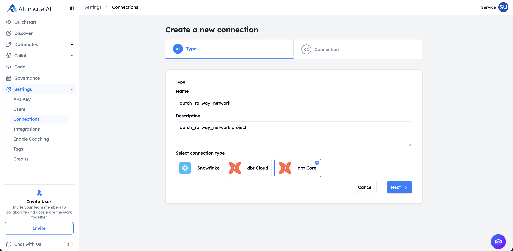
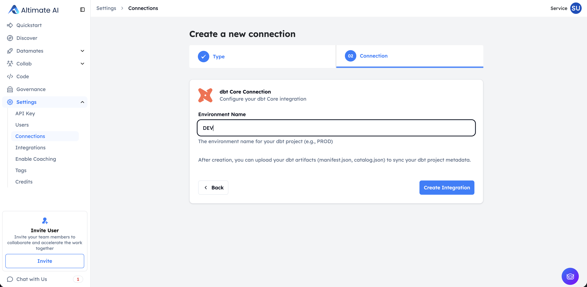
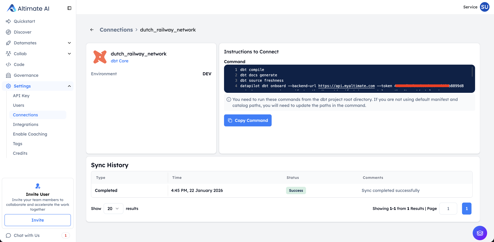

This page covers the setup steps necessary to view your **dbt Core** project's documentation and lineage in the SaaS UI.

The steps below ship your `manifest.json` and `catalog.json` to the SaaS UI in order to visualize information like dbt model/column descriptions and column lineage.

/// admonition | Please note that this lineage and documentation in UI functionality is not yet supported with dbt 1.8
    type: info
///

/// admonition | If you want to re-create any existing dbt Core integration using Connections, kindly delete the existing integration first and then create a fresh connection.
    type: warning
///

## Step 1: Create a dbt Core Connection

1. Navigate to **Settings -> Connections** and click **Create new connection**

    

2. Select **dbt Core** as the connection type & provide the required connection name & description details

    

3. Provide **Environment Name** & Click **Create Connection** to create the dbt Core connection

    

| Field                  | Description                                                                                                                                                                                        |
| ---------------------- | -------------------------------------------------------------------------------------------------------------------------------------------------------------------------------------------------- |
| Connection name        | Unique connection name, this can be mapped to your dbt Project                                                                                                                                     |
| Connection description | A brief description of the connection (e.g., "Production dbt Core project for analytics")                                                                                                          |
| Environment name       | Environment name can be based on which environment that you are going to upload manifest.json and catalog.json files from. For now, just add the value as "prod" for your production environments.  |

## Step 2: Install the open-source DataPilot CLI

The next step is to install the latest version of DataPilot CLI. It will be used to upload manifest and catalog files to the SaaS instance. Please run the following command to install the latest version of the DataPilot CLI.

```
pip install altimate-datapilot-cli --upgrade
```

Here's the link to the repo: [https://github.com/AltimateAI/datapilot-cli](https://github.com/AltimateAI/datapilot-cli)

## Step 3: Execute the command for uploading the manifest and catalog files

Go to **Settings -> Connections** page and click on the dbt Core connection name for the connection created. Copy the command for uploading files in the overlay screen on the side.

/// admonition | manifest and catalog files don't contain any information about your data. It's all metadata about your environment. Please feel free to check our [security page](/arch/faq/) for more info on how we protect your metadata.
    type: info
///

<br>

You need to update the following placeholders in the copied command -

| Placeholder                    | Description                                                                                                                        | Example                         |
| ------------------------------ | ---------------------------------------------------------------------------------------------------------------------------------- | ------------------------------- |
| Path/to/manifest/file          | This is path to your manifest file in the project directory. It's usually stored in the 'target' directory in your dbt project.    | ./target/manifest.json          |
| Path/to/catalog/file           | This is the path to your catalog file in the project directory. It's usually stored in the 'target' directory in your dbt project. | ./target/catalog.json           |
| Path/to/run-results/file       | Path to your run results file in the project directory                                                                              | ./target/run_results.json       |
| Path/to/semantic-manifest/file | Path to your semantic manifest file in the project directory                                                                        | ./target/semantic_manifest.json |
| Path/to/sources/file           | Path to your sources file in the project directory                                                                                  | ./target/sources.json           |

/// admonition | In addition to the required `manifest.json` and `catalog.json`, we now support uploading additional artifacts — `run_results.json`, `semantic_manifest.json`, and `sources.json` — for richer insights. These are optional but recommended for complete visibility into your dbt project.
    type: info
///

/// admonition | If you are missing manifest.json or catalog.json files in the target directory, please run the `dbt build` and `dbt docs generate` commands. Also, you can add steps to upload the manifest and catalog files command in your dbt pipelines. That way, you will always have up-to-date documentation and lineage in UI without any manual steps.
    type: tip
///

Here's the sample output after running the command and successfully uploading your files.

```
(.venv) pradnesh@pradneshs-MacBook-Air jaffle_shop % datapilot dbt onboard --backend-url https://api.tryaltimate.com --token 00x0x0x0x0x0x0 --instance-name freemegatenant --dbt_core_integration_id 1 --dbt_core_integration_environment prod --manifest-path ./target/manifest.json --catalog-path ./target/catalog.json
Manifest onboarded successfully!
Catalog onboarded successfully!
Manifest and catalog ingestion has started. You can check the status at https://freemegatenant.demo.tryaltimate.com/settings/integrations/1/prod

```

/// admonition | It takes a few minutes to upload the files and sync that info with the rest of the UI. You can check the status of the upload by going to the link provided in the command output.
    type: tip
///

## Automating with CI/CD Pipelines

To ensure your dbt documentation and lineage in the UI stays up-to-date automatically, we strongly recommend integrating the manifest and catalog upload process into your CI/CD pipeline. This eliminates manual steps and ensures that any changes to your dbt project are immediately reflected in the SaaS UI.
