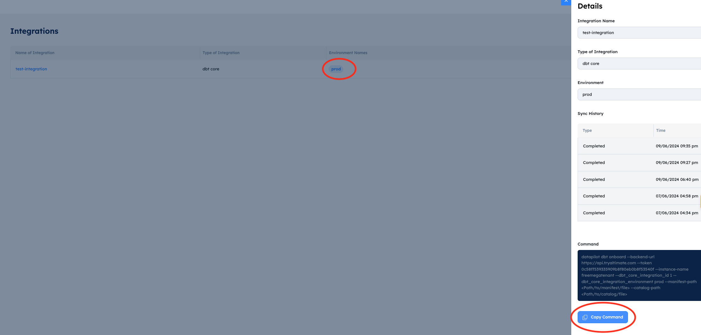

This page covers the setup steps necessary to view your dbt documentation and lineage in the SaaS UI.
The steps below ship your manifest.json and catalog.json projects to SaaS UI in order to visualize information like dbt model/column descriptions and column lineage.

/// admonition | Please note that this lineage and documentation in UI functionality is not yet supported with dbt 1.8
    type: info
///

## Step 1: Add new integration in the "Settings" area

From the navigation menu on the left-hand side, go to Settings -> Integrations area. Click on (Add Integration) button on the top right corner.
A new UI page will open as shown below - please add the following information.

<br>

| Field            | Description                                                                                                                                                                                        |
| ---------------- | -------------------------------------------------------------------------------------------------------------------------------------------------------------------------------------------------- |
| Integration name | Unique integration name, this can be mapped to your dbt Project                                                                                                                                    |
| Integration type | "dbt-core" This is a fixed field for now, that cannot be changed by the user as the functionality is only available for the dbt-core users                                                         |
| Environment name | Environment name can be based on which environment that you are going to upload manifest.json and catalog.json files from. For now, just add the value as "prod" for your production environments. |

## Step 2: Install the open-source DataPilot CLI

The next step is to install the latest version of DataPilot CLI. It will be used to upload manifest and catalog files to the SaaS instance. Please run the following command to install the latest version of the DataPilot CLI.

```
pip install altimate-datapilot-cli --upgrade
```

Here's the link to the repo: [https://github.com/AltimateAI/datapilot-cli](https://github.com/AltimateAI/datapilot-cli)

## Step 3: Execute the command for uploading the manifest and catalog files

Go to Settings->Integrations page and click on the environment name for the integration you just created. Copy the command for uploading files in the overlay screen on the side.

/// admonition | manifest and catalog files don't contain any information about your data. It's all metadata about your environment. Please feel free to check our [security page](https://docs.myaltimate.com/arch/faq/) for more info on how we protect your metadata.
    type: info
///

<br>

You need to update the following placeholders in the copied command -

| Placeholder            | Description                                                                                                                       | Example                |
| ---------------------- | --------------------------------------------------------------------------------------------------------------------------------- | ---------------------- |
| Path/to/manifest/file | This is path to your manifest file in the project directory. It's usually stored in the 'target' directory in your dbt core project.   | ./target/manifest.json |
| Path/to/catalog/file   | This is the path to your catalog file in the project directory. It's usually stored in the 'target' directory in your dbt core project | ./target/catalog.json  |

## Commands to download manifest and catalog files from DBT Cloud:

### 1. Download manifest.json
```bash
curl -X GET \
  "https://cloud.getdbt.com/api/v2/accounts/${ACCOUNT_ID}/runs/${RUN_ID}/artifacts/manifest.json" \
  -H "Authorization: Token ${DBT_CLOUD_TOKEN}" \
  -o manifest.json
```

### 2. Download catalog.json
```bash
curl -X GET \
  "https://cloud.getdbt.com/api/v2/accounts/${ACCOUNT_ID}/runs/${RUN_ID}/artifacts/catalog.json" \
  -H "Authorization: Token ${DBT_CLOUD_TOKEN}" \
  -o catalog.json
```

### Required Environment Variables

- `ACCOUNT_ID` - Your DBT Cloud account ID
- `RUN_ID` - The specific run ID for the artifacts
- `DBT_CLOUD_TOKEN` - Your DBT Cloud API authentication token

/// admonition | If you are missing manifest.json or catalog.json files in the target directory, please run the 'dbt build' and 'dbt docs' commands. Also, you can add steps to upload the manifest and catalog files command in your dbt pipelines. That way, you will always have up-to-date documentation and lineage in UI without any manual steps.
    type: tip
///
Here's the sample output after running the command and successfully uploading your files.

```
(.venv) pradnesh@pradneshs-MacBook-Air jaffle_shop % datapilot dbt onboard --backend-url https://api.tryaltimate.com --token 00x0x0x0x0x0x0 --instance-name freemegatenant --dbt_core_integration_id 1 --dbt_core_integration_environment prod --manifest-path ./target/manifest.json --catalog-path ./target/catalog.json
Manifest onboarded successfully!
Catalog onboarded successfully!
Manifest and catalog ingestion has started. You can check the status at https://freemegatenant.demo.tryaltimate.com/settings/integrations/1/prod

```

/// admonition | It takes a few minutes to upload the files and sync that info with the rest of the UI. You can check the status of the upload by going to the link provided in the command output.
    type: tip
///

## Automating with CI/CD Pipelines

To ensure your dbt documentation and lineage in the UI stays up-to-date automatically, we strongly recommend integrating the manifest and catalog upload process into your CI/CD pipeline. This eliminates manual steps and ensures that any changes to your dbt project are immediately reflected in the SaaS UI.

## Automatic Sync with dbt Cloud Connection

For dbt Cloud users, you can now set up automatic artifact syncing in the SaaS UI using the dbt Cloud API connection. This eliminates the need for manual file uploads or CLI commands.

### Prerequisites: Create a dbt Cloud Service Token

Before setting up the connection, create a service token in dbt Cloud with **Job Viewer** permission. This grants read-only access to the Jobs API for fetching artifacts (manifest.json, catalog.json) from your dbt Cloud runs.

1. Click your account name in the left menu and select **Account settings**
2. Select **Service Tokens** from the left sidebar
3. Click **+ New Token**
4. Enter a descriptive name (e.g., "Altimate Integration")
5. Assign the **Job Viewer** permission and select the projects you want to sync
6. Click **Save**
7. **Important**: Copy and save the token immediately — you won't be able to view it again

> **Note**: Permission availability may vary by dbt Cloud plan. Refer to the [dbt Cloud Service Tokens documentation](https://docs.getdbt.com/docs/dbt-cloud-apis/service-tokens) for details.


### Setup Steps

1. Navigate to **Settings -> Connections** and click **Create new connection**
2. Select **dbt Cloud** as the connection type
3. Provide the required connection details:
4. **Service Account Token**: Generate a new Service Token from dbt Cloud Account Settings ([learn more](https://docs.getdbt.com/docs/dbt-cloud-apis/service-tokens))
5. **Account ID**: Available at `https://cloud.getdbt.com/next/settings/accounts/{{account_id}}`
6. **Custom URL** (optional): For custom dbt Cloud instances (defaults to `https://cloud.getdbt.com/api/v2/`)
7. Click **Test Connection** to verify your setup
8. Configure the sync schedule:
    - **Scheduled**: Sync artifacts on a regular schedule. Select from Daily, Weekly, or Monthly frequency options and choose the time (UTC) when sync should occur (e.g., Daily at 12:00 AM UTC)
    - **Real-time**: (Coming soon) Immediate sync when dbt Cloud runs complete
9. Click **Create Connection**

After creation, your dbt Cloud projects and environments will be automatically discovered.

/// admonition | Automatic syncing keeps your documentation and lineage always up-to-date without manual intervention
    type: tip
///

/// admonition | The dbt cloud connection deletion has a processing delay of a few hours. If you need to recreate the same connection immediately, contact us.
    type: warning
///

## Recorded Demo

<div style="position: relative; padding-bottom: 62.5%; height: 0;"><iframe src="https://www.loom.com/embed/04c57021a56144358d78140eee45a989?sid=67a35e98-48cb-4800-a38b-9392133337cb" frameborder="0" webkitallowfullscreen mozallowfullscreen allowfullscreen style="position: absolute; top: 0; left: 0; width: 100%; height: 100%;"></iframe></div>
