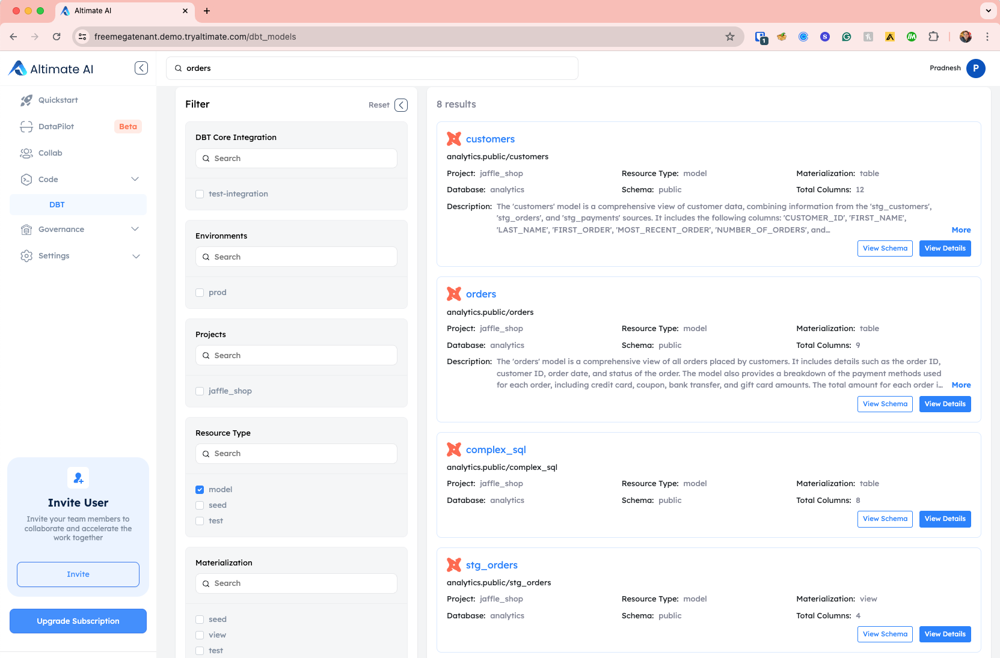

This page highlights functionality for searching and viewing documentation for your DBT Projects. Please go to Code -> dbt from the navigation menu on the left-hand side to view all your dbt models, seeds, and other components.

/// admonition | [Setups steps](./setupui.md) needed for the information to show in SaaS UI
    type: warning
///

## Search and Filter

On top of that, you can search for specific entities or columns by name via the search bar. This search also searches across the descriptions written for models and columns. On the left-hand side, there are different filters available for dbt project name, entity type, materialization etc., so you can filter different entities easily.
 

## View Schema

Suppose you want to get a quick view of the schema. Click "View Schema" button for a particular dbt Model, and the side screen will quickly show the view of schemas. In this view, you can also quickly see the documentation written for the model and columns.
 

## View Details (Docs)

The "View details" button takes you to a more detailed view, where you can see the schema, documentation, lineage, and code information.
 

In addition to schemas, you can also view the actual code and compiled code in the "Code" tab.

## Recorded Demo

<iframe width="560" height="315" src="https://www.youtube.com/embed/JUuQM6Hxcwg?si=HAAU3UQWHQR7LssQ" title="YouTube video player" frameborder="0" allow="accelerometer; autoplay; clipboard-write; encrypted-media; gyroscope; picture-in-picture; web-share" referrerpolicy="strict-origin-when-cross-origin" allowfullscreen></iframe>

/// admonition | Using this feature requires an API key. You can get it by signing up for free at [www.altimate.ai](https://www.altimate.ai) Also, you need to perform the setup steps outlined on the [Setup UI page](setupui.md)
    type: info
///
