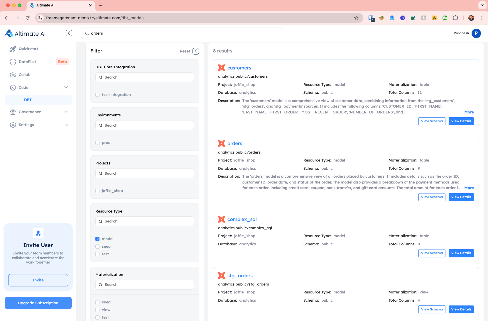
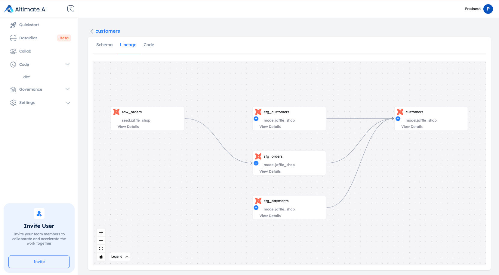
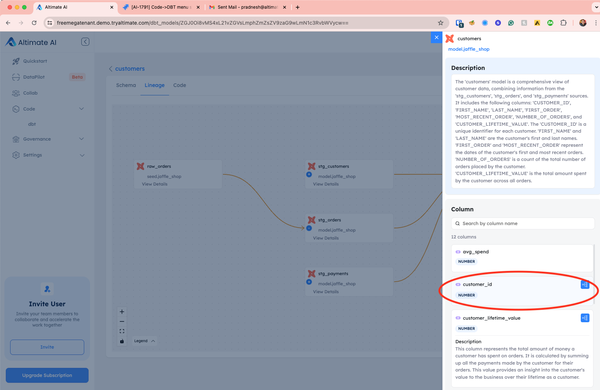
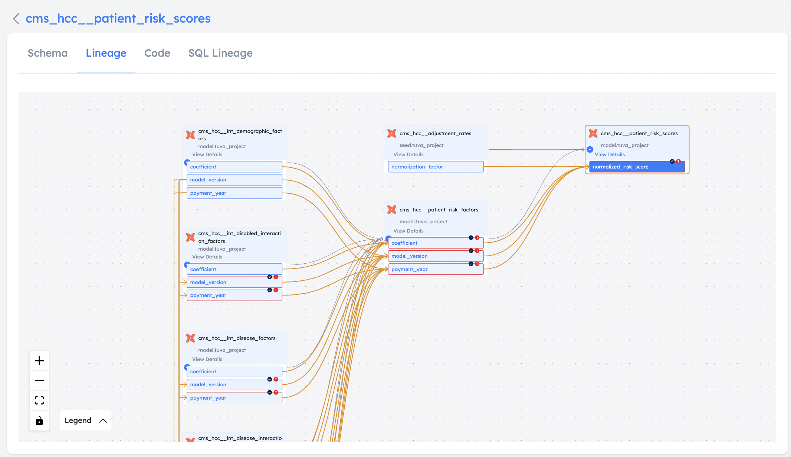
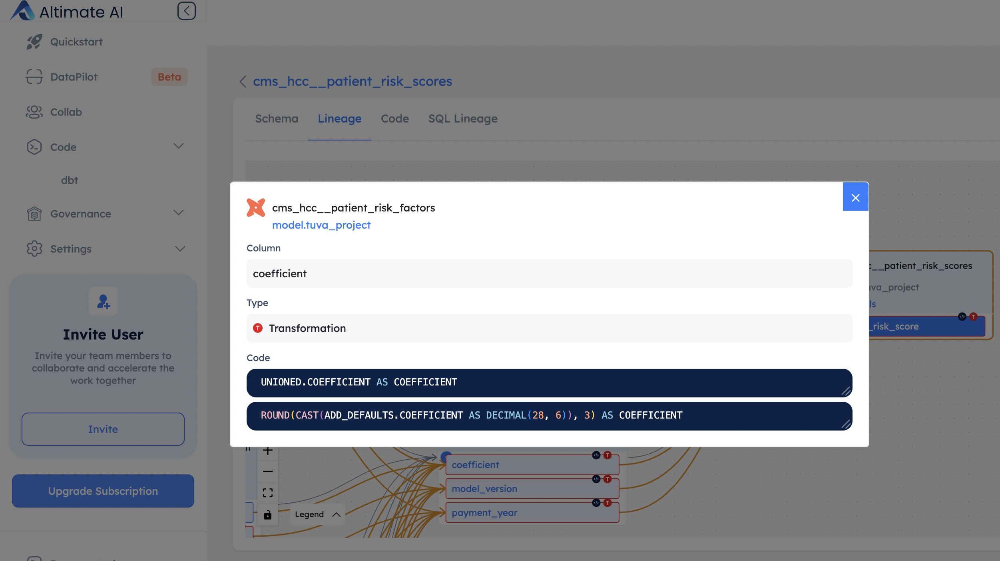

In the DataPilot SaaS UI, you can see model level as well as column level lineage. You can also see the types of changes that occurred during the column lineage traversal
e.g. column was unchanged or alias was used

/// admonition | [Setups steps](./setupui.md) needed for the information to show in SaaS UI
type: warning
///

## View Model Level Lineage

Go to code -> dbt from the left-hand navigation menu and see the available list of dbt Models. You can also search on the top or use provided filters to find the exact model you are looking for.

 

Click on the "View Details" button and go to the Lineage tab. You can expand the lineage further by clicking on (+) signs on individual blocks.

 

/// admonition | If you click on the specific model in the lineage view, the lineage graph for only that model will be highlighted, as shown in the image above.
type: tip
///

## View Column Level Lineage

In order to view column-level lineage, first click on "View Details" button in one of models shown in the lineage view. This will display a list of columns present in the model.
Click on the column for which you need to view the lineage.

 

Once you click on the column, you will see the column lineage view as below:

 

## Code transformations

You can also see how that particular column was created from previous stage columns via transformation information available as icons at each block level.
The following type of transformations are shown in this view:

| Type           | Description                                           |
| -------------- | ----------------------------------------------------- |
| Original       | The original column in the lineage graph              |
| Alias          | Alias was used on the previous stage columns          |
| Transformation | Transformation was used on the previous stage columns |
| Unchanged      | No change was made in the previous stage column       |
| Not sure       | Not known how this column was created                 |

If code is available for a particular transformation, a small code icon is displayed. When you click on the code icon, it shows the list of code transformations that were performed to create that column.

## Recorded Demo

<iframe width="560" height="315" src="https://www.youtube.com/embed/JUuQM6Hxcwg?si=cT8KfuVBz-lm43WC&amp;start=116" title="YouTube video player" frameborder="0" allow="accelerometer; autoplay; clipboard-write; encrypted-media; gyroscope; picture-in-picture; web-share" referrerpolicy="strict-origin-when-cross-origin" allowfullscreen></iframe>

/// admonition | Using this feature requires an API key. You can get it by signing up for free at [www.altimate.ai](https://www.altimate.ai) Also, you need to perform the setup steps outlined on the [Setup UI page](setupui.md)
type: info
///
