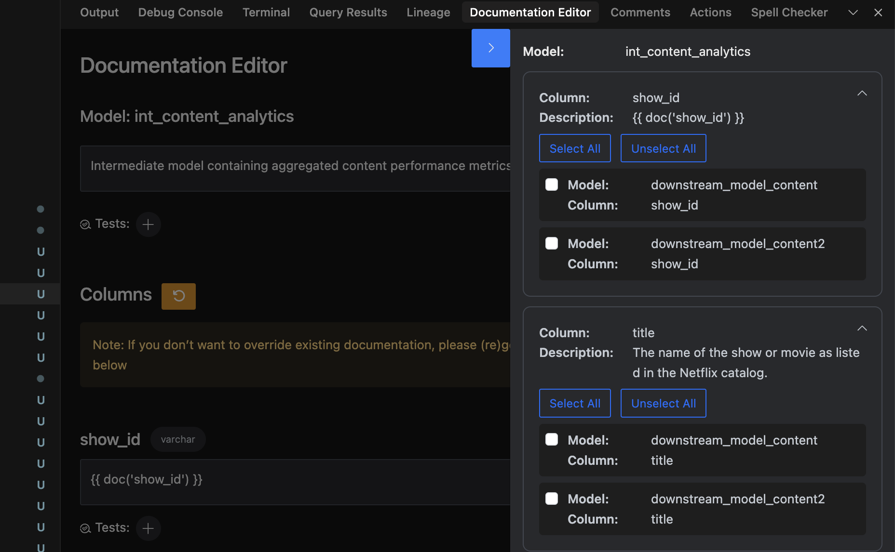

# Support for dbt Doc Blocks

dbt Power User provides comprehensive support for dbt doc blocks, allowing you to create, manage, and reference documentation blocks throughout your dbt project.

<div style="position: relative; box-sizing: content-box; max-height: 80vh; max-height: 80svh; width: 100%; aspect-ratio: 1.5470008952551477; padding: 40px 0 40px 0;"><iframe src="https://app.supademo.com/embed/cmc2au66hkebpsn1r4gfbewnf?embed_v=2" loading="lazy" title="Use Doc Blocks in dbt with the Power User for dbt Extension" allow="clipboard-write" frameborder="0" webkitallowfullscreen="true" mozallowfullscreen="true" allowfullscreen style="position: absolute; top: 0; left: 0; width: 100%; height: 100%;"></iframe></div>

## What are dbt Doc Blocks?

Doc blocks are reusable documentation components in dbt that allow you to define documentation once and reference it multiple times across your project. They're defined in `.md` files and can contain any markdown content including text, images, tables, and code snippets.

```markdown

This is a reusable documentation block that can be referenced throughout your dbt project.


```

## Referencing Doc Blocks

### In Schema Files

Doc blocks can be referenced in your `schema.yml` files for consistent documentation across models:

```yaml
version: 2

models:
  - name: my_model
    description: "{{ doc('my_model') }}"
    columns:
      - name: model_id
        description: "{{ doc('model_id') }}"
```

## Propagating Doc Blocks

Using the Propagate Docs Selector - you can select which downstream models you want to propagate docs to:


