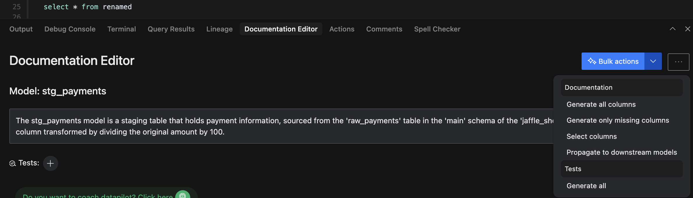
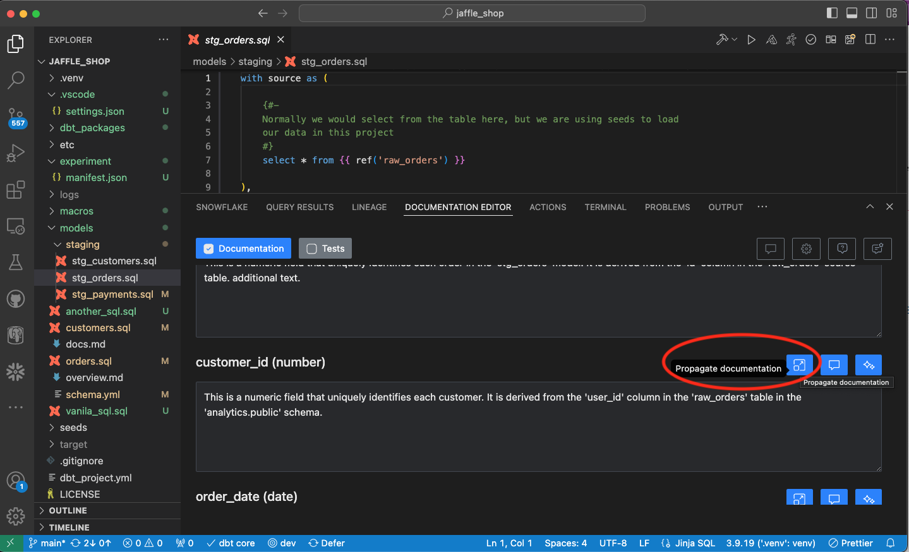
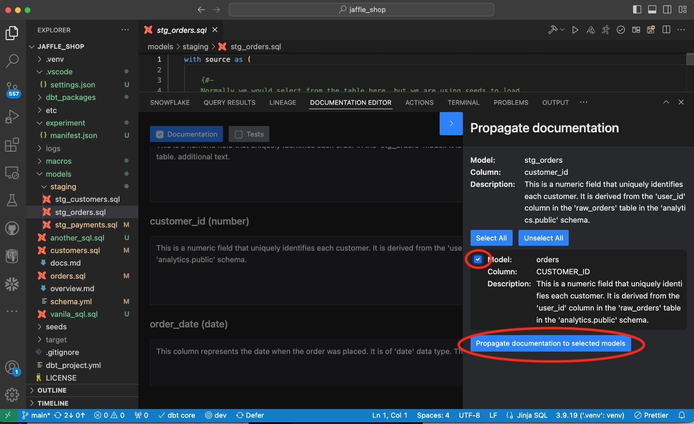

Instead of writing documentation manually, you can generate the documentation!

### Bulk generate documentation

Bulk documentation generation is possible for all columns. You can also choose to bulk-generate documentation only for columns that are missing descriptions.

### Regenerate documentation based on preferences around length and persona

We have added the DataPilot chat panel on the left-hand side. There, you can regenerate documentation based on specific preferences e.g. personas, content length.

### Language and Persona Settings

When it comes to generating documentation, the following settings are available:  
**Language:** You can choose between French, English, Dutch, German at this time.  
**Personas:** you can choose between technical user, business user and general user. If you specify general user, we don't use specific persona to generate documentation.

<iframe src="https://app.supademo.com/embed/cm8og6wbf02pi110iisz3eqfc?embed_v=2" loading="lazy" title="Documentation Settings" allow="clipboard-write" frameborder="0" webkitallowfullscreen="true" mozallowfullscreen="true" allowfullscreen style="position: absolute; top: 0; left: 0; width: 100%; height: 100%;"></iframe>

 Settings can be configured in the settings panel. Settings panel is opened by clicking "Settings" button in the top right corner of the Documentation Editor tab.

Existing documentation (whether generated or written manually) can be further updated using regeneration functionality with DataPilot.

/// admonition | Save changes in YAML file
type: tip
You can save the changes in the existing or a new YAML file with save button at the bottom of the panel.
If you see any issues with the content that's saved in the YAML file, please check the [optional config section](../setup/optConfig.md/#column-name-setup-for-yaml-file-updates).
///

### Propagate docs to downstream models

You can propagate already written descriptions to downstream model columns easily.

**First, click on "Docs Propagation" button for the particular column**

**Select columns in different models where docs should be propagated**

Select the checkboxes for right columns in models and click on the "Propagate documentation to selected models" button

### Personalize and Coach AI

You can personalize and coach the Documentation Writer AI teammate.

/// admonition | Personalize and Coach Documentation Writer AI
type: tip
Please check more info about how to personalize and coach documentation writer AI teammate [here](../teammates/coach.md).
If you would like to learn more about AI teammates, please check this [doc page](../teammates/introduction.md)
///

### Documentation Collaboration

You can also enable reviews of documentation via collaboration workflow. Please check details [here](../govern/collaboration.md#document-collaboration-workflow)

### Interactive Demo

Here's a demo of generating model and column descriptions:

<interactive demo of generating documentation>

<iframe src="https://app.supademo.com/embed/cm8oeopuq03drzh0i0yyvsxw7" allow="clipboard-write" frameborder="0" webkitallowfullscreen="true" mozallowfullscreen="true" allowfullscreen style="position: absolute; top: 0; left: 0; width: 100%; height: 100%;"></iframe>

/// admonition | Document generation or propagation requires an API key. You can get it by signing up for free at [www.altimate.ai](https://wwww.altimate.ai)
type: info
///

### Recorded Demo

  <iframe style="position: absolute; top: 0; left: 0; width: 100%; height: 100%;" 
          src="https://www.youtube.com/embed/8EuBDEuYZ2o" 
          title="YouTube video player" 
          frameborder="0" 
          allow="accelerometer; autoplay; clipboard-write; encrypted-media; gyroscope; picture-in-picture; web-share" 
          referrerpolicy="strict-origin-when-cross-origin" 
          allowfullscreen>
  </iframe>

