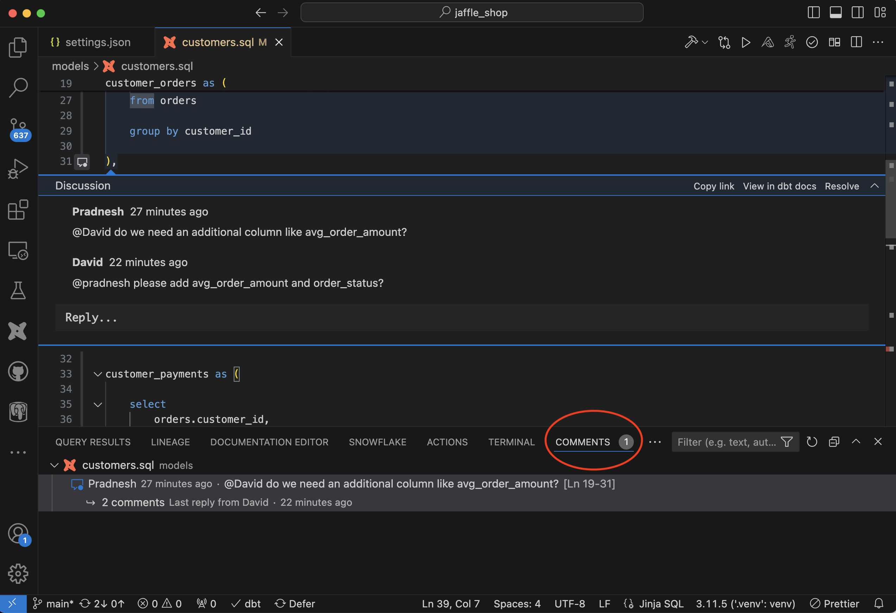
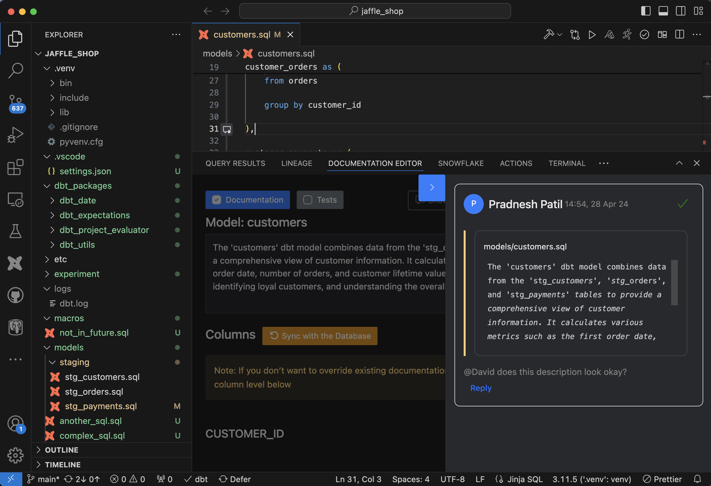

Collab functionality enables you to discuss code and documentation easily with the stakeholders via VSCode and UI. Many stakeholders are not comfortable using IDE directly; this functionality enables them also to have a discussion with technical users.

## Code Collaboration Workflow

/// admonition | Code Collaboration workflow allows you to discuss code without creating a PR
    type: tip
///

### Start a discussion

You can start a discussion at the file or code block levels (single or multiple lines) by pressing (+) sign next to the code.

 

/// admonition | If you click on the display icon as shown in the image above, you can show details of the discussion previously started
    type: tip
///

When a discussion is started, the extension generates dbt docs and uploads those docs to the Altimate AI SaaS instance so that non-technical stakeholders can contribute to the discussion via SaaS UI as well.

### Add a comment

Once the discussion is started, you can publish a comment and also tag other users from the Altimate AI SaaS instance.

 

/// admonition | If you don't want to tag the user but still want to share the link with them, just copy the link from the comments box, and share it with them manually (Slack, Email etc.)
    type: tip
///

### Email notification (if a user is tagged)

Tagger user receives an email notification with a link to open the discussion in the Altimate AI UI.

 

### Non-technical users can reply to comment via UI

### Technical user can see the comment in IDE directly

The technical user who started the discussion in IDE can see the replies from other users directly in the IDE.

The discussion can continue from here onwards or it can be resolved by clicking resolve action available on top of the comment textbox. Discussion can be started from a UI also
similarly, by clicking on (+) sign next to the code blocks.

## Document Collaboration Workflow

Table and column descriptions can also be reviewed and discussed with this functionality.

### Start a discussion

Discussion can be started via VSCode in the Documentation Editor panel or from SaaS product UI also from the link shared as covered in code collaboration workflow above.

### Add a comment

You can add a comment and tag a user to the comment. In that case, that particular user will receive an email notification to open the discussion. Please check the code collaboration workflow for email notification example.

### View all doc discussions

You can view all doc discussion on line no. 1 of the model file, and copy discussion links from there. Click on the display icon shown on the left-hand side of line no. 1.

You can copy the documentation discussion link from here and share it with other users. You can also resolve the discussion as needed.

## Lineage Export Workflow

You can export lineage from IDE to SaaS UI and share the URL with other team members for better collaboration

### Export lineage

You can export model-level and column-level lineage. Just click the export button at the top of the panel and give the export a name.

Once you create an export, a link will be generated at the bottom. You can copy this link and share it with others.

### View Lineage in SaaS

Anyone can use this link, and view the lineage in SaaS UI.

You can also view the lineage from the list of all exported lineage views available from "Collab" -> "Export Lineage" left-hand side navigation

/// admonition | In order to view the lineage in SaaS UI from the link, a user needs to be registered in the same Altimate AI instance
    type: info
///

## Recorded Demo

<iframe width="800" height="600" src="https://www.youtube.com/embed/pI1U94j-pOI?si=ckfDMYqeVgjBmg-7" title="YouTube video player" frameborder="0" allow="accelerometer; autoplay; clipboard-write; encrypted-media; gyroscope; picture-in-picture; web-share" referrerpolicy="strict-origin-when-cross-origin" allowfullscreen></iframe>

/// admonition | This feature requires an API key. You can get it by signing up for free at [www.altimate.ai](https://www.altimate.ai)
    type: info
///
