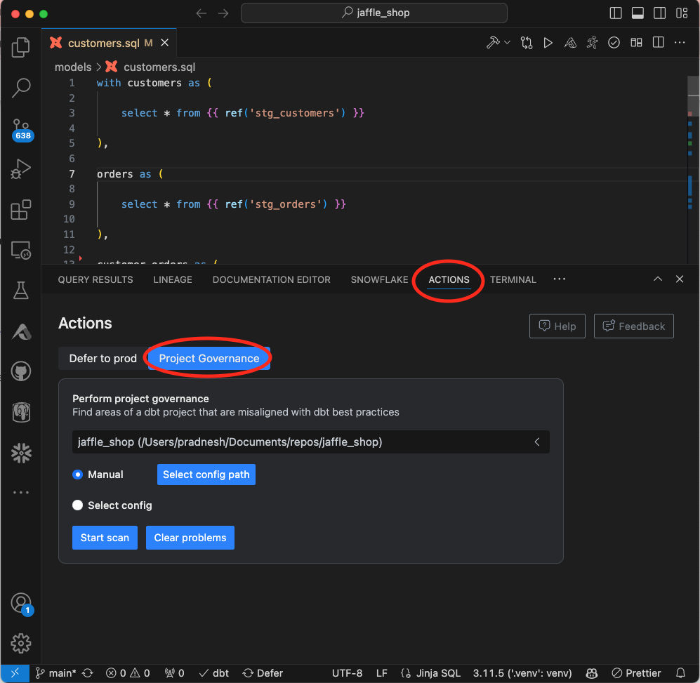
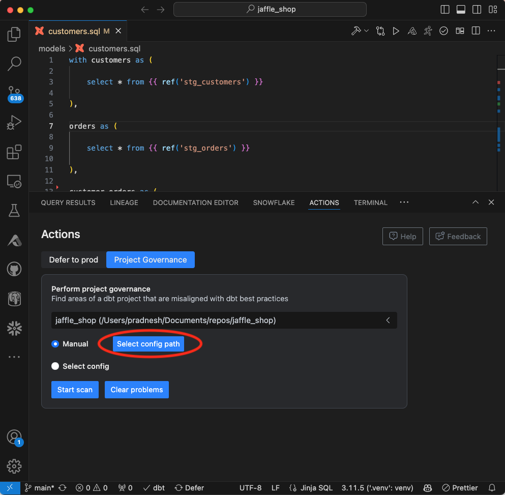
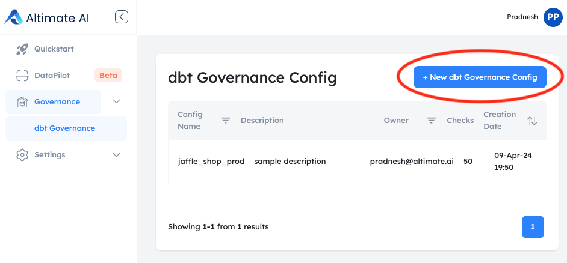
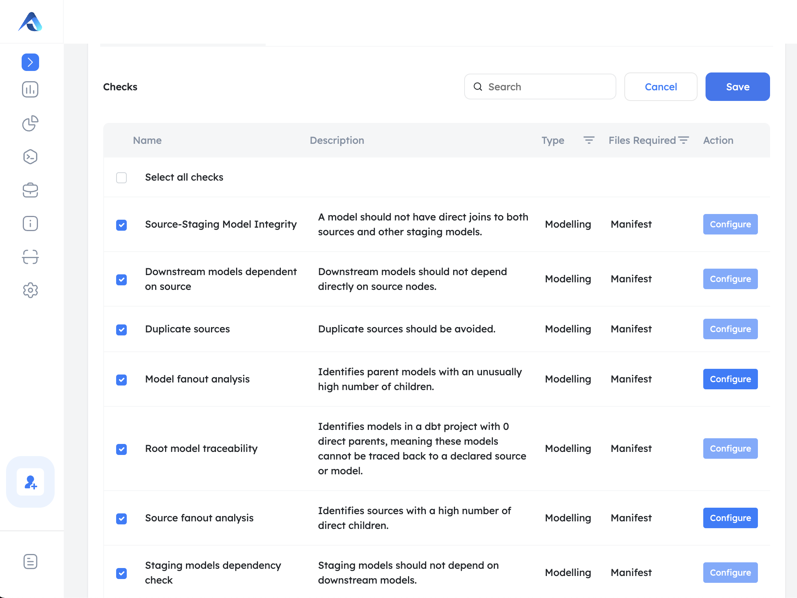
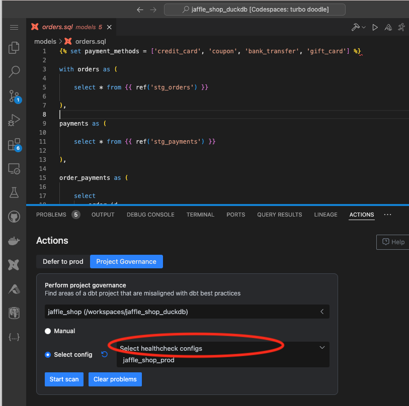
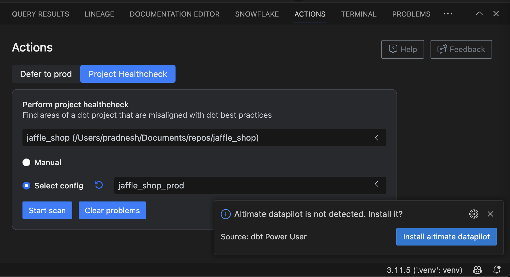
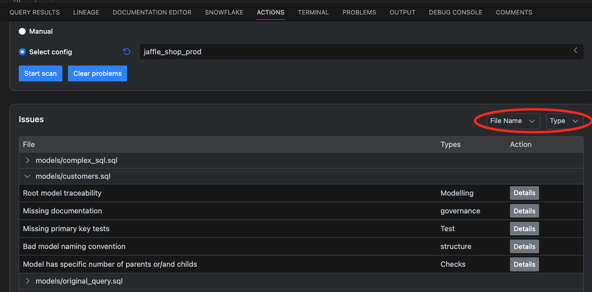

Prevent issues from getting shipped to production! Project governance functionality lets you swiftly scan all dbt projects in your workspace against dbt best practices and organizational guidelines to quickly bring issues to your attention.

## Available via Extension & Python Package

Project governance functionality is available in the power user extension and the open-source Python package.

/// admonition | Also, the project governance functionality is available as a Python package, so the checks can be integrated in your Git, CI/CD workflows. More details [here](https://datapilot.readthedocs.io/en/latest/insights.html)
    type: tip
///

## Configure Checks

You can configure different checks per your preferences in a local YAML file or the SaaS configuration stored in the Altimate AI backend. Navigate to the Action panel in the extension

First, navigate to the Actions panel in the extension and go to "Project Governance" tab. Then, choose the dbt project for which you want to perform a governance check.
<br>

### Manual Configuration of Checks

The configuration of checks and the list of checks to be performed can be defined in a YAML file.
More details on the configuration and YAML file [here](https://datapilot.readthedocs.io/en/latest/configuration.html#project-health-configuration)

Select the YAML file by clicking on "Select Config Path"
<br>

### SaaS Configuration of Checks

/// admonition | SaaS configuration method allows you to share multiple configurations and reference those as per environments, teams, and projects.
    type: tip
///

First, navigate to governance menu item on left hand side nav and choose "new dbt Governance Config".
<br>

In the governance config, a name and description should be provided. The owner field is automatically populated by the name of the current user.

In the model section, you can define regex patterns for names to define different types of models. The default configuration is already pre-populated as:

```
  staging: "^stg_.*"       # Regex for staging models
  mart: "^(mrt_|mart_|fct_|dim_).*"  # Regex for mart models
  intermediate: "^int_.*"  # Regex for intermediate models
  base: "^base_.*"         # Regex for base models
```

Below that section, there are different types of checks available. Few of the checks, require additional configuration.
In that case, please click on the "configure" button next to the check to provide necessary configuration. You can search for specific checks and select / deselect checks that should be included in the config.

This list also shows files required to perform the check. Checks require either a manifest file or catalog file or both files.
You can filter checks based on the type of files required. Please hit the "save" button after you are done creating dbt Governance config on this screen.

<br>

Select the right config for checks from the list

<br>

## Do the Scan

Click the start scan button. You may be asked to install Altimate AI DataPilot package.

/// admonition | DataPilot python package is [open source package](https://github.com/AltimateAI/datapilot), that's actually used to do governance checks with the power user extension
    type: tip
///

The scan usually runs in a few seconds, but depending on the size of your project and manifest / catalog files it may take longer.

<br>

## View Scan Results

View the scan results right below the "Start Scan" button after the scan is finished. Scan results are organized by file type and check type and can be filtered on the same.
You can clear results via a button or start the scan again.

<br>

## List of Checks

Checks between the Python package and Power User extension are the same. You can find a complete list of checks [here](https://datapilot.readthedocs.io/en/latest/insights.html)

## Recorded Demo

<iframe width="800" height="600" src="https://www.youtube.com/embed/3nJ9otNNIwQ?si=2K-bzC0_q74o6VXZ" title="YouTube video player" frameborder="0" allow="accelerometer; autoplay; clipboard-write; encrypted-media; gyroscope; picture-in-picture; web-share" referrerpolicy="strict-origin-when-cross-origin" allowfullscreen></iframe>
