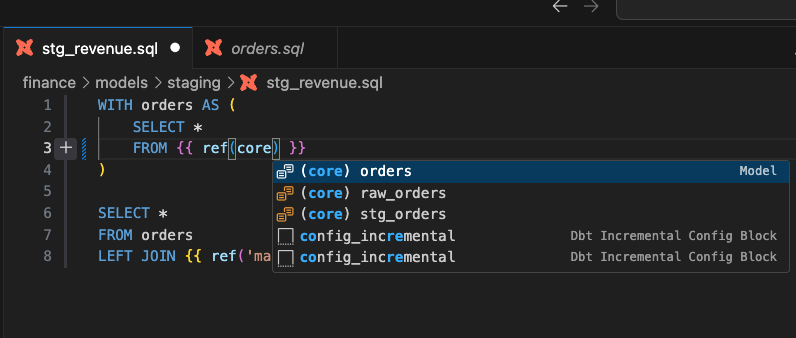
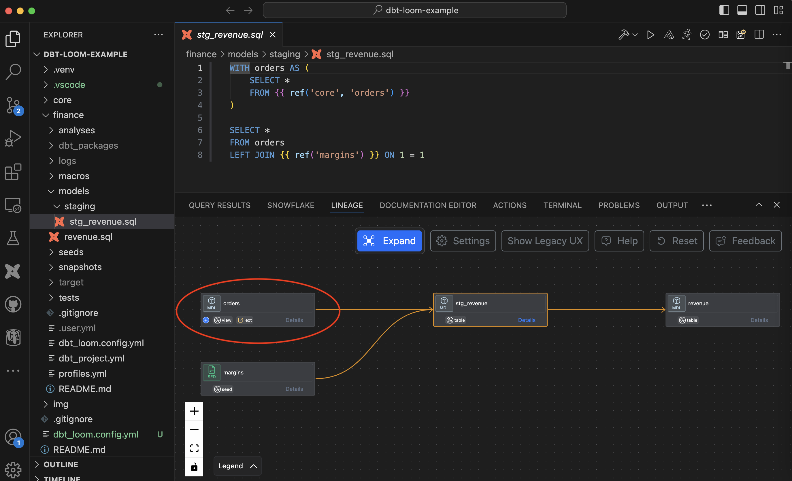

# Multi Project Support with dbt-loom

Power User extension now supports dbt-loom, where native features like query preview, compiled code, column lineage support multi-project references.

## Setup dbt-loom in your project

- Instructions on how to [install and configure dbt-loom](https://github.com/nicholasyager/dbt-loom)
- Sample project [example with dbt-loom configured](https://github.com/Bl3f/dbt-loom-example)

/// admonition | Please make sure dbt_loom.config.yml file is in the root of your multi-project directory
type: warning
///

## Reference models from other projects in code via auto-complete

Use standard dbt-loom syntax to reference models from other projects. For example,

```
{{ ref('core', 'orders') }}
```

where 'orders' model from the 'core' project is referenced.



## Visualize Lineage with models from the other projects

When you visualize the model or column lineage, models from other projects will be shown with the special "ext" type as below.



## Limitations

- Clicking on referenced model name in the code, and then opening that model file doesn't work for multi-project references.

## Recorded Demo

<div style="position: relative; padding-bottom: 62.5%; height: 0;"><iframe src="https://www.loom.com/embed/539c361693de4cc6bebb96e1fdda1f04?sid=d3390ef2-7af5-4993-b08d-cfb664571992" frameborder="0" webkitallowfullscreen mozallowfullscreen allowfullscreen style="position: absolute; top: 0; left: 0; width: 100%; height: 100%;"></iframe></div>
