**Why Notebooks?**

Notebooks allow you to codify your usual ad-hoc data analysis, data preparation workflows, so they can be reused. For example, if you have a workflow for standard data analysis - check for duplicates, check timezone field, make sure only certain values are present for a "customer_type" column - you can create a notebook to codify these steps. Then, you can always trigger this notebook with a click of button for a table or data output of particular model to validate or clean the data. In these notebooks, you can create different 'cells' mapping to jinja-sql, python or markdown text in a single file, and you can execute these cells together.

**Notebook templates**

You can also utilize some out-of-the-box notebook templates for common tasks - e.g. profile the data results, create a config file for the project, create dbt staging models etc.

**Notebook sharing**

Many times, this ad-hoc work is dependent on organizational best practices and the type of data that your team works on. So, these notebooks can be reused by your team members as well as extended teams. That's why we have enabled sharing - where you can share notebooks with other users in your Altimate AI saas instance. This is especially useful when you have popular notebooks spread across multiple code repositories.

/// admonition | We would love to hear your feedback on what additional functionality we can build in this area. If you have encountered any issues in this functionality, please message us over [chat](https://app.myaltimate.com/contactus)
    type: tip
///

## Enable notebooks in VSCode

You just need to add the following line to the settings.json file in your .vscode directory at the root of your repo.

```
"dbt.enableNotebooks": true,
```

/// admonition | If you don't have the .vscode directory at the root of the repo, please create it
    type: info
///

Then, reload or restart your VSCode.

## Create new notebook

You can create a notebook by going to File -> New File and then choosing the option of
DataPilot Notebook as shown below.

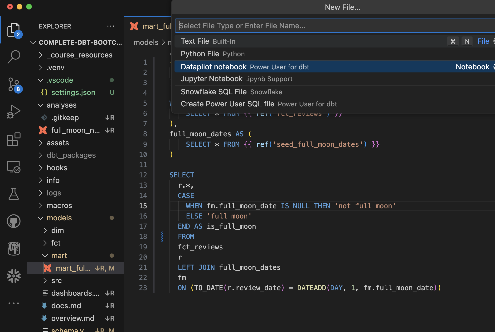<br>

After this, it will give you an option of creating a blank notebook or use one of the existing templates.
For now, let's choose a "blank notebook". The first code cell will be automatically created for you.

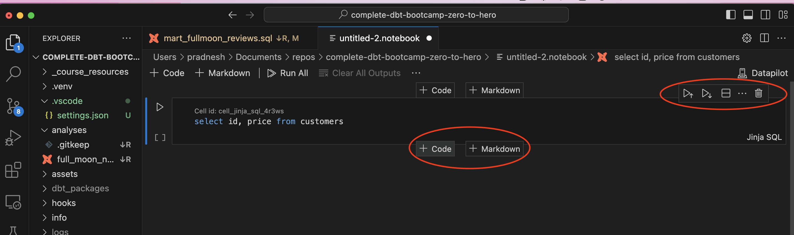<br>

You can add additional code cells or markdown text cells. There are additional options available for the code cell to run cells, split, delete etc. as below

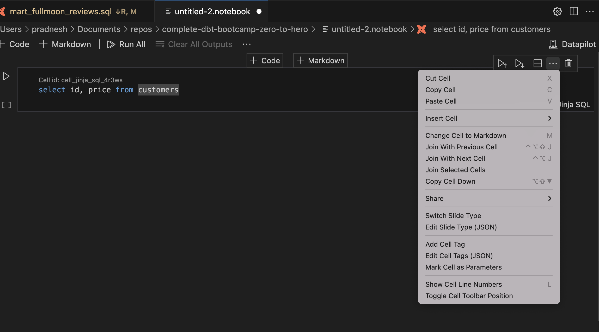<br>

After you are done, you can just save the notebook file like any other file in VSCode.

## Use notebook templates

There are a few ways in which you can trigger notebook templates.

/// admonition | The notebook templates may use some standard Python packages, and VSCode may ask for your confirmation before installing the necessary packages
    type: info
///

**There is a contextual notebook menu available at the top of the file when you open any SQL file in VSCode**
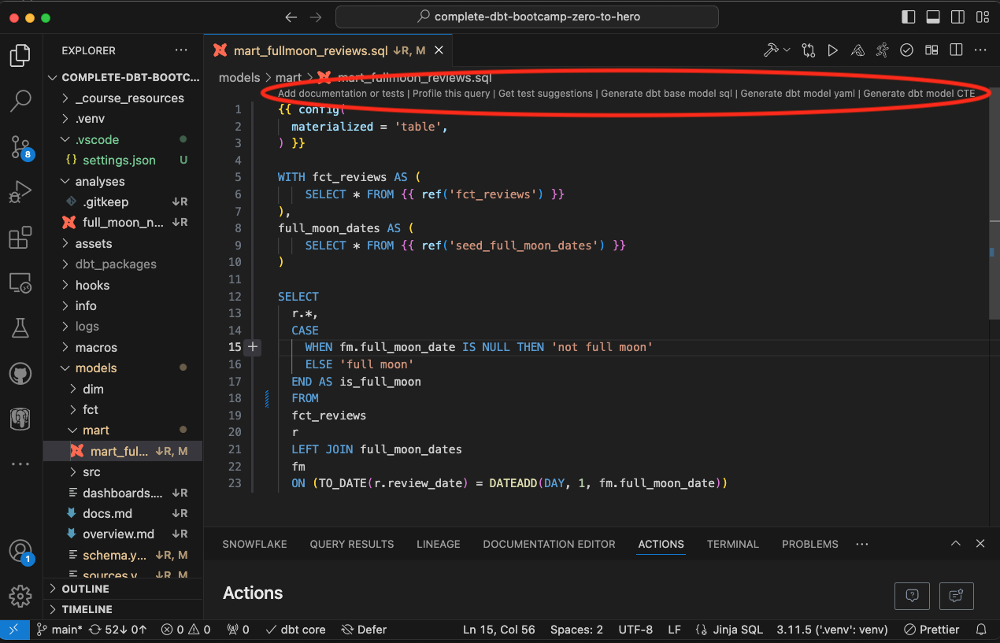<br>

After notebook is created based on the template, just click on "Run all" button on top to execute the notebook and get results.
Following notebook templates are available today:

### [Template] Profile the query

This template will have two cell blocks. First block will have SQL / jinja query and it will produce preview of data results.
The second block will have python code for profiling the query.

### [Template] Get test suggestions

This template will recommend tests based on the context of the dbt model, and generate code for those tests as well.
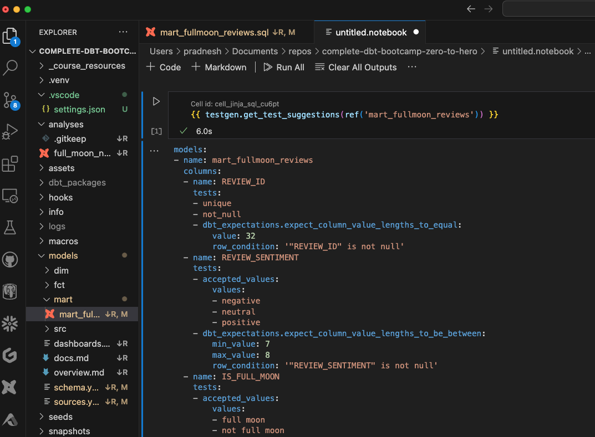<br>

### [Template] Generate dbt base model SQL

This template will generate base model SQL based on your input of source name and table information.
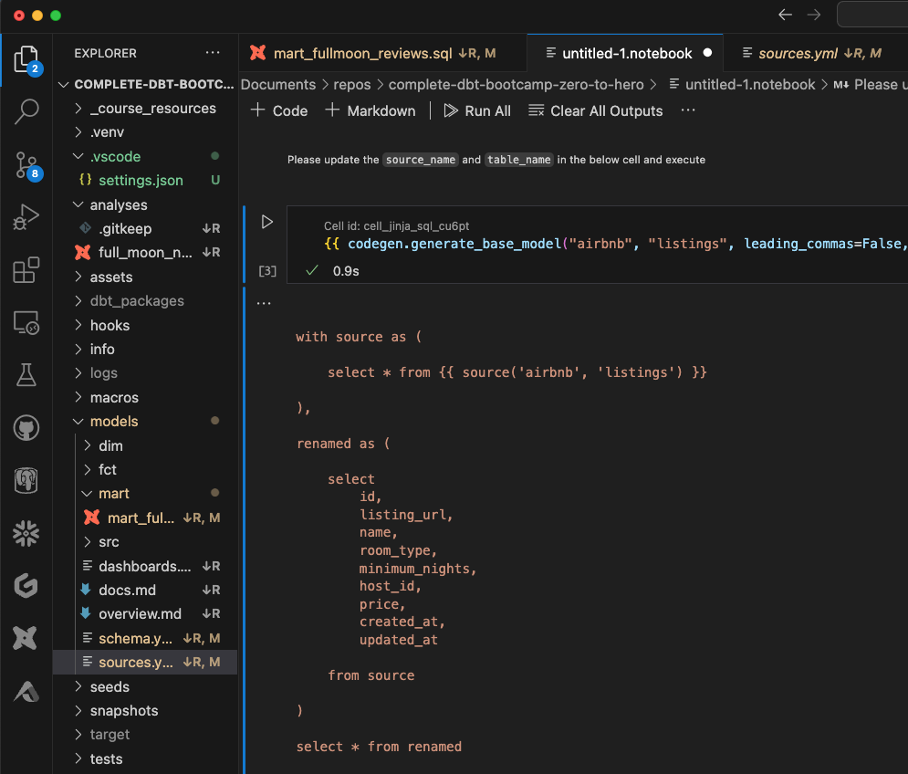<br>

### [Template] Generate dbt model yaml

This template creates config yaml for documentation and tests for the particular dbt model from where the action is triggered.
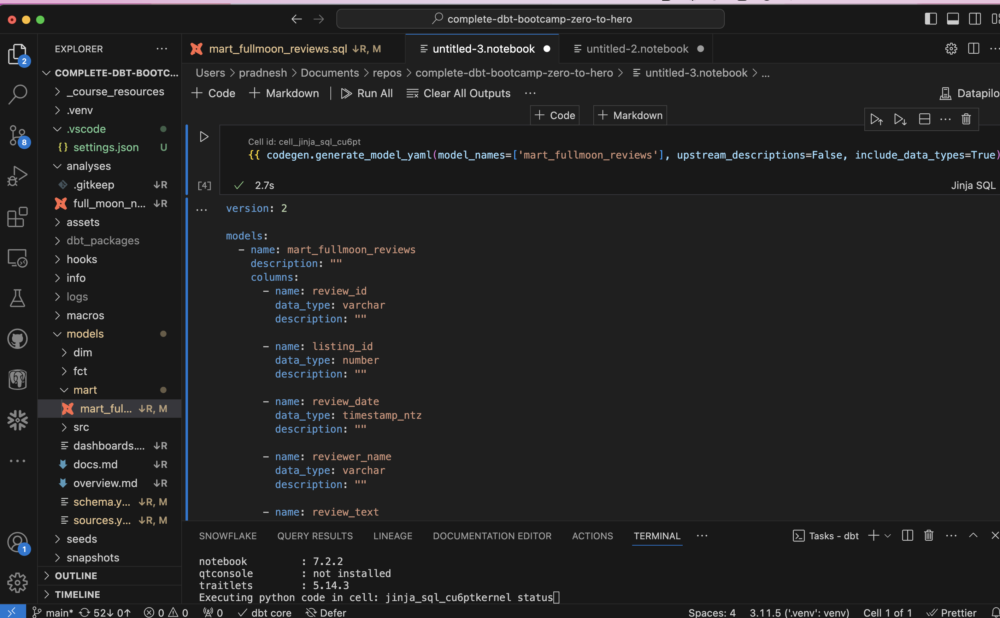<br>

### [Template] Generate dbt model CTE

This template generates model CTEs from dbt model file.

**You can also create notebooks from the "Actions" tab in VSCode (present in the bottom panel)**

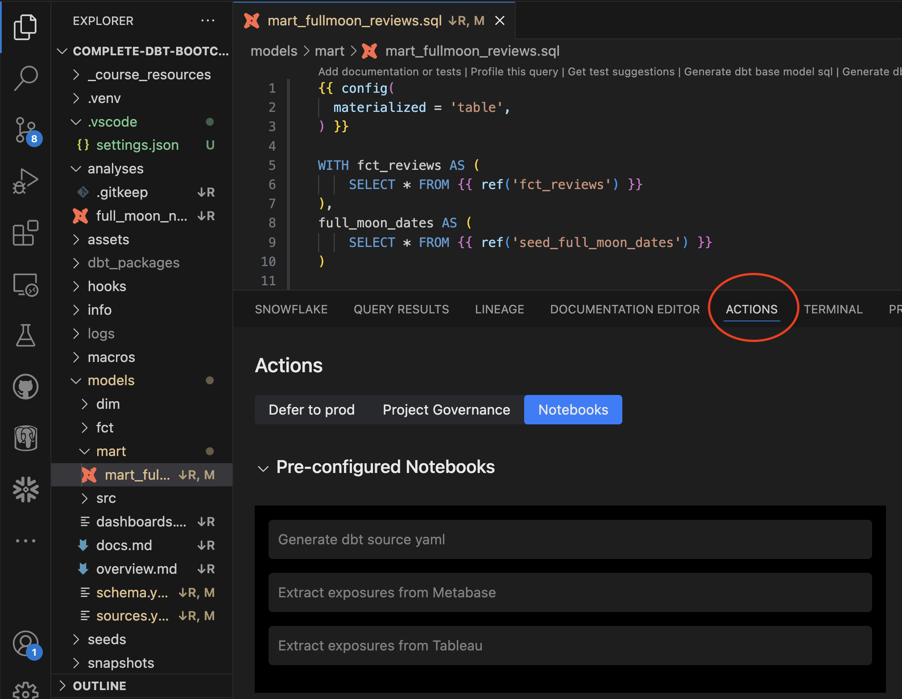<br>

There are some notebook templates available as pre-configured notebooks. These templates are used at
dbt Project level.

### [Template] Generate dbt source yaml

Based on schema name specified in the code block, it can generate source yaml for you automatically.
You need to provide schema name as an input in the code block.

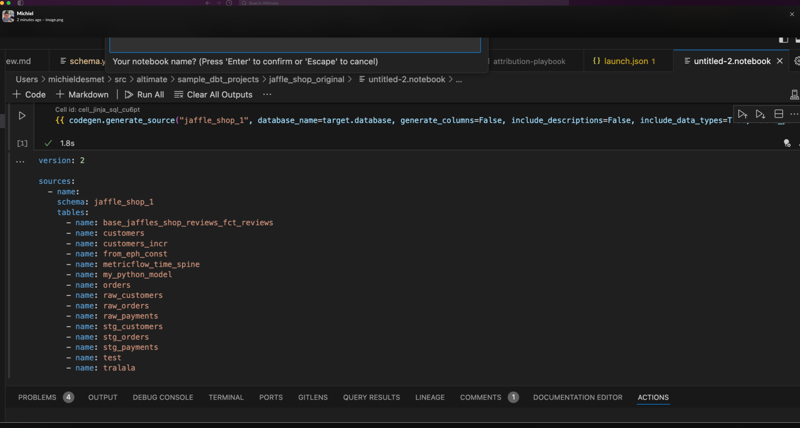<br>

### [Template] Extract exposures from Metabase

This template helps extract exposures from Metabase
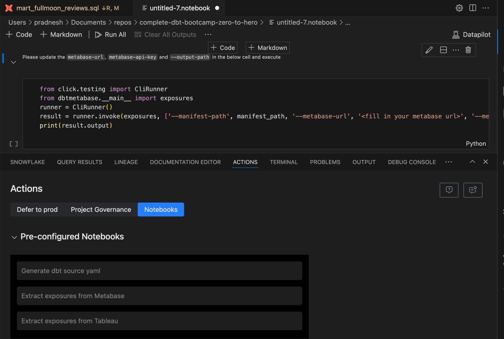<br>

/// admonition | We would love to hear your feedback on what additional templates or functionality we can build in this area. If you have encountered any issues in this functionality, please message us over [chat](https://app.myaltimate.com/contactus)
    type: tip
///

## Share notebook

Once you save the notebook, you can share it with other users in DataPilot instance. This enables you to share notebooks across repositories with the whole organization.

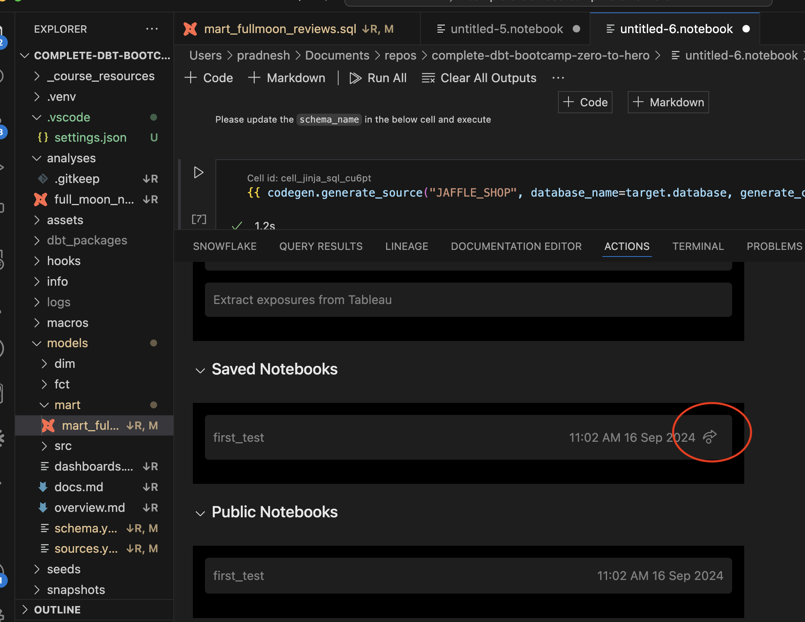<br>

## Recorded demo

<div style="position: relative; padding-bottom: 62.5%; height: 0;"><iframe src="https://www.loom.com/embed/326aecdce9ee42e8b2d28e366d52be5a?sid=fee59cc0-ea1f-4dcd-a22b-908f121b2255" frameborder="0" webkitallowfullscreen mozallowfullscreen allowfullscreen style="position: absolute; top: 0; left: 0; width: 100%; height: 100%;"></iframe></div>
