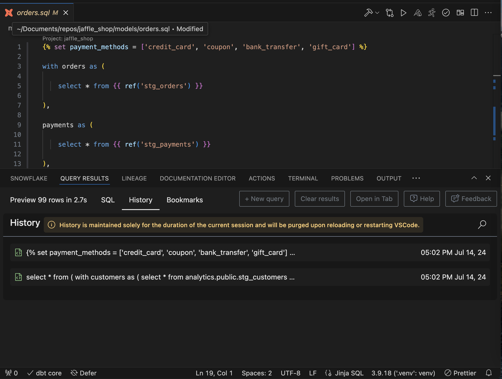
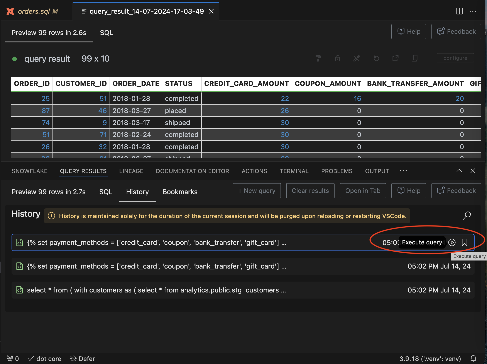
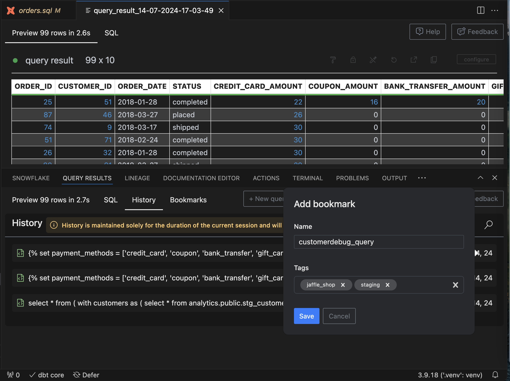
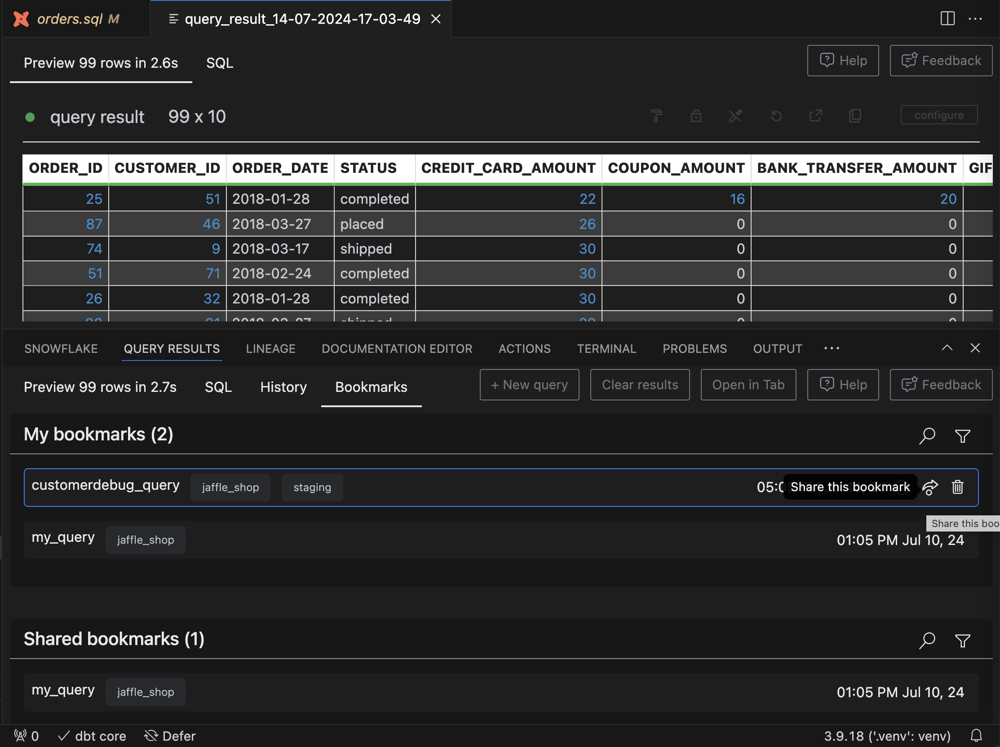
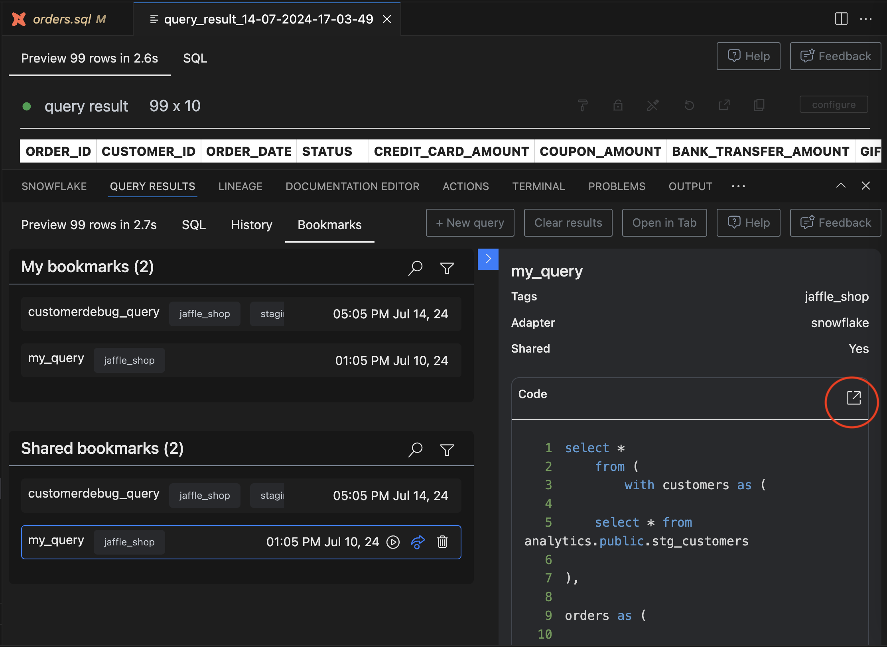

# Query History and Bookmarks

Now, you can see the history of all the SQL queries or dbt models you ran. So, you can re-run them to view and compare results to see how your data has changed between code changes. You can also look at the compiled SQL code of queries that were run previously.

Queries from the query history can also be bookmarked and tagged. So, you can reuse those queries next time you need to do a similar ad-hoc analysis.

Users can also share their query bookmarks with other users in your org-specific DataPilot SaaS instance. That way, you can have a shared repository of the most useful queries across the team.

/// admonition | Your VSCode session stores only the last 10 queries in the query history, and this info is stored locally on your machine and not in the SaaS instance.
    type: info
///

## View Query History

You can view query history in the "History" tab of the "Query History" panel. You can also search your query history for specific queries.

 

## Execute Query from History

If you hover over the query from the history, you can perform a few actions, like executing the query (play icon) or bookmarking the query (bookmark icon). If you execute the query, the results are shown in the main code editor window as shown below:

 

/// admonition | In this way, you can [compare query results](https://docs.myaltimate.com/test/queryResults/#compare-query-results) between different runs of your query
    type: info
///

## Add Bookmark

If you execute some query frequently, you can also bookmark that query by clicking the bookmark button when you hover the query entry in the history.

 

/// admonition | You can add tags to your queries for better organization. You can also search your bookmarks by text or by tags. Many users use tags to categorize queries based on a specific purpose or a project.
    type: tip
///

## Share Bookmark

You can share your bookmarks with other users in your Altimate AI instance so they can utilize those queries. When you share a bookmark, it's shared with all the users in "your" Altimate AI SaaS instance.

 

## View Code

Query or bookmark code can be easily viewed by clicking on the query. Also, this code can be opened in the main code editor window by clicking on the icon as shown below:

 

## Recorded Demo

<iframe width="560" height="315" src="https://www.youtube.com/embed/1TPAyE5EJ5Y?si=JQqP2cXIEu_AUvwU" title="YouTube video player" frameborder="0" allow="accelerometer; autoplay; clipboard-write; encrypted-media; gyroscope; picture-in-picture; web-share" referrerpolicy="strict-origin-when-cross-origin" allowfullscreen></iframe>

/// admonition | This feature requires an API key. You can get it by signing up for free at [www.altimate.ai](https://www.altimate.ai)
    type: info
///
