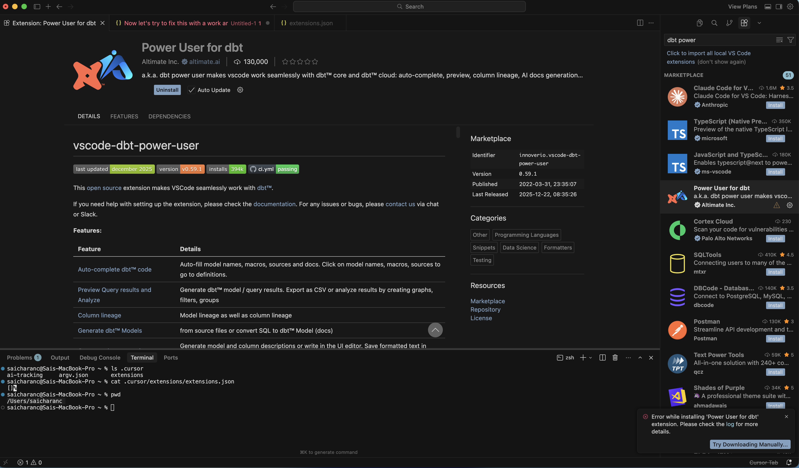
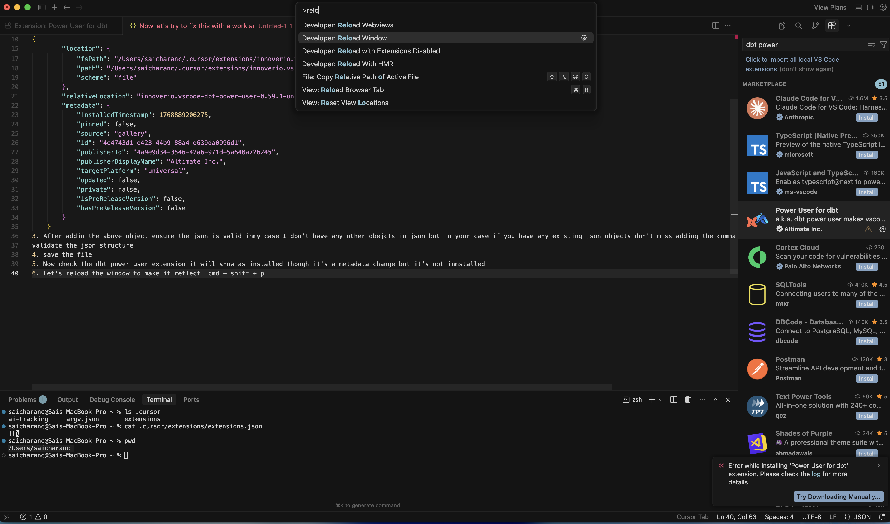
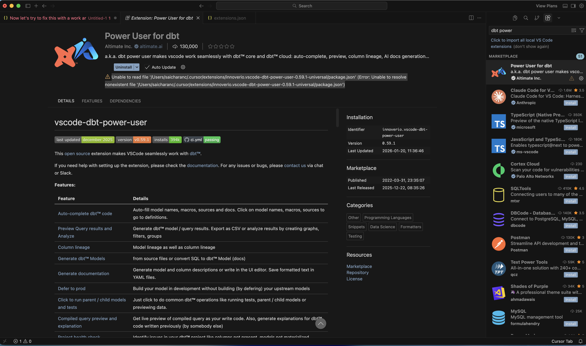
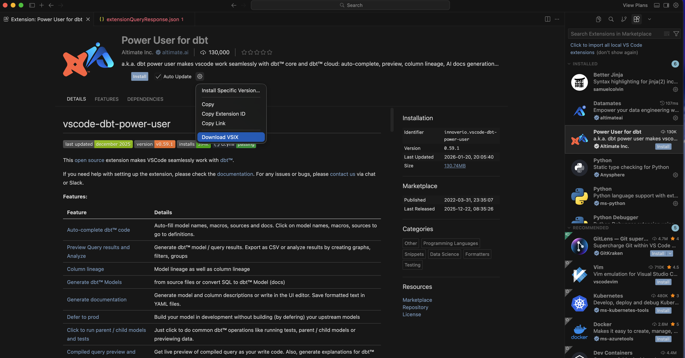

# Cursor IDE: Installation Workaround

/// admonition | Known Cursor Issue
    type: warning

Some Cursor IDE users experience the dbt Power User extension installation freezing for several minutes, followed by a **"Failed to fetch"** error dialog. This is a **known issue on Cursor's side** and has been reported and acknowledged by the Cursor team. See the [Cursor forum thread](https://forum.cursor.com/t/dbt-power-user-extension-installation-freezes-with-repeated-extensionquery-requests-and-failed-to-fetch-error/149385/4) for details.

Until the Cursor team resolves this, please try the workarounds below.
///

## Problem

When installing the dbt Power User extension in Cursor IDE:

1. The installation **freezes for several minutes** with repeated `extensionQuery` requests.
2. An error dialog appears with a **"Failed to fetch"** message.
3. The extension fails to install through the normal marketplace flow.

---

## Workaround 1: Register extension metadata and reinstall

This workaround tricks Cursor into recognizing the extension entry, then lets you cleanly reinstall it.

**Step 1.** Open the Cursor extensions metadata file at:

| Platform | Path |
|----------|------|
| macOS / Linux | `~/.cursor/extensions/extensions.json` |
| Windows | `%USERPROFILE%\.cursor\extensions\extensions.json` |

**Step 2.** Add the following JSON object to the array in that file:

/// admonition | Update the paths
    type: tip

Replace `<YOUR_HOME_DIR>` with your actual home directory path (e.g. `/Users/jane`, `/home/jane`, or `C:/Users/jane`).
///

```json
{
    "identifier": {
        "id": "innoverio.vscode-dbt-power-user"
    },
    "version": "0.59.1",
    "location": {
        "$mid": 1,
        "fsPath": "<YOUR_HOME_DIR>/.cursor/extensions/innoverio.vscode-dbt-power-user-0.59.1-universal",
        "path": "<YOUR_HOME_DIR>/.cursor/extensions/innoverio.vscode-dbt-power-user-0.59.1-universal",
        "scheme": "file"
    },
    "relativeLocation": "innoverio.vscode-dbt-power-user-0.59.1-universal",
    "metadata": {
        "installedTimestamp": 1768889206275,
        "pinned": false,
        "source": "gallery",
        "id": "4e4743d1-e423-44b9-88a4-d639da0996d1",
        "publisherId": "4a9e9d34-3546-42a6-971d-5a640a726245",
        "publisherDisplayName": "Altimate Inc.",
        "targetPlatform": "universal",
        "updated": false,
        "private": false,
        "isPreReleaseVersion": false,
        "hasPreReleaseVersion": false
    }
}
```

/// admonition | Validate your JSON
    type: info

If `extensions.json` already has other entries, make sure to add a comma separator between objects so the JSON remains valid.
///

**Step 3.** Save the file.

**Step 4.** The extension will now appear as installed in Cursor, but it is not actually installed yet — this is just a metadata entry.



**Step 5.** Reload the Cursor window:

- Press `Cmd + Shift + P` (macOS) or `Ctrl + Shift + P` (Windows/Linux)
- Type **"Developer: Reload Window"** and press Enter

**Step 6.** Open the dbt Power User extension page. You will see an error that the extension files don't exist — this is expected:



```
Unable to read file '.../.cursor/extensions/innoverio.vscode-dbt-power-user-0.59.1-universal/package.json'
```



**Step 7.** **Uninstall** the extension, then **reinstall** it. You can choose any version you want to install. The installation should now complete successfully.

---

## Workaround 2: Manual VSIX installation

If Workaround 1 does not resolve the issue, you can manually install the extension using a `.vsix` file.

**Step 1.** Download the `.vsix` file from the [Open VSX Registry](https://open-vsx.org/extension/innoverio/vscode-dbt-power-user):

- Go to the extension page and click **Download** to get the `.vsix` file.



**Step 2.** Install the `.vsix` file in Cursor:

- Open the **Extensions** panel in Cursor
- Drag and drop the downloaded `.vsix` file into the Extensions panel

The extension will install directly from the file, bypassing the marketplace fetch entirely.

---

/// admonition | Still having issues?
    type: tip

If neither workaround resolves the problem, please reach out on the [#tools-dbt-power-user](https://getdbt.slack.com/archives/C05KPDGRMDW) Slack channel or [contact support](https://www.altimate.ai/support).
///
