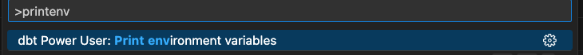
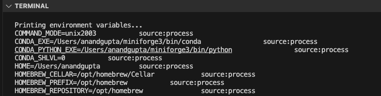
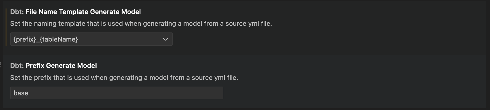

## Environment Variables Setup

There are multiple sources from where the extension reads the environment variables.

- [Using vscode Integrated terminal Profiles](#environment-variables-setup-using-the-integrated-terminal-profiles-vscodesettingsjson)
- [Variables set outside of Visual Code in .zshrc or .bashrc](#environment-variables-set-outside-of-visual-code-zshrc-bashrc)
- [dot env file (we get this from python extension)](#environment-variables-through-pythonenvfile)

/// admonition | Environment variable available in vscode terminal doesn't necessarily will be available to the extension. Extension can only read environment variables if available in the above sources
type: warning
///

### Environment variables set outside of Visual Code (.zshrc, .bashrc, ...)

If you have variables set in .zshrc or .bashrc the extension automatically picks it up.
These environment variables will be passed to all operations of the extension. If you make changes to the environment variables you need to restart vscode.

/// admonition | The environment variable should be valid for all your dbt projects. For example DBT_PROFILES_DIR can be set to ., that way dbt will lookup the profiles.yaml file inside the root of the dbt project.
type: info
///

### Environment variables setup using the integrated Terminal Profiles ( .vscode/settings.json )

The extension will read any VSCode configurations in .vscode/settings.json and pass them to all operations of the extension:

OSX:

```
"terminal.integrated.env.osx": {
    "ENV_VARIABLE_NAME": "VALUE"
}
```

Windows:

```
"terminal.integrated.env.windows": {
    "ENV_VARIABLE_NAME": "VALUE"
}

```

Linux:

```
"terminal.integrated.env.linux": {
    "ENV_VARIABLE_NAME": "VALUE"
}
```

The official documentation can be found [here](https://code.visualstudio.com/docs/terminal/profiles)

/// admonition | Visual Code variable substitution is not supported except the environment variable pattern ${env:*} and ${workspaceFolder}.
type: warning
///

### Environment variables through python.envFile

The extension also loads an environment variable definitions file identified by the python.envFile setting. The default value of this setting is `${workspaceFolder}/.env`.

This way supports all Visual Code variable substitution patterns but the environment variables will not be available to the vscode terminal. Read all about [environment variables](https://code.visualstudio.com/docs/python/environments#_environment-variables) supported by the Visual Code Python extension.

/// admonition | Make sure the .env file is in the [right format](https://www.dotenv.org/docs/security/env) or else the extension won't be able to detected the variables.
type: warning
///

### Listing Environment Variables detected by the extension

We have a debugging utility available within the extension that lists down the environment variables available to the extension and the source from where it is read. Here is how you can trigger the debugging utility

1. Cmd +Shift + P (Ctrl + Shift + P in case of windows) to start the VSCode command bar
2. Select the option dbt Power User: Print environment variable
   
3. It should print all the environment variables detected and the sources as well
   

/// admonition | In certain scenarios, step 3 has to be executed twice to get the environment variables printed.
type: warning
///

### Default DBT Env Support

The following env variables when set are automatically picked by the extension

DBT_PROFILES_DIR : This is used to override the folder where profiles file is located
DBT_TARGET_PATH : This is for overriding the dbt target path

## Custom dbt Runner

The dbt.dbtCustomRunnerImport configuration can be used to plug your own dbt runner. This dbt runner has to invoke dbt but can perform authentication or additional configuration steps before invoking dbt or your own custom dbt executable.

Code can be imported from the selected Python environment, so just install your own library or inline the code in the configuration. Note that the Python code should be written in one line.

For example let's add this custom dbt runner in your project root folder, called `my_custom_runner.py` . In this case we inherit from the existing dbtRunner from dbt, but that's optional, as long as the interface is compatible with dbt, it should work as expected.

```python
from typing import List
from dbt.cli.main import dbtRunner, dbtRunnerResult

class MyCustomRunner(dbtRunner):
    def invoke(self, args: List[str], **kwargs) -> dbtRunnerResult:
        print("Here you can perform setup or authentication or modify args")
        super().invoke(args, **kwargs)

### patch the dbtRunner
dbtRunner = MyCustomRunner
```

Now in the vscode config json add an entry for `"dbt.dbtCustomRunnerImport”` .

```json
{
	"dbt.dbtCustomRunnerImport”: “from my_custom_runner import dbtRunner”
}
```

Note that the custom dbtRunner is only used for dbt command invocations. Some operations like metadata fetching, query execution will directly use dbt api and will therefore not use the instructions set up in the custom dbt runner.

For more information you can check out these resources:

- [Programmatic Invocation Support in dbt](https://docs.getdbt.com/reference/programmatic-invocations)
- [dbt Runner Implementation in dbt core](https://github.com/dbt-labs/dbt-core/blob/ddd6506beafd410847d0702267c1e87150377668/core/dbt/cli/main.py#L43)

## [Deprecated] MSSQL, Synapse, Oracle - Query Preview Config

/// admonition | It is no longer required to specify query template for any of the adapter.
type: warning
///

Your database may not support standard SQL LIMIT statements like `SELECT * from table LIMIT 10`. You can override this default behaviour through `dbt.queryTemplate`.

Please make a PR in the [dbt-power-user repo](https://github.com/AltimateAI/vscode-dbt-power-user) if you find that you need to change `dbt.queryTemplate` for your favourite adapter and help the community.

### `dbt.queryTemplate` for Oracle

Change to `select * from ({query})\n where ROWNUM <= {limit}`

### `dbt.queryTemplate` for MS SQL, Synapse

Change to `set rowcount {limit}; {query}` or `{query}\n order by 1 OFFSET 0 ROWS FETCH FIRST {limit} ROWS ONLY` (note that your query can't have an order by clause).

## Enable color highlighting of terminal output on Windows

These instructions are for setting the TERM environment variable to xterm-256color in a VSCode terminal instance. This configuration instructs the terminal to operate in a mode that supports 256 colors and various text formatting options, enhancing the display of colored output. So, the relevant dbt command outputs e.g job status "Success" or "Failure" are shown in the right color.

```
"terminal.integrated.env.windows": {
    "TERM": "xterm-256color"
}
```

/// admonition | Above instructions for color highlighting are for Windows machines only
type: warning

///

## Skip Project

To specify project folders explicitly and control which projects are included in the build process, you can configure the `dbt.allowListFolders` setting.

This can be particularly useful when you have a large number of projects in the same workspace. You can define workspace-relative paths to include as follows:

```json
"dbt.allowListFolders": [
  "folder1",
  "folder2"
]

```

## Configure Source to Model file name template

You can configure the file name template for source to model files. To do so, go to the extension setting and choose the template you want to use and specify the prefix.



## Configure sqlfmt

sqlfmt is a SQL formatter that you can use with dbt-power-user VSCode extension so your dbt models are always correctly formatted.

### Install `sqlfmt`

We recommend installing sqlfmt with the jinjafmt extra (which will also install the Python code formatter, Black).

Install sqlfmt by running,

```
pipx install 'shandy-sqlfmt[jinjafmt]'
```

If you don't have 'pipx' installed, please install it using instructions [here](https://github.com/pypa/pipx).
Find more about sqlfmt in their [docs](https://docs.sqlfmt.com/getting-started/installation).

### Configure `dbt.sqlFmtPath` or `dbt.sqlFmtAdditionalParams`

You can configure the path to sqlfmt through `dbt.sqlFmtPath` and you can configure additional parameters through `dbt.sqlFmtAdditionalParams`.

### Usage

Please select "dbt Power User" (extension id:`innoverio.vscode-dbt-power-user`) as the default formatter. You can do this either by using the context menu (right click on a open dbt model in the editor) and select "Format Document With...", or you can add the following to your settings:

```json
  "[jinja-sql]": {
    "editor.defaultFormatter": "innoverio.vscode-dbt-power-user"
  }

```

### Format on save

You can enable format on save for python by having the following values in your settings:

```json
  "[jinja-sql]": {
    "editor.defaultFormatter": "innoverio.vscode-dbt-power-user",
    "editor.formatOnSave": true
  }

```

## Setup Altimate API credentials using Environment variables

You can now setup the Altimate Instance Name and Key using environment variables

add following entries to .env file

```bash
ALTIMATE_KEY=<Altimate Key>
ALTIMATE_INSTANCE_NAME=<Altimate Instance Name>
```

Now, the vscode settings.json to include

```
{
    "dbt.altimateAiKey": "${env:ALTIMATE_KEY}",
    "dbt.altimateInstanceName": "${env:ALTIMATE_INSTANCE_NAME}"
}
```

This setting is available in v0.37.9 and onwards.

## Column name setup for YAML file updates

DataPilot can update your YAML files when documentation or tests are added or edited.
Different databases use different column casing conventions. For example, Snowflake always uses upper-case column names, whereas Postgres uses lower-case column names by default.

These database-specific standards may create issues in DataPilot behavior without the correct configuration. These issues may include -

- The documentation editor may save column names in incorrect casing in YAML files.
- Operations like "bulk generate" documentation for missing columns may generate documentation for existing columns.

If you are facing these issues, you can adjust the following settings:

- New column names are always saved in lowercase in YAML files, except for columns with [quoted identifiers](https://docs.getdbt.com/reference/resource-properties/quote), regardless of the database. (dbt handles database-specific casing automatically this way)

If you want to save the column name as it is in the database, set `dbt.showColumnNamesInLowercase`=false in .vscode/settings.json

- If you update documentation or tests for the existing columns, we will not change the casing for column names that are already present in YAML files

If there are columns with [quoted identifiers](https://docs.getdbt.com/reference/resource-properties/quote), we don't change the casing of such columns; we add the 'quote: true' attribute for those columns. You can also set a regex string to find unquoted identifiers by adding `dbt.unquotedCaseInsensitiveIdentifierRegex`= 'your_regex' in .vscode/settings.json or change it in VSCode extension settings.

## Disable setup walkthrough pop-up

To disable the popup that prompts for extension to be setup when loaded for the first time set the setting dbt.hideWalkthrough to true in vscode's settings.json

```
{
    "dbt.hideWalkthrough": true
}
```
