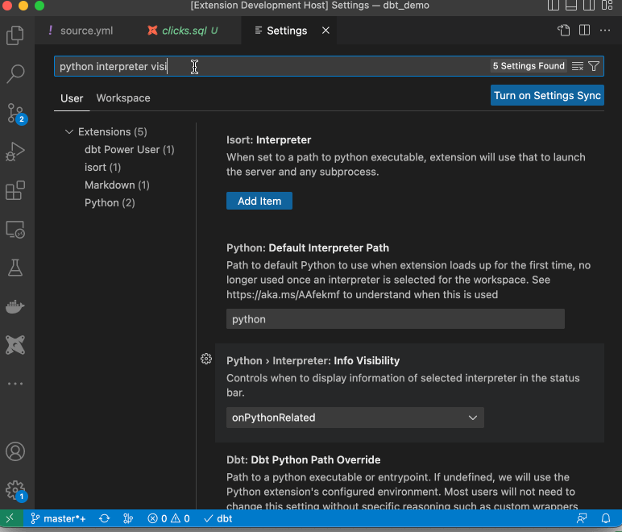

/// admonition | Only use the following steps for "dbt Core" environments. If you have a dbt Cloud environment, use the [required config instructions for "dbt Cloud" environments](./reqdConfigCloud.md). If you have a dbt Fusion environment, use the [required config instructions for "dbt Fusion" environments](./reqdConfigFusion.md).
type: warning
///

## Use the setup wizard for configuration (recommended)

/// admonition | Need to setup environment variables? Refer to this [section](https://docs.myaltimate.com/setup/optConfig/#environment-variables-setup)
type: warning
///

This method will save a bunch of time for you, and you can also validate your configuration. Setup wizard will help you in associating sql files with jinja-sql, selecting the right Python interpreter, make sure dbt dependencies are correctly installed etc. In the end, it will also validate your configuration.

You can start the setup wizard by clicking on dbt status icon in bottom status bar, and perform following necessary steps as shown in click-through demo below:

<interactive demo for setup wizard>

<div style="position: relative; padding-bottom: calc(75.08376963350786% + 42px); height: 0;"><iframe src="https://app.supademo.com/embed/clsvee2nn062bpekcffkgv0sv" allow="clipboard-write" frameborder="0" webkitallowfullscreen="true" mozallowfullscreen="true" allowfullscreen style="position: absolute; top: 0; left: 0; width: 100%; height: 100%;"></iframe></div>

**Here are steps covered in the setup wizard**

**Select Python Interpreter**

Click on the action button - "Select Python Interpreter" and choose your preferred python interpreter. Usually, choosing interpreter that's recommended, or mapped to your virtual environment software (e.g. venv) as per the list is a good idea. If you know the path of your Python environment, you can choose it from the list or if the path is not present there, you can enter it manually.

/// admonition | If needed, please run 'where python' command on terminal to see if it shows path to Python interpreter that you are using.
type: tip
///

**Install dbt**

If dbt is not installed in your environment (dbt status icon on bottom status bar will show it), Click on "Install dbt" button in the next step.
It will ask for dbt version and adapter that's need for your database environment (e.g. Snowflake). Based on these inputs, setup wizard will automatically install dbt in your environment

**Install dbt deps**

Many times project failures or weird errors are seen if dbt dependencies are not installed. In this step, once you click on 'Run dbt deps' button, setup wizard will automatically run dbt deps command for your project.

**Validate Project**

Last step is clicking on button - "Validate Project" It will run a bunch of checks to make sure your dbt environment and project are setup correctly.
If there are some issues, it will tell you exactly what's wrong as well.

/// admonition | If you still can't get the extension setup correctly, please contact us via slack or chat through [support page](https://www.altimate.ai/support)
type: tip
///

## Manual method of configuration

/// admonition | Please follow the manual method only if you couldn't use the setup wizard above.
type: info

///

### Associate \*.sql files with jinja-sql

There are two different methods to do this. Please follow only one method:

#### Method1: Configure in Preferences > Settings in the extension


#### Method2: Update the settings.json file directly

/// details | Type 'settings.json' in the VS Code command pallet to open it


///

and add following lines at the end of settings.json

```
    "files.associations": {
        "*.sql": "jinja-sql",
        "*.yml": "jinja-yaml"
    },
```

### Associate Python Interpreter with dbt installation

Ensure that the Python interpreter selection is always visible on the bottom strip of the VS Code for ease of use:

/// details | Enable python interpreter visibility by updating VSCode settings



///

Select the Python interpreter that has dbt installed.


/// admonition | Tip
type: info

If you select a python environment with dbt already installed, the dbt label on the bottom strip of the VS Code will show a checkmark.

///

/// details | If dbt is shown as not installed in the extension, the extension can install dbt for you automatically - just click on the dbt status icon on the bottom strip of the VSCode.
type: tip

<interactive demo to install dbt in Python environment>

<div style="position: relative; padding-bottom: calc(57.25% + 44px); height: 0;"><iframe src=https://app.supademo.com/embed/clphpdd9d0fkapet0d9v8goup frameborder="0" webkitallowfullscreen="true" mozallowfullscreen="true" allowfullscreen style="position: absolute; top: 0; left: 0; width: 100%; height: 100%;"></iframe></div>

///

/// admonition | Warning for Python path overrides
type: warning

Avoid using the setting dbt.dbtPythonPathOverride unless using Meltano, the extension depends on the Python interpreter for visual code compatible environment variable parsing.

///

## Enable SaaS features by adding API key

There are multiple features in the extension, including [generate dbt documentation](../document/generatedoc.md), [column lineage](../test/lineage.md), [query explanation](../develop/explanation.md), [generate dbt model from SQL](../develop/genmodelSQL.md) that require an API key.

/// details | You can get an API key for free by signing up at [www.altimate.ai](https://www.altimate.ai)

<interactive demo to get an API key>

<div style="position: relative; padding-bottom: calc(51.70312500000001% + 44px); height: 0;"><iframe src=https://app.supademo.com/embed/yanO4l-w5hH0xzXf93w-d frameborder="0" webkitallowfullscreen="true" mozallowfullscreen="true" allowfullscreen style="position: absolute; top: 0; left: 0; width: 100%; height: 100%;"></iframe></div>

///

You need to add the API key from "Settings->API key" in your Altimate instance to the VSCode extension settings. You also need to add "Instance name" in the extension settings. Please get your instance name from your Altimate AI URL. If your URL for Altimate instance is - "companyx.app.myaltimate.com", then instance name is "companyx".

Go to VSCode extension settings, and add API key and instance name there.

/// details | Here's demo of how to add instance name and API Key to the extension settings

<Interactive demo to add API key in the extension>

<div style="position: relative; padding-bottom: calc(57.25% + 44px); height: 0;"><iframe src=https://app.supademo.com/embed/clnjpwl3u07x4pedv9ifjfuf9 frameborder="0" webkitallowfullscreen="true" mozallowfullscreen="true" allowfullscreen style="position: absolute; top: 0; left: 0; width: 100%; height: 100%;"></iframe></div>
///
