If you would like to use SSO for authentication, please follow the instructions below. <br>

We support OIDC (OpenID Connect) today, and SAML is not yet supported. We will explain the process for Okta as authentication provider below, but
similar steps can be used for other authentication providers as well.

## OKTA SSO Setup

## Step 1: Create a web app

Choose authentication method as "OIDC" and type of application as "web application".

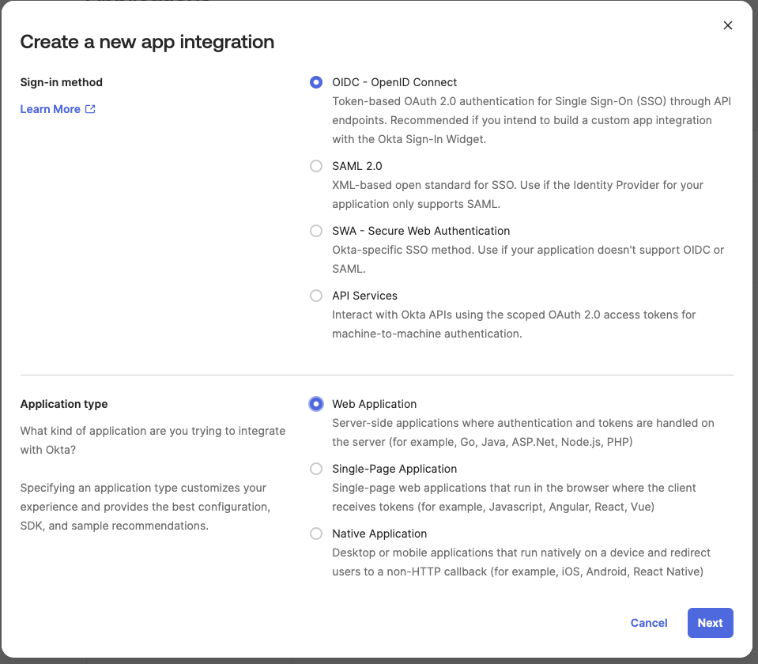

Add additional config for -

**Sign-in redirect URI**: https://"instance-url"/login/callback/okta <br>
**Sign-out redirect URI**: https://"instance-url"/login

Your instance-url may be either "instance-name".app.getaltimate.com or "instance-name".app.myaltimate.com

/// admonition | If you don't know the instance-name in above URIs, please contact the support team
    type: tip
///

Also, in "Assignments" section, please choose "skip group assignments" for now.

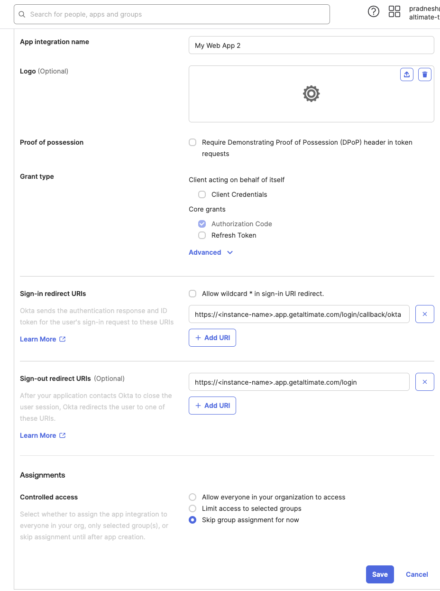

Finally, save the config to create the Okta app.

## Step 2: Share config info with our support team

Share Client-ID, Client-Secret, OIDC provider (Okta) URL (e.g.https://trial-1627894-admin.okta.com/admin/app/) with the support team.

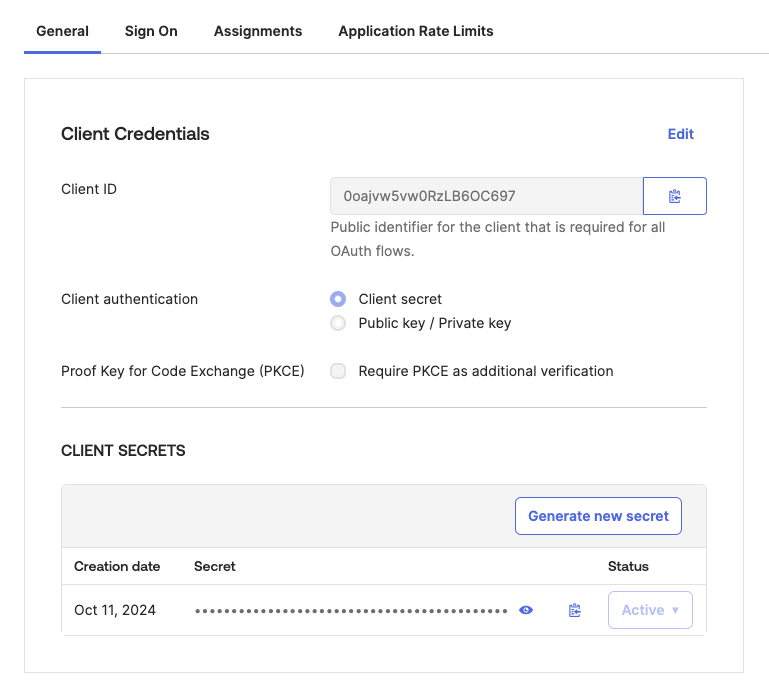

## Step 3: Start using Altimate AI instance with SSO

Once our support team has done necessary config based on the info provided by you in the earlier step, we will notify you.

You can also create a bookmark app in Okta by following these [instructions from Okta documentation](https://support.okta.com/help/s/article/create-a-bookmark-app?language=en_US)
Please use URL as https://<tenant>.getaltimate.com/login-redirect/okta or https://<tenant>.myaltimate.com/login-redirect/okta based on instructions shared by our support team. <br>

After this point, you can start using your Altimate AI instance with SSO and start onboarding users!

/// admonition | You need to have an enterprise plan for the SSO integration.
    type: info
///

## Azure AD SSO Setup

## Step 1: Create Azure AD App

Go to Azure [home](https://portal.azure.com/#home) and search “Active Directory” in search bar, and select active directory

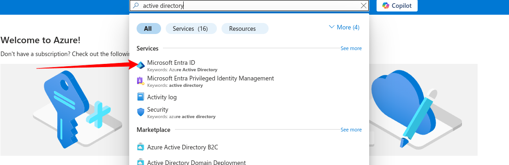

Click + Add and select App registration.

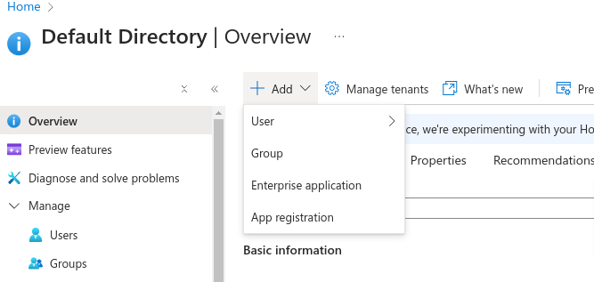

Enter a valid application name and in “Redirect URI” section, select “Web” and enter url “https://<instance url>/login/callback/active-directory” (replacing “instance url” with your instance url)

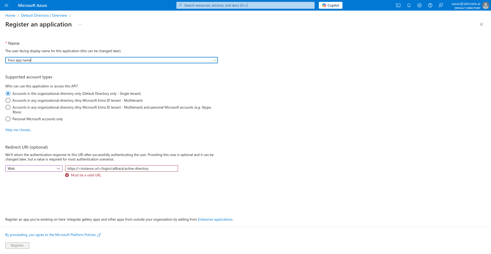

Your instance-url may be either "instance-name".app.getaltimate.com or "instance-name".app.myaltimate.com

/// admonition | If you don't know the instance-name in above URIs, please contact the support team
    type: tip
///

After registration, in overview section of the application, copy and save “Application (client) ID”. Then, Click “Add a certificate or secret”

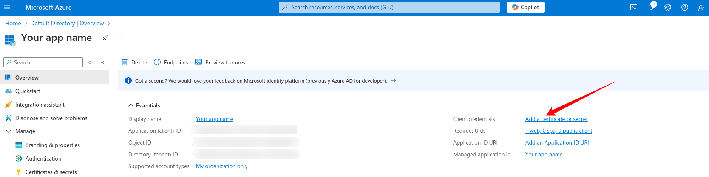

click “New client secret”. Enter description and select expiration according to your preferences.

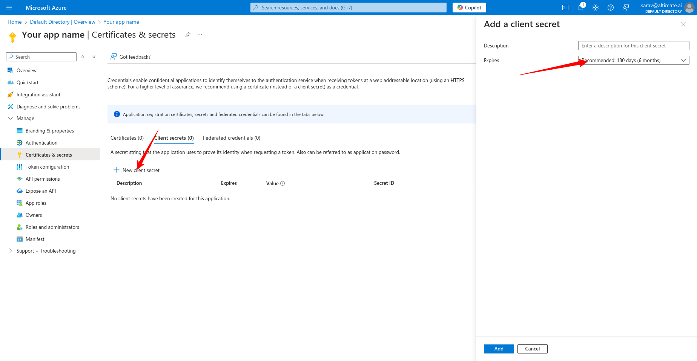

/// admonition | Make sure to contact us to update the secrets if it is expired.
    type: tip
///

Copy and save the secret value

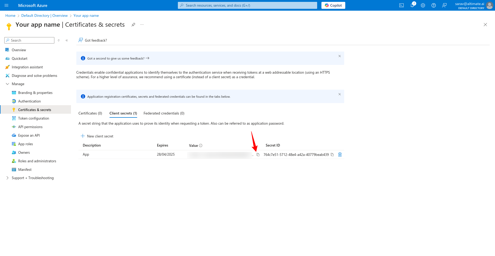

- Click “Default Directory | App registrations” link in the top left breadcrumb
- Click “Endpoints”
- Copy and save “OpenID Connect metadata document” url

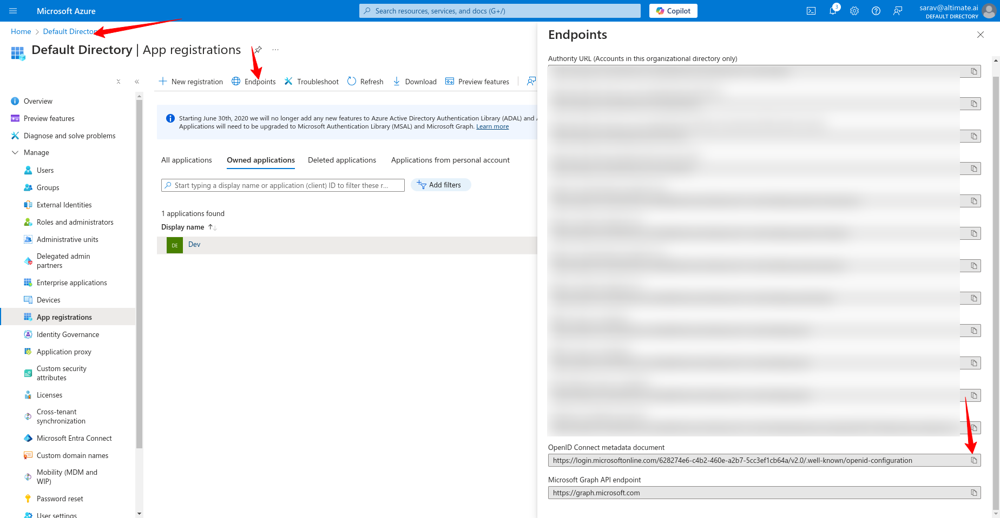

## Step 2: Share config info with our support team

From instructions in 'Step1' above, copy following information and share it with our support team

```
Application (client) ID
client secret
OpenID Connect metadata document url
```

## Step 3: Start assigning users / groups to app

Once our support team has done necessary config based on the info provided by you in the earlier step, we will notify you. After this point, you can start with additional steps necessary as below:

### Update the app to require user assignment

1. Sign in to the [Microsoft Entra admin center](https://entra.microsoft.com/).
2. If you have access to multiple tenants, use the Directories + subscriptions filter in the top menu to switch to the tenant containing the app registration from the Directories + subscriptions menu.
3. Browse to Identity > Applications > Enterprise applications, then select All applications.
4. Select the application you created earlier. Use the filters at the top of the window to search for a specific application.
5. On the application's Overview page, under Manage, select Properties.
6. Locate the setting Assignment required? and set it to Yes.
7. Select Save on the top bar.

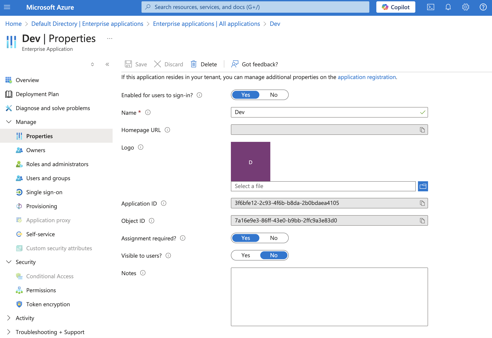

### Assign the app to users and groups to restrict access

Once you've configured your app to enable user assignment, you can go ahead and assign the app to users and groups.

1. Under Manage, select the Users and groups then select Add user/group.
2. Under Users, select None Selected, and the Users selector pane opens, where you can select multiple users and groups.
3. Once you're done adding the users and groups, select Select.
4. (Optional) If you have defined app roles in your application, you can use the Select role option to assign the app role to the selected users and groups.
5. Select Assign to complete the assignments of the app to the users and groups.
6. On return to the Users and groups page, the newly added users and groups appear in the updated list.

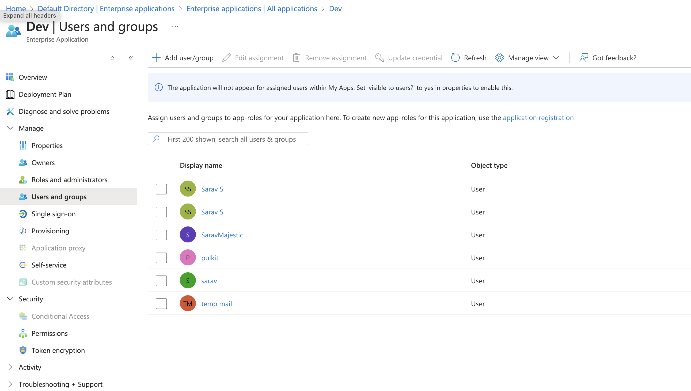

/// admonition | If needed, please check Microsoft Entra documentation [here](https://learn.microsoft.com/en-us/entra/identity-platform/howto-restrict-your-app-to-a-set-of-users)
    type: tip
///

## Azure AD Troubleshooting

If you encounter email related error during login with active directory like below, ask your Azure Active directory admin to add a valid email to the user as explained in next steps

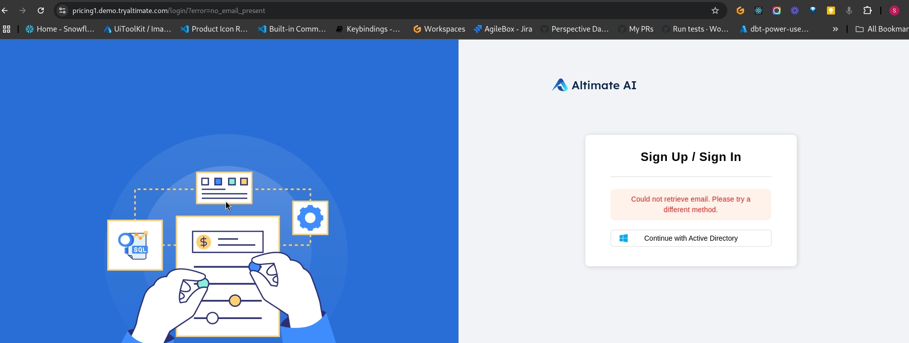

Solution:
In Azure, go to “Users” by searching in top search input. Select the user who has email issue and go to “Properties” and click edit button near “Contact Information”. Enter a valid email in “Email” field and save. User should be able to login now

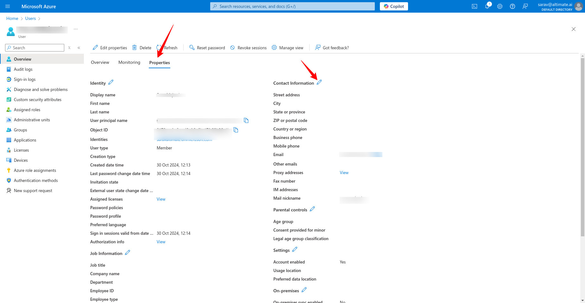
