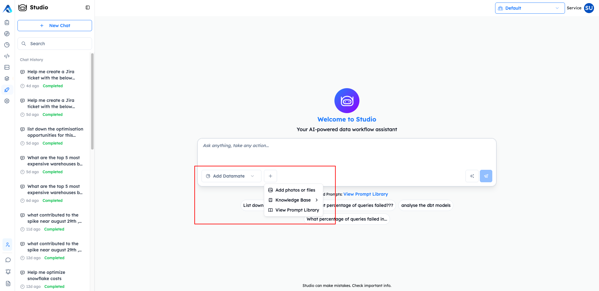
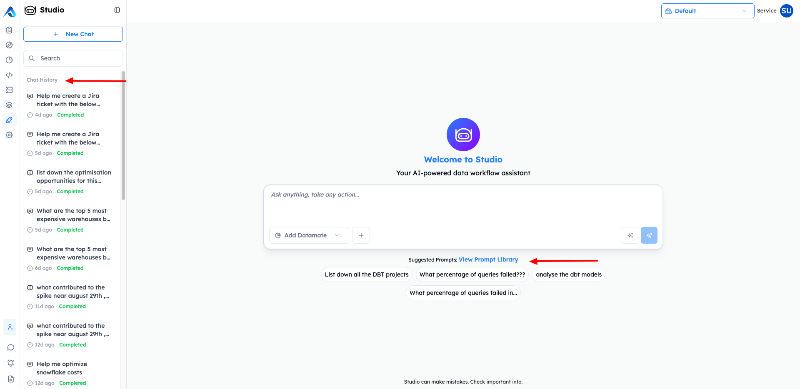
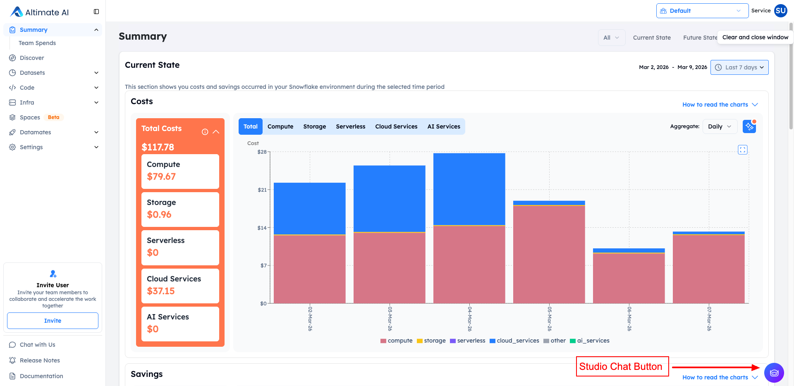
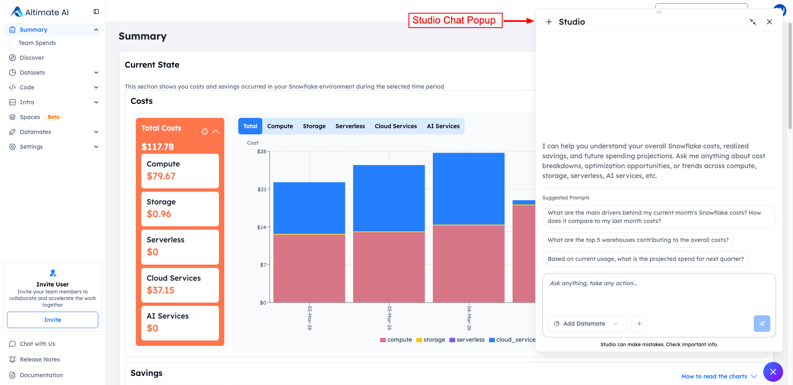

# Studio

## What is Studio?

Studio is a specialized agent designed for users to interact with their data stack using natural language. It is an easy-to-use solution for all your questions across Snowflake, DBT, Tableau, Databricks, Airflow, GitHub and more.

## Key Capabilities

Studio empowers users to:

- **Analyze performance** of existing workloads across your data infrastructure
- **dbt Project analysis** of entire dbt project structure, models, tests, dependencies etc.
- **Lineage exploration** to explore the lineage of dbt models and answer related questions
- **Documentation search** allows to search through dbt models documentation as well as add missing documentation
- **Perform root cause analysis** to quickly identify and resolve issues
- **Conduct cross-tool analysis** spanning multiple platforms in a single conversation
- **Generate detailed optimization plans** with quantified outcomes and projected savings
- **Best practices review** to get recommendations on dbt models best practices implementation

## Why Do We Need Studio?

Traditional AI approaches have critical limitations. These limitations are well taken care of through Studio:

### Without Studio

1. User asks: "Why is my dbt model running slow?"
2. Agent searches basic data
3. Finds execution time metrics
4. Provides incomplete analysis with:
   - Missing: Root cause of performance issue
   - Missing: Downstream impact on dependent models
   - Missing: Historical performance trends

**Result:** Incomplete, Siloed AI Responses

### With Studio

1. User asks: "Why is my dbt model running slow?"
2. Multi-agentic framework assembles rich context
3. Provides comprehensive analysis:
   - Root cause identified (e.g., inefficient CTEs, missing indexes)
   - Downstream impact on dependent models assessed
   - Actionable optimization recommendations with code examples

**Result:** Context-Rich, Memory-Enhanced Intelligence

## Extending Context

Beyond the integrations already connected to your SaaS instance, Studio allows you to enrich your queries with additional context:

| Option               | Description                                                                                                                                                      |
| -------------------- | ---------------------------------------------------------------------------------------------------------------------------------------------------------------- |
| **Datamates**        | Select any [Datamate](https://datamates-docs.myaltimate.com/user-guide/home/) to widen the context based on tools                                                |
| **Knowledge Bases**  | Connect organizational knowledge repositories from [Knowledge Hub](https://datamates-docs.myaltimate.com/user-guide/components/knowledgehub/) for deeper context |
| **File Attachments** | Upload documents, queries, or data files directly into your conversation                                                                                         |

This flexibility ensures you can ask questions across a broader tool set while providing the agent with the context it needs to deliver accurate, actionable insights.

## How Studio Works

### 1. Providing Input

When starting a conversation, users have multiple ways to provide context:

| Option                  | Description                                                                    |
| ----------------------- | ------------------------------------------------------------------------------ |
| **Ask a question**      | Type your query directly in the chat input                                     |
| **Add Datamate**        | Select a Datamate to access any tool specific information                      |
| **Attach files**        | Upload files for analysis (via "+" menu)                                       |
| **Knowledge Base**      | Access organizational knowledge repositories from Knowledge Hub (via "+" menu) |
| **View Prompt Library** | Browse pre-built prompts for common tasks (via 'Select Prompt Library')        |

### 2. Results Delivery

Once the search is complete, you receive a comprehensive analysis with:

- **Executive Summary** - High-level findings
- **Key Metrics** - Data tables with critical information
- **Detailed Analysis** - In-depth analysis (e.g., query-by-query breakdown)
- **Key Findings** - Insights with evidence and impact
- **Root Cause Analysis** - Why issues occurred
- **Optimization Recommendations** - Prioritized action items
- **Next Steps** - Implementation roadmap

### 3. Output Features

Analysis results include interactive options:

| Feature                 | Description                                 |
| ----------------------- | ------------------------------------------- |
| **View detailed steps** | Expand to see the full execution trace      |
| **Task Progress**       | Visual checklist of completed subtasks      |
| **Download**            | Export results for offline use or reporting |

### 4. Confidence Indicators

Studio provides transparency about result quality:

| Indicator            | Meaning                                         |
| -------------------- | ----------------------------------------------- |
| Low Confidence (50%) | Consider refining your query for better results |
| High Confidence      | Results are reliable and well-supported         |

## Components of Studio

Two important components of Studio are Chat History and Prompt Library:

### Chat History

Chat History is a persistent record of all your previous conversations with Studio. Located in the left sidebar, it provides quick access to past interactions, allowing you to revisit analyses, continue previous work, or reference earlier insights.

#### Key Features

| Feature               | Description                                                                 |
| --------------------- | --------------------------------------------------------------------------- |
| **Conversation List** | All past chats are displayed chronologically with preview titles            |
| **Status Indicators** | Each conversation shows its current status (e.g., "Completed")              |
| **Timestamps**        | Relative timestamps (e.g., "8h ago", "11h ago") help you locate recent work |
| **Search**            | Quickly find specific conversations using the search bar                    |
| **New Chat**          | Start a fresh conversation at any time with the "+ New Chat" button         |

#### How It Works

- **Automatic Saving** - Every conversation is automatically saved to your Chat History
- **Title Generation** - Conversations are titled based on your initial query (e.g., "Help me create a Jira ticket with the below details...", "Analyse the query")
- **Quick Resume** - Click any conversation to instantly resume where you left off

#### Use Cases

- **Continuing Analysis** - Pick up where you left off on a complex investigation
- **Reference Past Insights** - Look back at previous cost analyses or query optimizations
- **Audit Trail** - Track what questions you've asked and what answers you received
- **Knowledge Building** - Build on previous conversations rather than starting from scratch

### Prompt Library

Prompt Library is a shared repository of pre-built, reusable prompts that help you get started quickly with common data analysis tasks. It serves as a knowledge base of effective queries created by you, your team and the organization.

#### Key Features

| Feature                | Description                                                                   |
| ---------------------- | ----------------------------------------------------------------------------- |
| **Pre-built Prompts**  | Ready-to-use prompts for common analytical tasks                              |
| **Tagging System**     | Organize prompts with tags like "query", "summary", "test" for easy discovery |
| **Ownership Tracking** | See who created each prompt (individual or "Altimate AI")                     |
| **Team Sharing**       | Share prompts with "All org" or specific teams                                |
| **Search & Filter**    | Find prompts by type, team, owner, or tags                                    |
| **Custom Prompts**     | Create and save your own prompts with "+ New Saved Prompt"                    |

#### How to Use

1. **Access the Library** - Click "View Prompt Library" from the Suggested Prompts link on the main Studio screen
2. **Browse or Search** - Use filters (Type, Teams, Owner, Tags) or search to find relevant prompts
3. **Select a Prompt** - Click the send icon to use a prompt directly
4. **Customize** - Many prompts have placeholders (e.g., `<enter no. of days>`) that you can fill in
5. **Save Your Own** - Click "+ New Saved Prompt" to add your custom prompts to the library

#### Filters Available

| Filter    | Purpose                                              |
| --------- | ---------------------------------------------------- |
| **Type**  | Filter by prompt category                            |
| **Teams** | Show prompts shared with specific teams              |
| **Owner** | Filter by prompt creator                             |
| **Tags**  | Filter by semantic tags (query, summary, test, etc.) |
| **Sort**  | Order by "Recently Added" or other criteria          |

#### Benefits

- **Faster Start** - Don't write prompts from scratch; use proven templates
- **Best Practices** - Leverage prompts crafted by experts
- **Consistency** - Teams use standardized prompts for common analyses
- **Knowledge Sharing** - Share effective prompts across the organization or with specific teams
- **Parameterized Templates** - Prompts with placeholders adapt to different scenarios

## Accessing Studio from SaaS Pages

Studio is also seamlessly integrated throughout the SaaS platform, providing context-aware assistance directly within the pages. A Studio popup is available on every major page, offering relevant prompts and insights based on the specific data and context of that page.

### How It Works

Each SaaS page includes a **Studio button** (chat icon) in the bottom right corner. Clicking this button opens a Studio popup panel that:

- **Automatically understands the page context** - The agent knows which page you're on and what data you're viewing
- **Provides relevant suggested prompts** - Pre-built questions specific to that page's functionality
- **Allows custom questions** - You can ask your own questions within the page context
- **Offers full expansion** - Use the "Expand in Studio" link to open the full Studio experience

### Page-Specific Studio Integration

#### Summary Page:

When accessing Studio from the **Summary** page, you get assistance focused on cost analysis and spending insights.

**Use Cases**: Cost analysis, spending trends, budget forecasting, cost optimization opportunities

#### Discover Page:

When accessing Studio from the **Discover** page, you get assistance in identifying and prioritizing optimization opportunities.

**Use Cases**: Optimization prioritization, cost-saving initiatives, quick wins identification, resource efficiency

#### Datasets Page:

When accessing Studio from the **Datasets** page, you get assistance for exploring and understanding your data assets.

**Use Cases**: Data catalog exploration, metadata analysis, data governance, dependency mapping

#### Code Page:

When accessing Studio from the **Code** page (Queries tab), you get assistance for query performance analysis and optimization.

**Use Cases**: Query optimization, performance troubleshooting, cost attribution, anti-pattern identification

#### Infra Page:

When accessing Studio from the **Infra** page, you get assistance for infrastructure management and warehouse optimization.

**Use Cases**: Resource monitoring, infrastructure cost optimization, utilization analysis

### Benefits of Page-Specific Studio

| Benefit                     | Description                                                                                                                    |
| --------------------------- | ------------------------------------------------------------------------------------------------------------------------------ |
| **Consistent Experience**   | Same powerful Studio's agent capabilities available wherever you need them                                                     |
| **Contextual Intelligence** | The agent understands what data and metrics are relevant to your current page                                                  |
| **Faster Insights**         | No need to switch between pages. Suggested prompts help you ask the right questions immediately without thinking about context |
| **Progressive Disclosure**  | Start with a quick popup, expand to full Studio when needed                                                                    |
| **Chat History**            | The history for all the chats done through SaaS pages is retained and can be viewed on the main Studio page                    |

/// admonition | Studio is currently in Beta. We're continuously improving the platform based on user feedback.
    type: info
///

/// admonition | For more information and access to Studio, visit [app.myaltimate.com](https://app.myaltimate.com)
    type: tip
///
