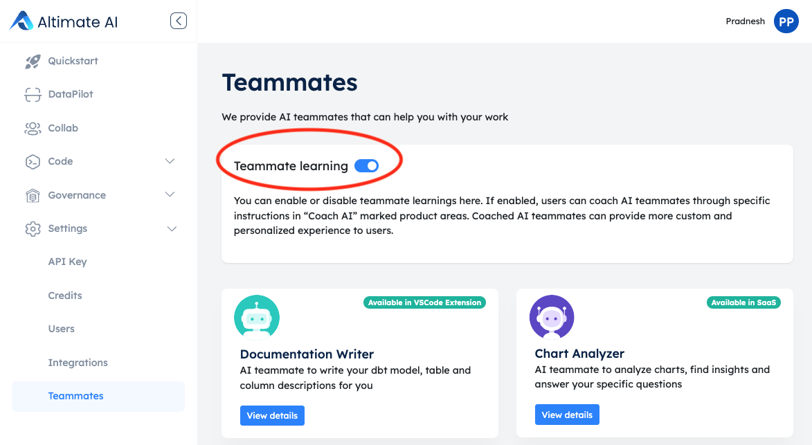
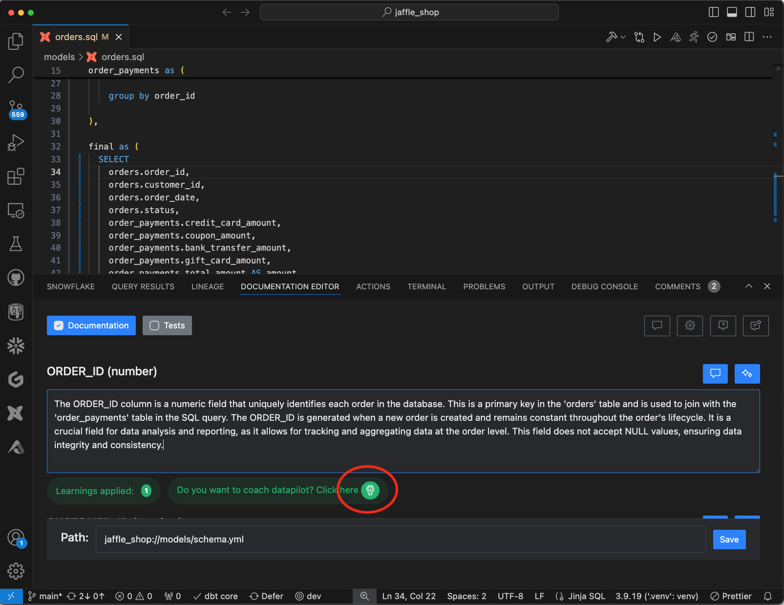
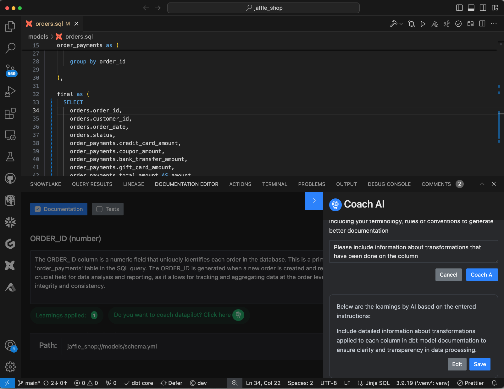
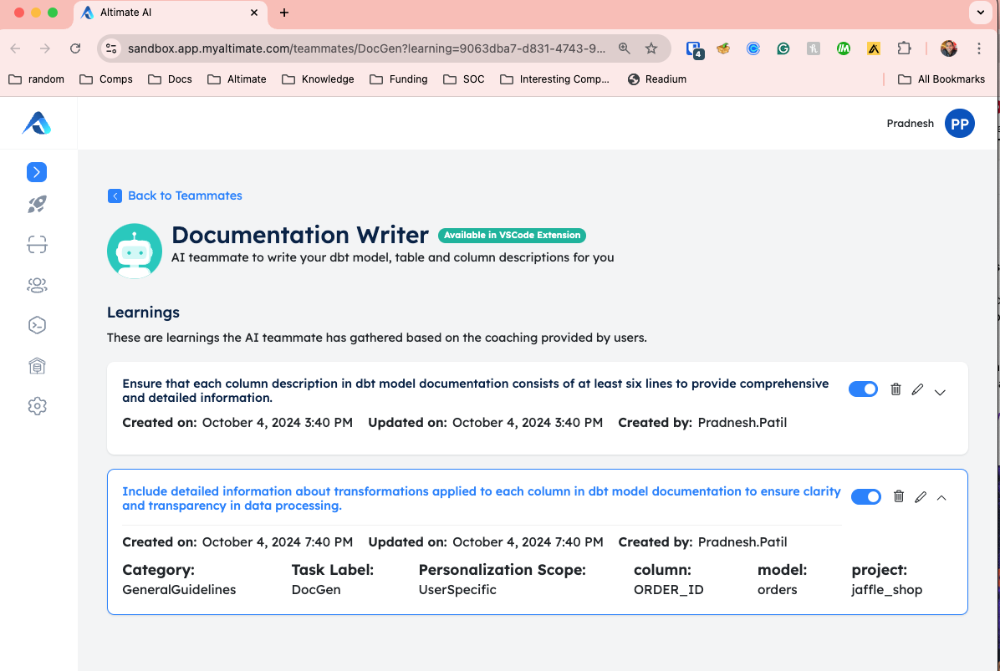

You can coach and personalize your AI teammates by giving instructions in the natural language.

First, enable AI teammates functionality by going in settings -> teammates menu.
 

/// admonition | Unless you enable teammates in the SaaS instance, coaching and personalization outlined below won't work.
    type: warning
///

## Documentation Writer

Documentation writer AI teammate is available via the documentation editor panel in the Power User VSCode extension.
Here are more details on how to [generate documentation](../document/generatedoc.md)

### Trigger coaching

If you want to coach your documentation writer, after the documentation is generated, click on "do you want to coach AI" icon
as shown below:

 

### Provide instructions

You can provide instructions in the naturla language first and then the AI temmate will show you what it has understood.
You can edit that understanding further as shown below:

 

### Curate and update learnings

All the learnings done by AI teammates can be curated further by you in the settings -> teammates are in the SaaS UI.
You can edit the earlier learnings, enable / disable them or you can simply delete them as well.

 
