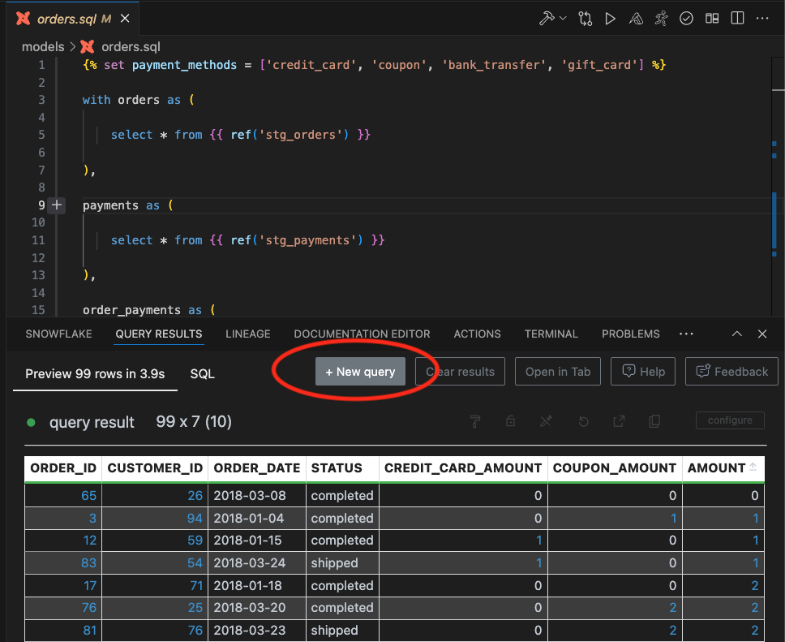
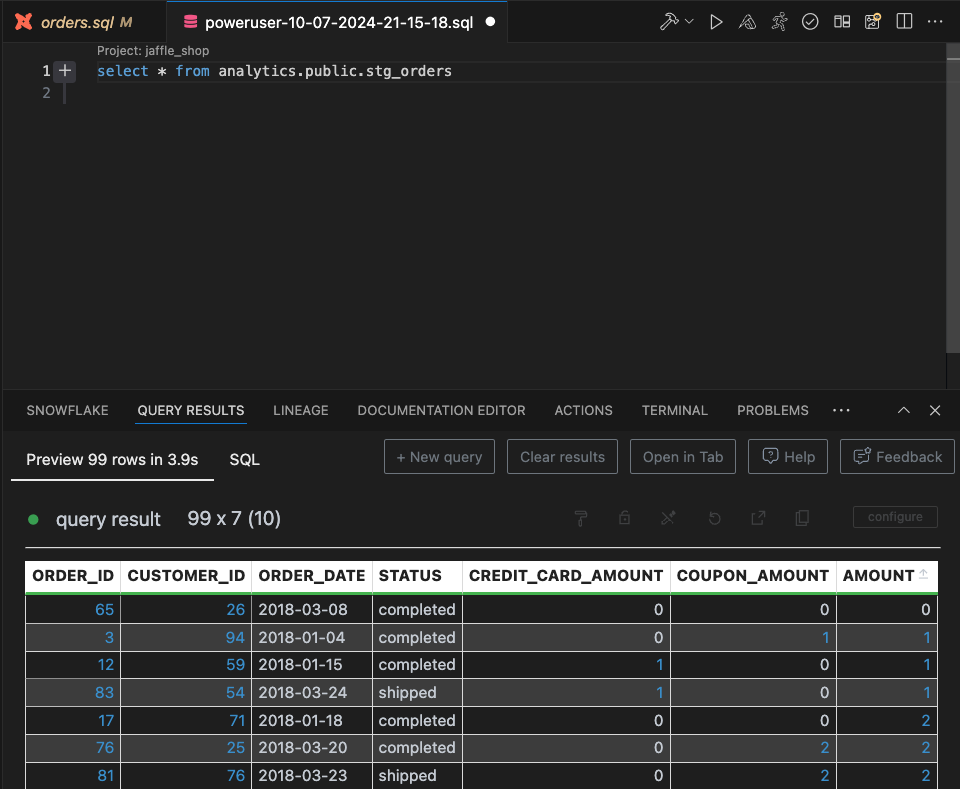
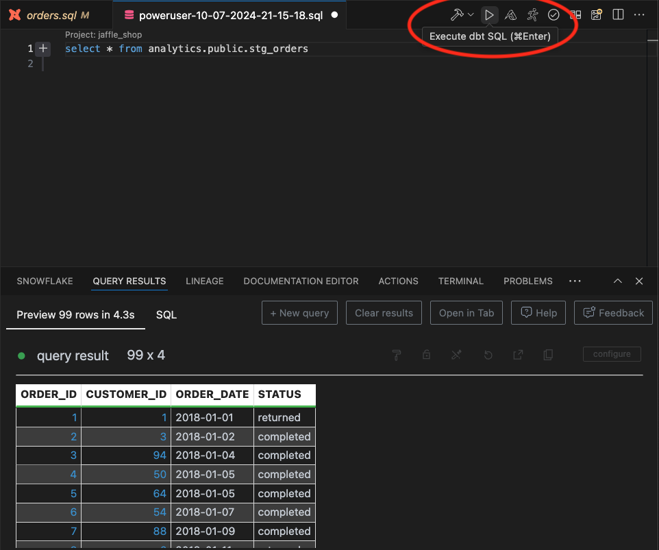

You can run ad hoc SQL queries or dbt Models in the "Query Results" tab

## Click on the "New Query" Button

The "New Query" button is available in the "Query Results" bottom panel.

## Enter a Query

Enter the SQL or dbt query that you want to run

## Run the Query

Click on play button to run the query and see the results in the bottom panel

