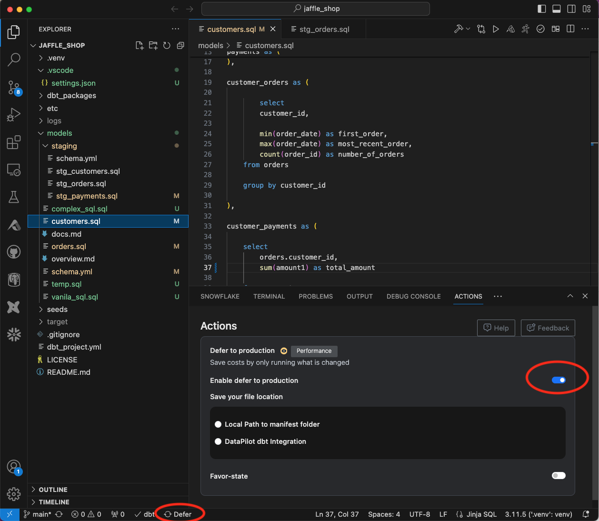
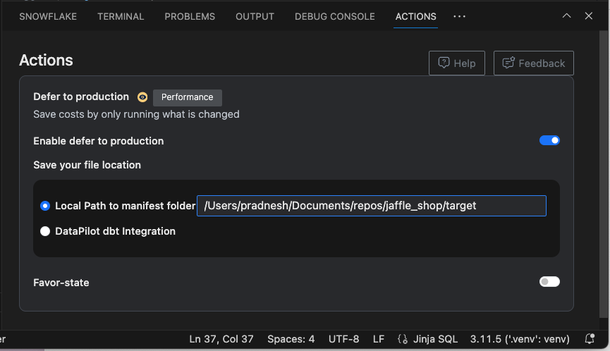
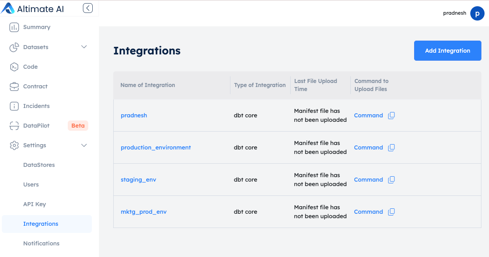
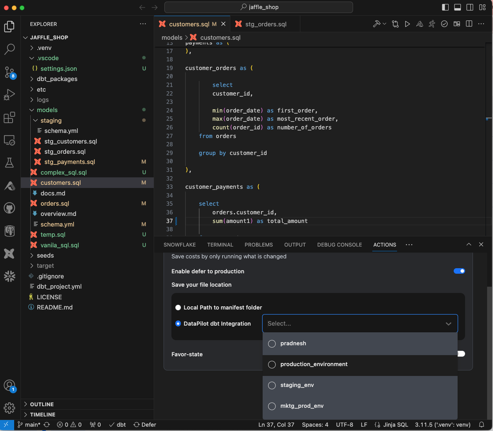

Defer functionality in dbt allows the user to run a subset of models or tests without having to first build their upstream parents. Usually, it leads to significant cost and time savings during testing of the dbt models. More information about this functionality is available in [dbt docs](https://docs.getdbt.com/blog/defer-to-prod).

### Step 1: Enable Defer to production functionality in the "Actions" panel as below

 

### Step 2: Choose where your manifest file is stored for the production environment

You can either use this functionality in the local mode where your manifest files stay in your local computer. You can also use the SaaS instance to store your manifest files so multiple team members can benefit from prod or staging data.

## Local Mode

Choose the location of your local manifest file as shown in the image below:

 

## SaaS Mode

/// admonition | To use the Altimate SaaS instance, you will need to install the `altimate-datapilot` python package. You can install it using the following command: `pip install altimate-datapilot`. This package is required to upload the manifest file to the SaaS instance. You can find more information about the package [here](https://github.com/AltimateAI/datapilot).
type: tip
///

First, create the dbt integration in the Altimate AI SaaS instance by going to Settings -> Integrations from left side navigation menu. This is just to create a reference where you can upload respective manifest files to point to.

/// admonition | If you would like to connect your on-premise storage for manifest file uploads, please [contact us](https://www.altimate.ai/support) via chat or Slack.
type: info
///

 

Then, copy the command (last column in above image) from the UI to upload manifest files mapped to this integration.

The command will look something like this -  

"datapilot dbt onboard --token <token> --instance-name <instance_name> --dbt_core_integration_id <id> --manifest-path 'Path/to/file'"
  
(You need to replace 'Path/to/file' with the path to your manifest file e.g. /Users/mrx/documents/repos/jaffle_shop/target/manifest.json)

/// admonition | You can use this command to run at regular intervals in your CI/CD or orchestration tool so the latest manifest is always available for reference automatically in other environments
type: tip
///

Now, choose the right dbt integration to reference in your VSCode as below:

 

### Step 3: Enable/disable favor state

Turn on favor-state if you need it. If it's turned on, the defer functionality will favor using the node defined in the referenced integration, even if the node exists in the current project.

## Recorded demo video

<iframe width="800" height="600" src="https://www.youtube.com/embed/r91_NShqhlU?si=dil-QKff7d5hHjL4" title="YouTube video player" frameborder="0" allow="accelerometer; autoplay; clipboard-write; encrypted-media; gyroscope; picture-in-picture; web-share" referrerpolicy="strict-origin-when-cross-origin" allowfullscreen></iframe>

## Interactive demo

<iframe src="https://app.supademo.com/embed/cltlt0f7g1tk6cd1jy5qo12ym" allow="clipboard-write" frameborder="0" webkitallowfullscreen="true" mozallowfullscreen="true" allowfullscreen style="position: absolute; top: 0; left: 0; width: 100%; height: 100%;"></iframe>

/// admonition | Using defer to prod with SaaS instance requires an API key. You can get it by signing up for free at [www.altimate.ai](https://www.altimate.ai) Local mode doesn't require an API key.
type: info
///
