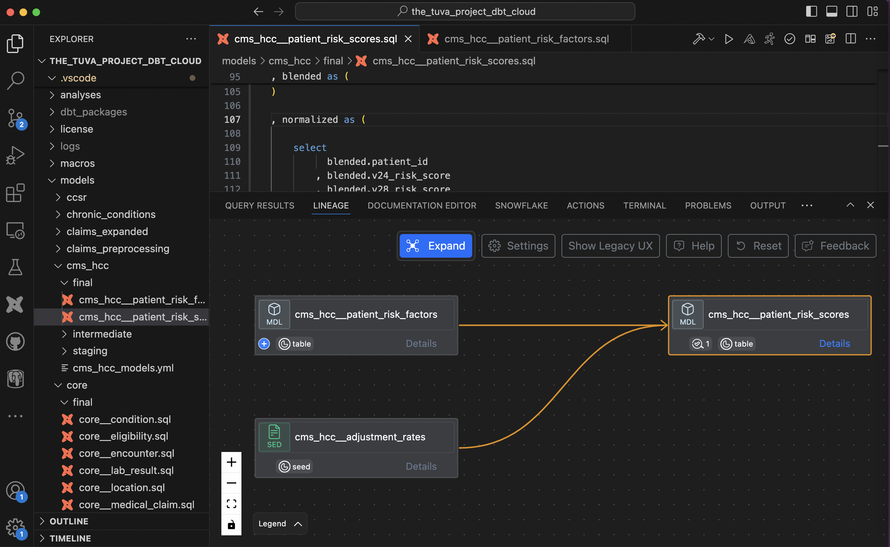
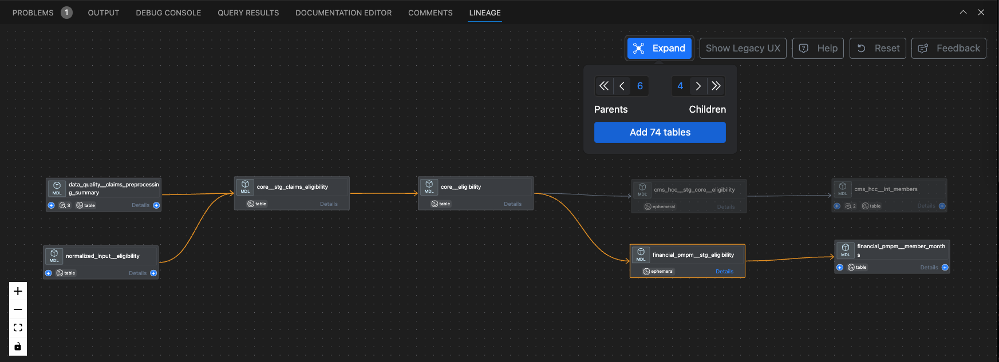
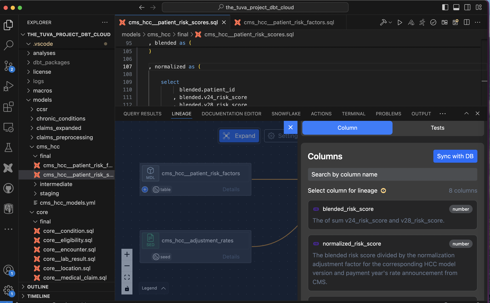
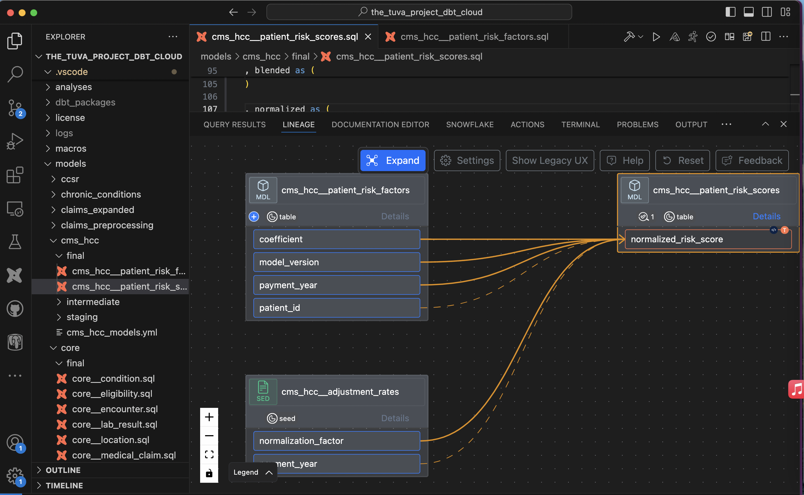
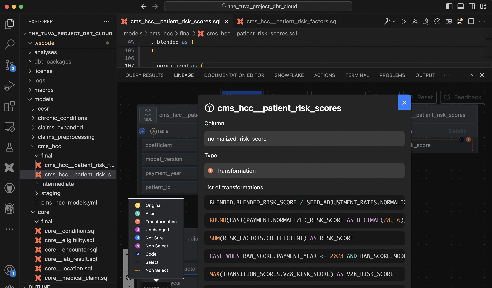
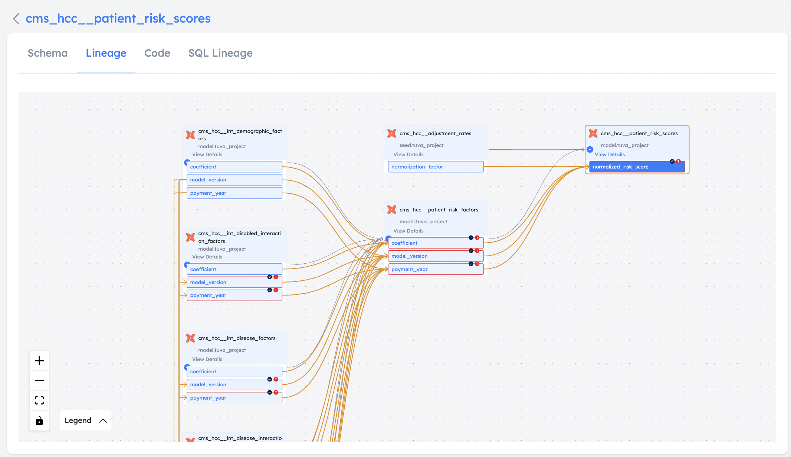

Lineage is available as model level lineage and column level lineage. You need to add an API key to view column level lineage. You can view model level lineage without an API key.

## Model lineage

- Different dbt entities like sources, seeds, models, tests, metrics, exposures, and model types are shown in the lineage view.

- For applicable components, Clicking on "Details" shows a list of columns with descriptions as well as dbt tests that are written for that particular component.

## Expand lineage graph

You can expand lineage at a single expansion level by clicking (+) signs on individual blocks or you can expand multiple levels of lineage by using "Expand" button as show below

## Column lineage

- After clicking on "Details" for the component, you can see a list of columns. Then, you can click on a column name to change model lineage to column lineage view.

- In the column lineage view, links between components are shown as select links and non-select links. Select links are shown as solid lines if there is a direct flow of data between columns through select statements. Non-Select links are shown as dotted lines if columns appear in the condition/clause like where, join, having, etc. Check the Settings tab if you want to disable certain types of links or set specific expansion levels by default.

## Code transformations

- On each individual component, you can see small icons that show how that column was created (through transformation, just name change or passed unchanged). If code is available for a particular transformation, a small code icon is displayed.
- When you click on the code icon, it shows the list of code transformations that were performed to create that column.

/// admonition | Column lineage with code transformation is also available in SaaS UI. Please refer to the section on [SaaS Discovery UI](../discover/viewlineage.md)
    type: tip
///

/// details | Following are a few limitations in the column level lineage
    type: note

- Snapshots are not supported (coming soon)
- Operators that may result in an incomplete lineage - Unnest - Lateral View Flatten - Json flatten to columns
///

## Export lineage

You can export lineage view to a web page. Please check more details [here](../govern/collaboration.md#lineage-export-workflow)

## Interactive demo - column lineage

<iframe src="https://app.supademo.com/embed/clxkvc6q801nwsioa2h827cpt" title="Column Lineage v3" allow="clipboard-write" frameborder="0" webkitallowfullscreen="true" mozallowfullscreen="true" allowfullscreen style="position: absolute; top: 0; left: 0; width: 100%; height: 100%;"></iframe>

## Recorded demo - column lineage

<iframe src="https://www.loom.com/embed/24c9230c94854443a17d85de78f90ea8?sid=ba72566e-20e0-4ea2-a16a-55c8d5751c9e" frameborder="0" webkitallowfullscreen mozallowfullscreen allowfullscreen style="position: absolute; top: 0; left: 0; width: 100%; height: 100%;"></iframe>

/// admonition | Column lineage requires an API key. You can get it by signing up for free at [www.altimate.ai](https://www.altimate.ai)
    type: info
///
