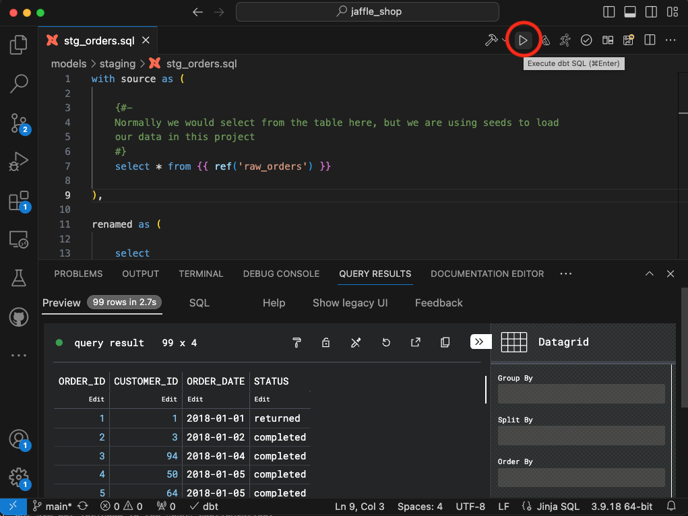
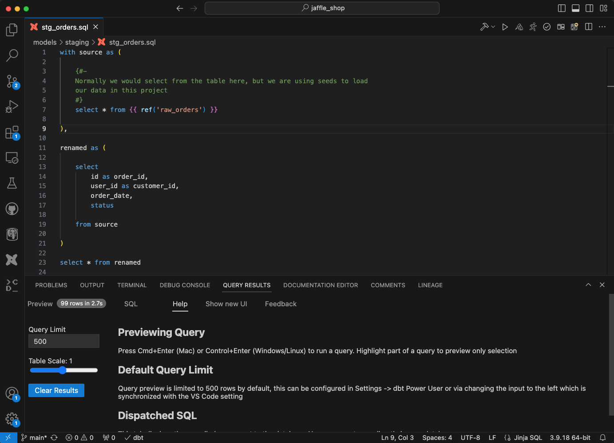
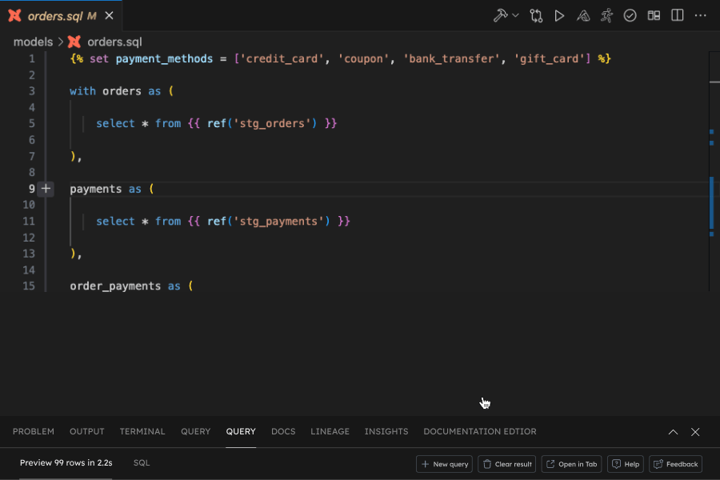

You can preview the resulting data and SQL query from your code with the extension, export it as CSV and do further analysis.

## Preview results, export and analyze

You can preview results for the entire dbt model or select part of the dbt model to preview results only for that selection. After you select, Press Cmd+Enter (Mac) or Control+Enter (Windows/Linux) to run a query.

<interactive demo of preview query results>

<iframe src=https://app.supademo.com/embed/S4uCGtgs_jisbJs5SfJzZ frameborder="0" webkitallowfullscreen="true" mozallowfullscreen="true" allowfullscreen style="position: absolute; top: 0; left: 0; width: 100%; height: 100%;"></iframe>

/// details | You can also preview query results via "execute dbt SQL" operation from the toolbar on the top right corner. You have to click on the "play" button as shown in the image below.

///

/// details | You can view and copy the SQL query that was executed to get the data results.

In order to view executed SQL query, you need to click on SQL tab inside "Query Results" bottom panel.
There is a copy SQL button also, it becomes visible only when you hover over the top right corner.

///

## Configure settings for query preview

There are multiple actions available as actions on the top of query results preview window. Please click “configure” button to make it visible.

| Action      | Details                                                                                              |
| ----------- | ---------------------------------------------------------------------------------------------------- |
| Dark Mode   | You can change configuration of preview results display to light, dark, solarized etc. display modes |
| Scroll Mode | Free scroll or aligned scroll                                                                        |
| Read only   | Read only or editable mode (Note: editable mode doesn’t save values in the database)                 |
| Reset       | Reset button to reset the view                                                                       |
| Export      | You can export the data in CSV format                                                                |
| Copy        | You can copy the data shown in the preview. There are multiple options like CSV and JSON format      |

Query preview is limited to 500 rows by default, this can be configured in Settings area or you can configure query results options in "Help" tab in the bottom panel as below.

You can also change table zoom level with 'scale' setting so you can see more columns in a single view or you can clear results by clicking “clear results” button.

## Compare Query Results

You can save query results by opening in a tab. Then, make changes to a query and run query results.
Now, you can compare previous results with new results easily as below:

<iframe src="https://app.supademo.com/embed/clyjc445z035z1y2pqv8z7oyd" loading="lazy" title="Compare results" allow="clipboard-write" frameborder="0" webkitallowfullscreen="true" mozallowfullscreen="true" allowfullscreen style="position: absolute; top: 0; left: 0; width: 100%; height: 100%;"></iframe>

## Run an ad-hoc query

You can run ad hoc SQL queries or dbt Models in the "Query Results" tab

