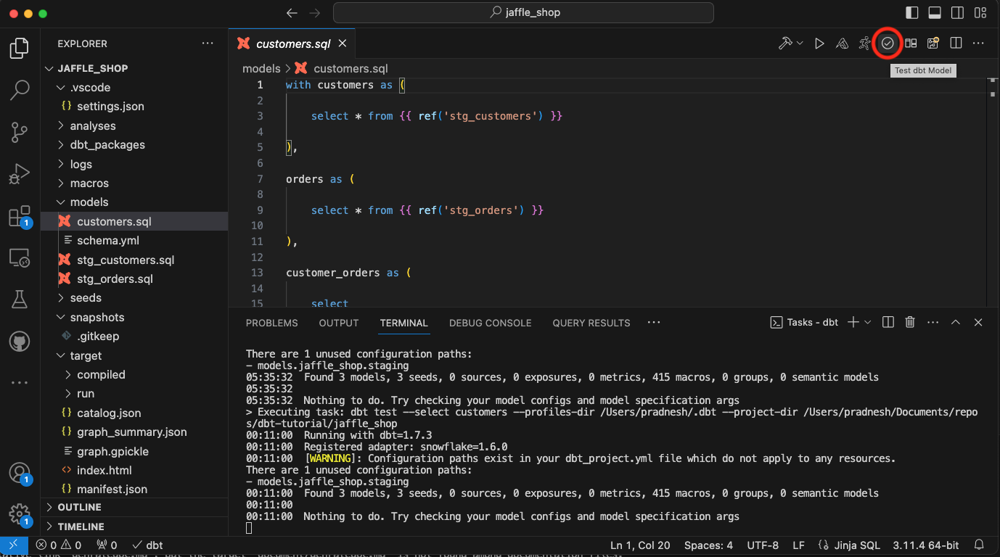
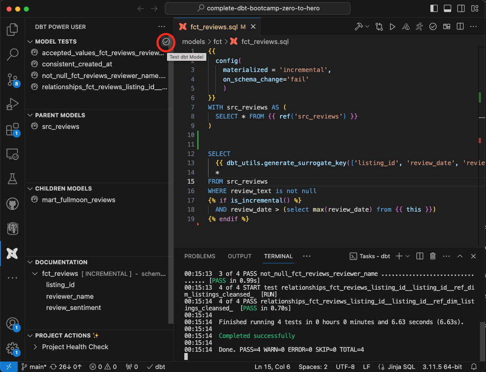

There are two methods to run dbt model tests. You can either do it from the top right corner toolbar or from the extension side panel.

### Method 1: Run tests from the toolbar

The toolbar action to run tests is present on the top right corner of the VSCode, as shown in the image below:

### Method 2: Run tests from the side panel

On the left side of the navigation, click on the dbt power user extension icon to open the left-side panel, as shown in the image below.
Then, click on the "Test dbt Model" button (hover over the area shown by the red circle to make it visible) to execute dbt model tests.

