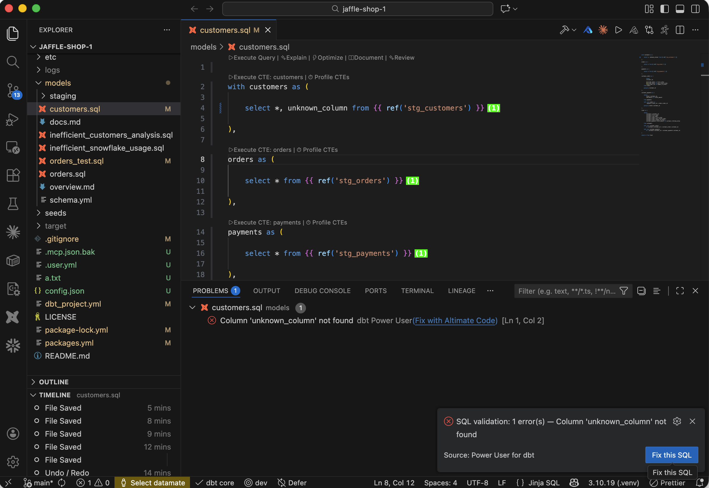

Identify SQL issues like non-existent columns, keyword typos, extra parentheses easily

Following SQL checks are available:

| Check                        | Details                                                                                         |
| ---------------------------- | ----------------------------------------------------------------------------------------------- |
| Identify non-existent column | If SQL is referencing some columns that don't exist, those columns will be identified as error. |
| Keyword typos                | If there are some typos in SQL keywords, those keywords will be flagged                         |
| Missing or extra parentheses | If there are missed or extra parentheses, that SQL area will be highlighted                     |

## Errors and quick fix

Every error popup raised by Validate SQL includes a **Fix with Altimate Code** button. Clicking it opens the Altimate Code chat with the model name and raw SQL pre-filled, so you can ask for a fix without restating the problem.

In addition to the SQL checks above, the four pre-execution paths that previously failed silently now each show a descriptive error popup with its own Fix button:

| Path | What you'll see |
|---|---|
| dbt manifest not loaded | *dbt manifest not loaded. Run `dbt parse`…* |
| Model not present in manifest | *Model `X` not found in manifest…* |
| Parent graph entry missing | *Could not find model graph entry…* |
| SQL compilation failed (broken `ref()` etc.) | *Unable to compile SQL for model `X`…* |

After Validate SQL writes diagnostics to the Problems panel, an error notification with a **Fix this SQL** button also appears. The prompt sent to Altimate Code contains the compiled SQL plus the validation errors.

/// admonition | See also: Problems panel quick fix
    type: tip

The Validate SQL errors that land in the Problems panel also get the **Fix with Altimate Code** quick-fix light-bulb and inline link covered in [Troubleshooting → Fix with Altimate Code (any error row)](../troubleshooting.md#fix-with-altimate-code-any-error-row).
///

<interactive demo of SQL validator>

<iframe src=https://app.supademo.com/embed/clpyaam841qoepezyayydl83b frameborder="0" webkitallowfullscreen="true" mozallowfullscreen="true" allowfullscreen style="position: absolute; top: 0; left: 0; width: 100%; height: 100%;"></iframe>

