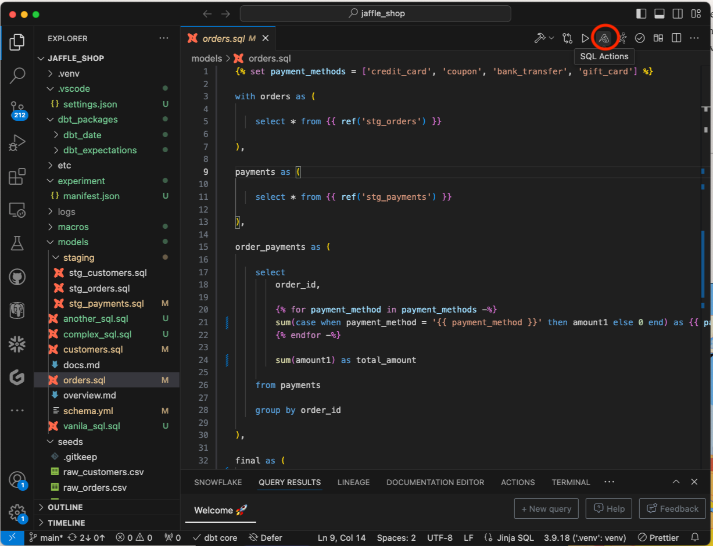
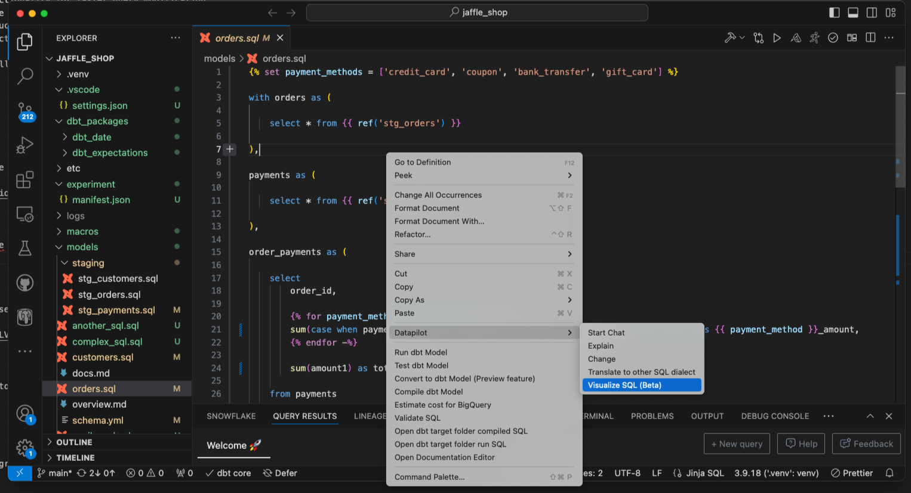
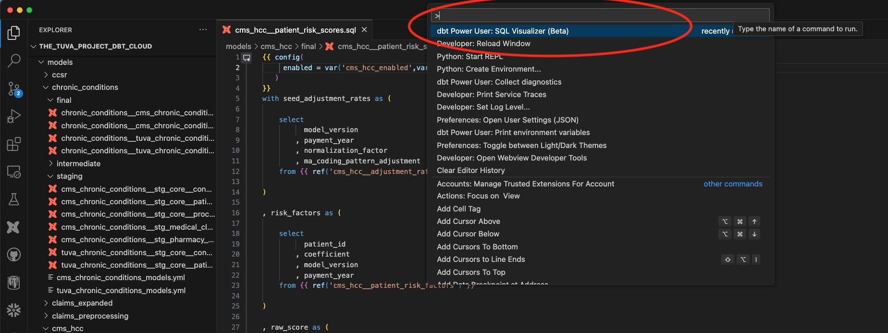
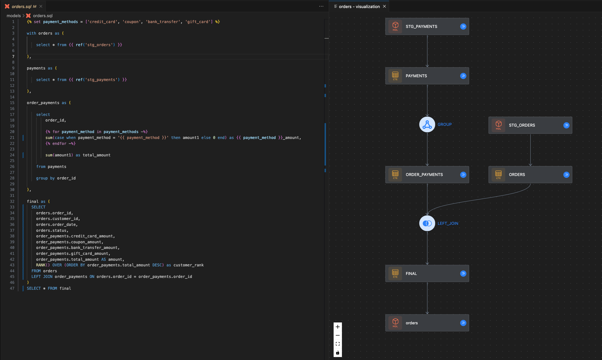
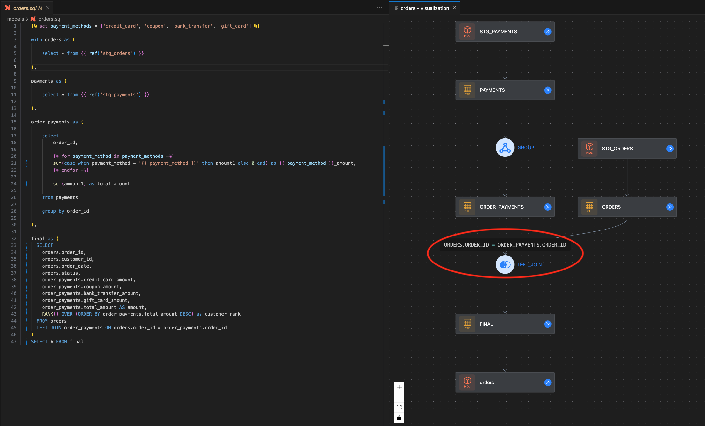

# SQL Visualizer (Beta)

The new SQL visualizer translates complex SQL queries into intuitive graphical representations. SQL visualizer functionality shows the SQL structure of your code and how different components of the code are connected.
The provided SQL query is visually broken down into nodes representing CTEs, joins, filters, and unions, making it easier to understand, refactor, and debug the query components.

### Key Benefits

- Enhanced Comprehension: Quickly grasp SQL structure and flow through visual elements.
- Improved Productivity: Drag-and-drop functionality for faster query modification.
- Better Collaboration: Visual diagrams are effective documentation and are easier to share.
- Easier Refactoring: Simplify query restructuring with the visual graph of all components.
- Simplified Debugging: Identify and correct errors quickly by visually tracing query logic.

/// admonition | This functionality is still in beta. The functionality may change further to streamline the experience
    type: info
///

## Trigger the functionality

### Actions Toolbar

Click on "SQL Actions" icon as shown in the image below and choose "Visualize SQL" option from the drop down as below:

### Right Click Menu

You can just right click in the file, chose "DataPilot" menu and then choose option "Visualize SQL"

### Command Palette

Open the model file for which you need to see SQL visualization. Then, press cmd+shift+P (for Mac) or Ctrl+shift+P (for Windows) to bring up the command palette. Search for "SQL visualizer" and execute it.

## View the SQL components flow

Please use the bottom left corner buttons to zoom in / zoom out, etc.

## Hover over connections to view the code

You can hover over connections like join, group, union to see the code. You can also click on "View Details" within the component to see the list of columns and descriptions.

## Same view is available in the SaaS Discovery UI

SQL visualizer is also available in the SaaS Discovery UI where you can also see column lineage, dbt Model documentation and compiled code.
Please check more details on how to set up SaaS Discovery UI [here](../discover/setupui.md)

## Recorded Demo

<iframe src="https://www.loom.com/embed/11068668306f4b209450dc7b47b830c9?sid=75ab7592-7f45-4a88-8579-78e411ebadb4" frameborder="0" webkitallowfullscreen mozallowfullscreen allowfullscreen style="position: absolute; top: 0; left: 0; width: 100%; height: 100%;"></iframe>

