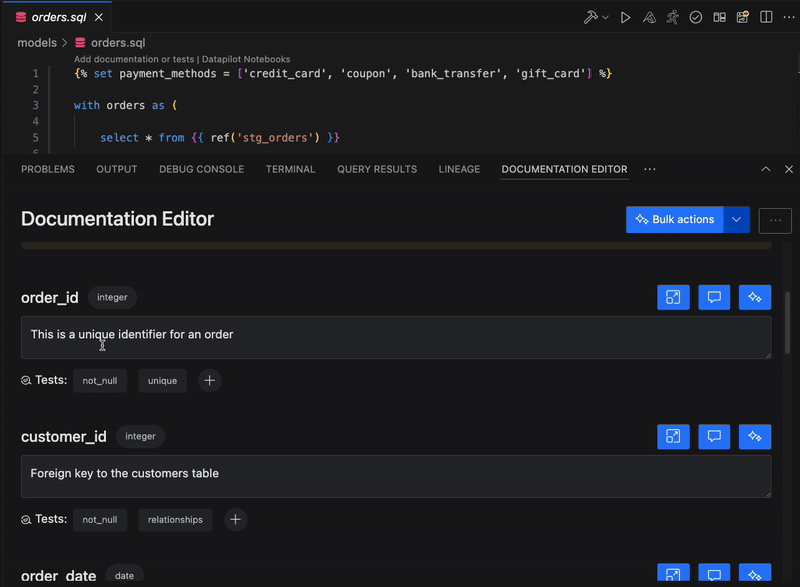
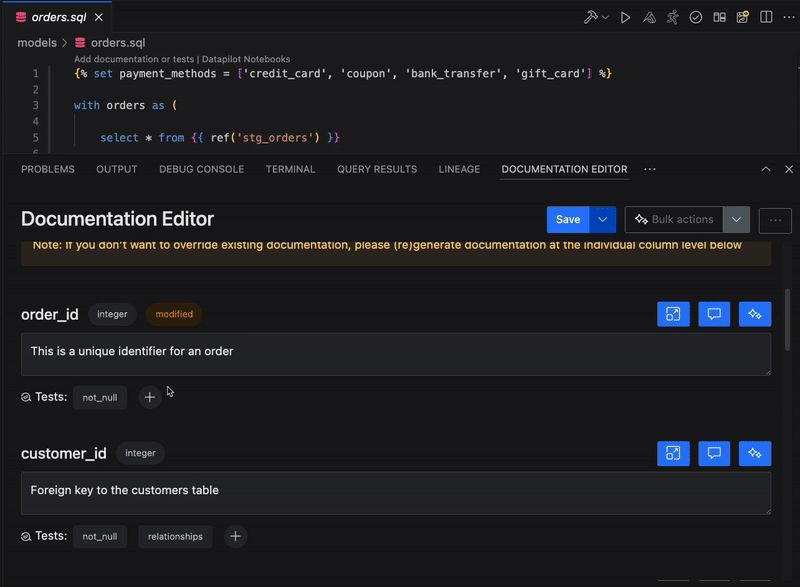
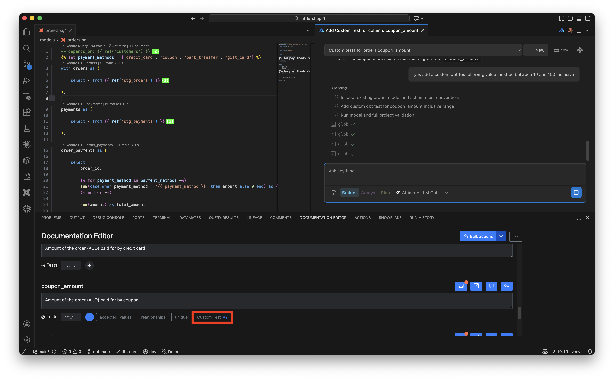
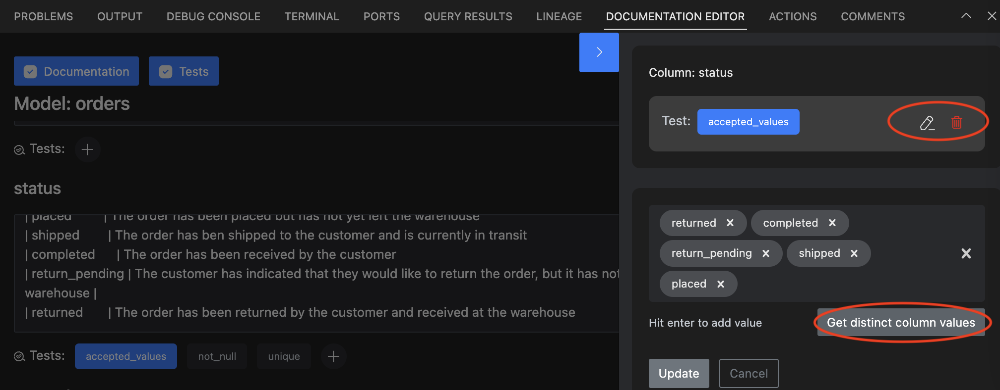

You can generate, view, edit and delete dbt tests in VS Code under the Documentation Editor section.

/// details | Following are a few limitations

- The [alternative method for defining tests](https://docs.getdbt.com/reference/resource-properties/data-tests#alternative-format-for-defining-tests) is not supported yet
- the definition of tests defined as macro is not available yet
  ///

## View dbt Tests

The documentation editor shows the tests that have been added for the dbt model and columns.
You can see the details of the tests by clicking on the test name.  

## Add dbt Tests

You can add default dbt tests: unique, not_null, accepted_values, relationship by clicking (+) sign next to the "Tests:" label.

## Generate dbt Tests 

You can also generate test code for custom tests based on `dbt_utils` and `dbt_expectations` packages.

In the Documentation Editor, click the **(+)** sign next to the **Tests:** label and choose **custom tests**. Altimate Code opens in a side panel, asks any clarifying questions it needs, and writes the test (using `dbt_utils` / `dbt_expectations` if installed, or a custom macro otherwise).

/// admonition | Requires the Datamates extension
    type: info

Custom test generation runs through Altimate Code, which is powered by the **[Datamates](https://marketplace.visualstudio.com/items?itemName=altimateai.vscode-altimate-mcp-server)** extension. Make sure Datamates is installed and active before invoking custom test generation.
///

/// admonition | Altimate Code may occasionally retry dbt commands before producing a successful test, and in rare cases may ignore installed packages or generate inaccurate code. Review the generated test before saving.
    type: info
///

## Edit/delete dbt Tests

You can edit existing dbt tests if they are default dbt tests: unique, not_null, accepted_values, relationships by clicking on the test and using the "pencil" icon from the details screen. You can delete any dbt test
by clicking on the test and using the "trash can icon" from the details screen

### Getting distinct values for "accepted_values" test

As shown in the image above, there is a button to quickly get distinct values for a specific column with a click of a button. This helps you write the "accepted_values" test easily.

/// admonition | Save changes in YAML file
    type: tip

You can save the changes in the existing or a new YAML file with save button at the bottom of the panel.
If you see any issues with the content that's saved in the YAML file, please check the [optional config section](../setup/optConfig.md/#column-name-setup-for-yaml-file-updates).
///
