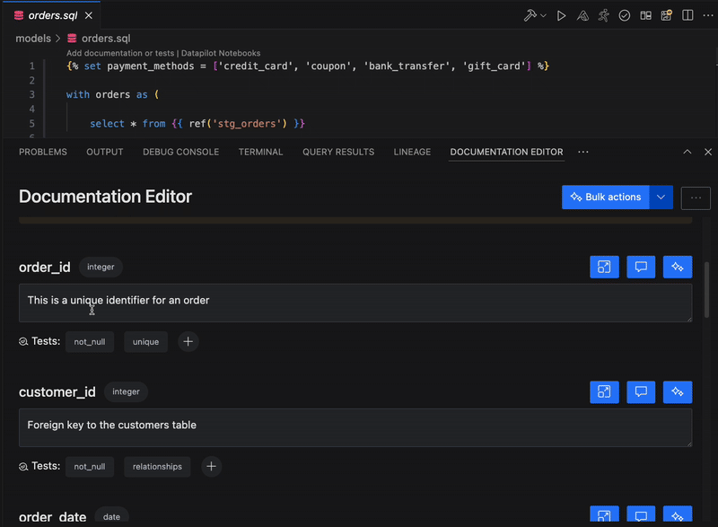

You can generate, view, edit and delete dbt tests in VS Code under the Documentation Editor section.

/// details | Following are a few limitations

- The [alternative method for defining tests](https://docs.getdbt.com/reference/resource-properties/data-tests#alternative-format-for-defining-tests) is not supported yet
- the definition of tests defined as macro is not available yet
  ///

## View dbt Tests

The documentation editor shows the tests that have been added for the dbt model and columns.
You can see the details of the tests by clicking on the test name.  

## Add dbt Tests

You can add default dbt tests: unique, not_null, accepted_values, relationship by clicking (+) sign next to the "Tests:" label.

## Generate dbt Tests (Beta)

You can also generate test code for custom tests based on dbt.utils and dbt.expectations package.
First, click on (+) sign next to the "Tests:" label and choose "custom tests". DataPilot automatically detects which dbt packages you have installed, and it generates test code based on packages in your environment.

If a test definition is not available from packages (dbt.utils or dbt.expectations) that you have installed in your environment, DataPilot writes custom SQL test code and puts it in the dbt macro.

/// admonition | This functionality is marked as beta. In some rare cases, DataPilot may decide to ignore the packages that you have installed or may generate inaccurate code.
type: info
///

## Edit/delete dbt Tests

You can edit existing dbt tests if they are default dbt tests: unique, not_null, accepted_values, relationships by clicking on the test and using the "pencil" icon from the details screen. You can delete any dbt test
by clicking on the test and using the "trash can icon" from the details screen

### Getting distinct values for "accepted_values" test

As shown in the image above, there is a button to quickly get distinct values for a specific column with a click of a button. This helps you write the "accepted_values" test easily.

/// admonition | Save changes in YAML file
type: tip
You can save the changes in the existing or a new YAML file with save button at the bottom of the panel.
If you see any issues with the content that's saved in the YAML file, please check the [optional config section](../setup/optConfig.md/#column-name-setup-for-yaml-file-updates).
///

## Recorded demo video

<iframe width="800" height="600" src="https://www.youtube.com/embed/VunQngGe-JE?si=G3whtDTnuJumSZ78" title="YouTube video player" frameborder="0" allow="accelerometer; autoplay; clipboard-write; encrypted-media; gyroscope; picture-in-picture; web-share" referrerpolicy="strict-origin-when-cross-origin" allowfullscreen></iframe>
