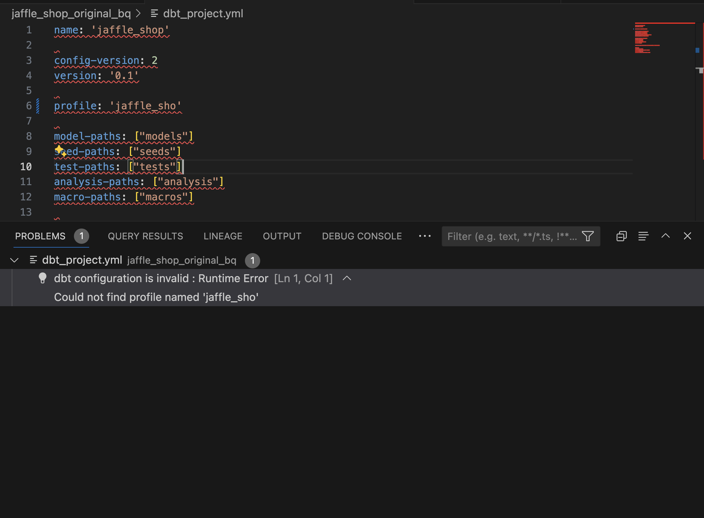
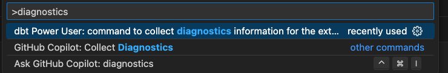
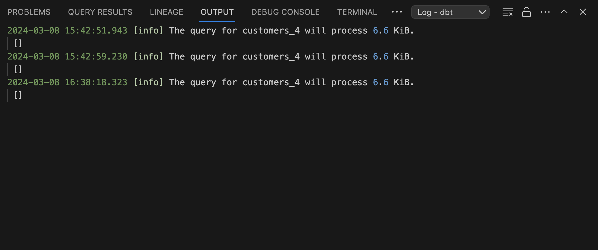
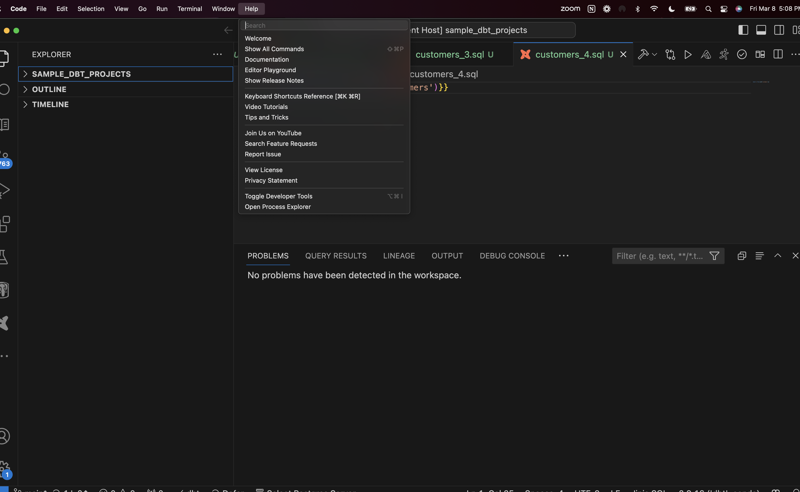

## Troubleshooting Steps

Follow these steps to effectively troubleshoot and resolve issues with the extension:

### Setup Wizard

Initially, use the setup wizard. This tool is designed to identify and possibly resolve environment issues automatically. You can access it by selecting "dbt" or "dbt is not installed" in the bottom left bar of the IDE and then clicking on "Setup Extension".

<iframe src=https://app.supademo.com/embed/clph7wqbu4xjbpe69qnl0m9pf frameborder="0" webkitallowfullscreen="true" mozallowfullscreen="true" allowfullscreen style="position: absolute; top: 0; left: 0; width: 100%; height: 100%;"></iframe>

### Problems Panel

Check the problems panel for any issues with your dbt project. You can access the problems panel by clicking on the `Problems` tab.

### Diagnostics command

The diagnostics command in the VSCode Power User extension provides a comprehensive report that covers various aspects of the system and DBT project environment. Here is a summary of the diagnostics it generates:

- **Environment Variables**: Lists all the environment variables which can help in understanding the system configuration and paths that might affect the DBT operations.

- **Extension Settings**: Details the settings related to the VSCode extension, including preferences like AI keys, instance names, and various enabled or disabled features that influence how the extension behaves.

- **Python and DBT Installations**: Confirms the installation of Python and DBT, along with their paths, ensuring that these essential tools are available and correctly set up.

- **Workspace and Project Details**: Provides information about the active workspace and DBT projects, such as the version of DBT, project directory, and the first workspace path.

- **DBT Project Configuration**: Outlines the configuration for the DBT project, including adapter type and version, and paths to essential files like dbt_project.yml.

- **Connection Testing**: Tests and verifies the database connection, detailing the connection parameters and any errors encountered during the connection attempt.

- **Potential Issues and Errors**: Identifies any issues with dependencies, such as mismatches in versions of Python libraries, and provides errors encountered during the execution of the DBT commands.
  Overall, the diagnostics command is designed to help users quickly assess and troubleshoot their DBT setup within VSCode by providing detailed insights into configuration, environment, and connection status.

Running the command

- On Mac, press `Cmd + Shift + P` or On Windows/Linux, use `Ctrl + Shift + P`
- type diagnostics and pick the option listed under the dbt power user extension name and press enter
  
- this should start a terminal window and print the diagnostic information

### Check Extension Logs

If the problem persists, examine the logs in the IDE's output panel.

1. Select `Log -> dbt` from the dropdown menu to view detailed extension logs, which can provide insights into underlying issues.
2. To access more detailed logs, you can change the log level to "Debug":
   - Open the vscode command palette -
     - On Mac, do this by pressing `Cmd + Shift + P`.
     - On Windows/Linux, use `Ctrl + Shift + P`.
   - Once the command palette opens, type `Set Log Level`, then choose `Debug`.
3. Run the operations again and you should start seeing debug logs in the `Log -> dbt` output stream

   

### Developer Tools

For more in-depth diagnostics, use the developer tools in Visual Studio Code (VSCode). Navigate to `Help -> Toggle Developer Tools` to access these tools, including a console with detailed logs and error messages.

### Contact Support

If issues still remain unresolved, please [contact us](https://www.altimate.ai/support) via Slack or chat for further assistance.

/// admonition | Feedback Widgets
    type: tip

There are also feedback widgets in the extension embedded in various features, where you can directly provide feedback on the roadmap or any issues that you encountered.
///

/// admonition | Still stuck? [contact us](https://www.altimate.ai/support) via Slack or chat
    type: tip
///
